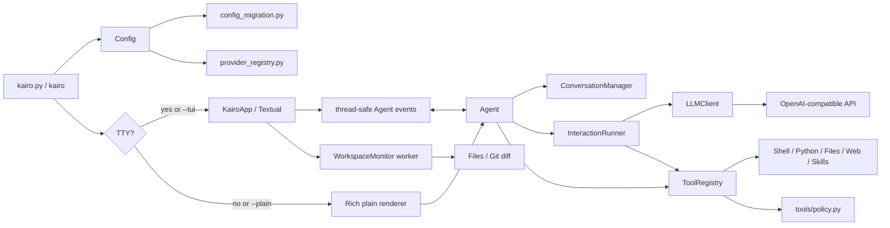
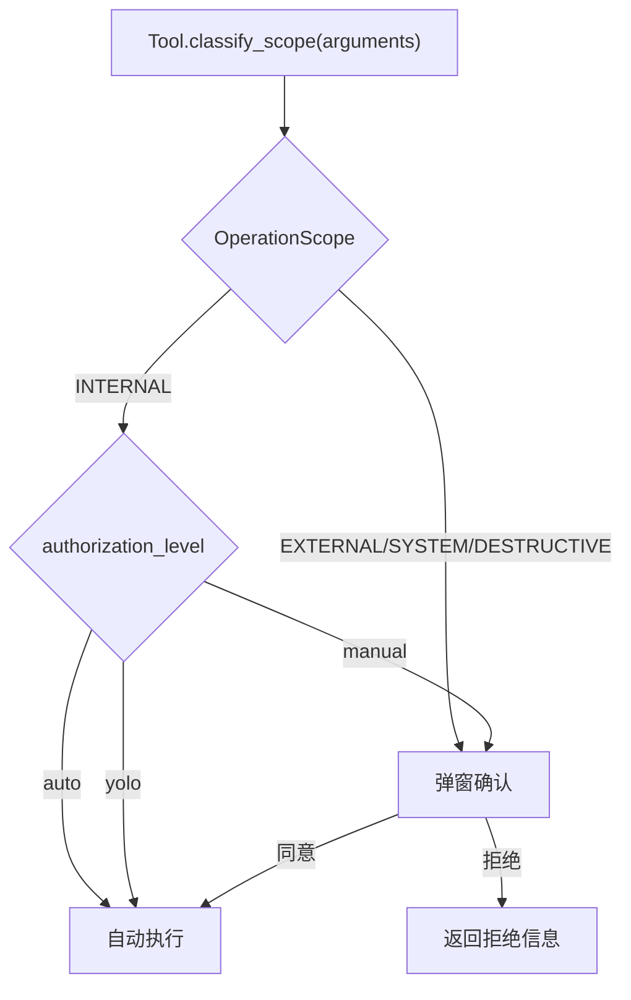

# 系统架构

## 总览

## 模块职责

| 路径 | 职责 |
| --- | --- |
| `kairo.py` | CLI 参数、TTY 检测、Textual/plain 入口选择 |
| `agent/commands.py` | Slash Command 单一元数据源，供 plain、Textual 和 `/help` 共用 |
| `agent/config.py` | JSON、环境变量、`llm.providers` 与 UI 配置归一化 |
| `agent/provider_registry.py` | provider/model 解析与归一化 |
| `agent/config_migration.py` | 旧 `model_profiles` 结构迁移到新的 `llm.providers` |
| `agent/bootstrap.py` | 唯一正式装配入口，负责组装内置工具和 Agent |
| `agent/core.py` | Agent facade：命令语义、workspace 切换、shutdown |
| `agent/interaction.py` | LLM/工具循环、Plan Mode、授权确认、上下文治理 |
| `agent/llm.py` | OpenAI-compatible 流式 HTTP/SSE 适配（含重试、代理） |
| `agent/context_manager.py` | 进程内会话、token 估算、摘要与安全裁剪 |
| `agent/workspace.py` | 只读文件扫描、会话触达追踪、Git/非 Git Diff 快照 |
| `agent/ui/` | Textual 应用、命令菜单、Workspace/Dock、事件桥接和 Kai 动画 |
| `agent/tui_widgets.py` | plain 模式的输入、菜单与 Dock |
| `agent/repl.py` | 持久 Python REPL 与持久 Shell 子进程 |
| `tools/base.py` | 工具接口、注册表、`@skill` 装饰器 |
| `tools/policy.py` | Permission、OperationScope、WorkspacePathPolicy、授权级别 |
| `tools/` | 内置工具实现 |
| `skills/` | 运行时加载的本地自定义工具目录 |

## 一次请求的生命周期

1. Composer 提交文本，Slash Command 在 UI 层处理；普通文本交给 Agent worker。
2. Agent 把用户消息加入当前 session，并在请求前计算实际上下文估算。
3. 达到阈值或输出预算不足时，Agent 先摘要压缩，再在必要时按完整轮次裁剪。
4. `LLMClient` 使用 urllib 发起流式请求，解析 content、thought、tool_calls、usage 和 context_error。
5. Textual 路径把连续 delta 合并后刷新当前消息；后台线程只投递事件，不直接操作 widget。
6. 工具调用先由 `InteractionRunner` 根据 `authorization_level` 和 `OperationScope` 决定是否授权，结果完整写入 history。
7. provider 报 context-length 错误时只做一次紧急压缩/裁剪重试。

Workspace 使用独立后台 worker。工具事件携带原始参数、目标路径、scope 和成功状态；UI 只消费不可变快照，目录扫描和 Git 子进程不能直接更新 widget。

## 授权与安全流程

## Textual 线程与事件契约

`EventConsole` 同时会被两类调用者使用：Textual 主线程中的同步 Slash Command，以及 Agent worker 中的流式交互。因此 `KairoApp.emit_from_worker()` 虽保留历史名称，但必须先判断当前线程：

- 当前线程是 UI 线程：直接 `post_message()` 或 `set_timer()`；
- 当前线程是后台 worker：通过 `call_from_thread()` 回到 UI 线程；
- content/thought delta 先进入带锁缓冲区，再以约 30 FPS 合并刷新；
- 后台线程不得直接查询或修改 Textual widget。

`/config`、`/skills`、`/plan`、`/manual`、`/auto`、`/yolo`、`/think` 和 `/workspace` 会在 UI 线程同步进入 `Agent.handle_command()`，是修改事件桥时必须保留的回归路径。

## 关键不变量

- session history 第一条必须是主 system instruction。
- tool result 不能脱离对应 assistant tool call。
- 压缩和裁剪按完整用户轮次处理，至少保留当前用户轮次。
- 流式响应期间不重写 history；进入下一次模型请求前再治理上下文。
- Textual widget 只能由 UI 线程更新；UI 线程禁止调用 `call_from_thread()`。
- plain 和 Textual 共用 Agent、配置、会话、工具语义和命令元数据。
- 环境变量中的 API Key 不得由 `Config.save()` 写回磁盘。

## 扩展边界

新 provider 应优先通过 `llm.providers` 配置适配 OpenAI-compatible 接口。只有协议确实不同才扩展 `LLMClient`，不要在 `Agent` 中加入 provider 分支。

`tests/harness.py` 也必须通过 `agent.bootstrap` 复用同一套工具装配，避免评估环境与正式运行环境漂移。

新 UI 事件应先在 `run_interaction_events()` 定义稳定语义，再由 Textual renderer 消费。不要让核心层直接依赖具体 widget。

新工具必须实现 `classify_scope()` 才能参与授权系统；默认返回 `INTERNAL`，但 Shell/Python/文件类工具应给出更精确的分类。
