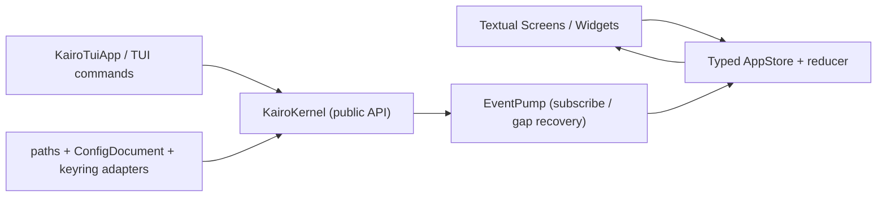

# Kairo TUI Foundation (kairo-tui 0.4.0a2) Implementation Plan

> **For agentic workers:** execute task-by-task with TDD; no git commits; report per-task completion with the exact suite result. Every task must end green: `frontends/tui` tests pass, the kernel suite is unchanged at **313 passed**, ruff/mypy clean for `frontends/tui`.
>
> **Scope:** this is phase "TUI Foundation" of `docs/tui_plan.md` (lines 38–79, 98–107, 113). Later phases (Chat Gate, Workbench Gate, Cutover, Release) are out of scope. Pages other than Setup are stubs. Streaming/message rendering, Sessions/Workspace/Memory/Extensions/Settings/Doctor pages, command palette polish, and theme application are explicitly deferred.

## Goal

Ship a standalone, installable `kairo-tui` package at `frontends/tui/` that:
- provides the `kairo_tui` import package and a `kairo-tui` console command;
- boots the real `KairoKernel` (public API only) from a platformdirs-resolved global config document, a keyring/env secret adapter, and a typed `AppStore` fed by an `EventPump`;
- renders the workbench shell (top bar / left nav / central page container / right inspector / bottom composer) with the four responsive breakpoints from `tui_plan.md`, the Setup page as default when the config document is empty, Esc priority, and the exit-with-background-turns three-option flow;
- keeps TUI commands (page navigation/help/exit) TUI-side and delegates business commands to `kernel.commands`;
- passes the AST boundary test (no `agent.*`, no legacy `tools.*`, no `kairo_kernel` private modules) and the secret-scan test;
- builds a clean wheel containing only `kairo_tui`.

## Architecture



- `KairoTuiApp` holds only a `KairoKernel` handle, the `AppStore`, and the `EventPump`. Widgets read store state; the app dispatches actions for user intent.
- All kernel state arrives **only** through events (via the pump) or the documented replay-gap/overflow recovery re-read. The TUI never polls.
- Layering: `paths` → `config_document` → `keyring_store` → `store` → `event_pump` → `bootstrap` → `app`/`screens`/`widgets` → `commands`/`smoke` → `cli`. Lower layers never import Textual.

## Tech Stack

- Python `>=3.11`, Textual `>=8.2,<9` (`.venv` has 8.2.8), Rich `>=14,<15` (see constraint note), `keyring>=25,<26` (25.7.0), `platformdirs>=4,<5` (4.10.0), `kairo-kernel==0.4.0a2` (exact pin; installed as 0.4.0a2 / `KERNEL_API_VERSION="1.1"`).
- Tests: pytest 9 + pytest-asyncio `asyncio_mode="auto"`; UI tests via Textual's built-in Pilot (`app.run_test(size=...)`, headless — no `textual-pilot` package needed).
- Lint/type: `ruff check frontends/tui`; `mypy frontends/tui` — **relaxed, kernel-style** (decision documented below).
- Packaging: setuptools; `python -m build` from `frontends/tui`.

## Global Constraints

- **Version & pins (exact):** `kairo_tui` version `0.4.0a2`; `requires-python = ">=3.11"`; dependencies exactly `textual>=8.2,<9`, `rich>=14,<15`, `keyring>=25,<26`, `platformdirs>=4,<5`, `kairo-kernel==0.4.0a2`. The kernel package is untouched; its wheel keeps containing only `kairo_kernel`.
- **Public-API-only:** `kairo_tui` may import from `kairo_kernel` only via the public surface: `KairoKernel, __version__, KernelConfig, KernelDependencies, KernelError, KernelResult, KERNEL_API_VERSION, build_kernel, contracts, ports`, plus `kairo_kernel.contracts.*` and `kairo_kernel.ports.*`. The AST boundary test (Task 12) forbids `agent`, `tools`, and every `kairo_kernel` private module (`engine`, `services`, `runtime`, `factory`, `kernel`, `mcp`, `memory`, `providers`, `skills`, `storage`, `errors`, `_version`, `config_document`, …).
- **No plaintext secrets on disk.** Keyring service is fixed to `"kairo"`, account = `secret_id`. When no keyring backend is available, the TUI stores only an **environment-variable reference** (`KAIRO_SECRET_<ID>`); the value must already be set in the environment. No fallback ever writes a secret value to disk. The kernel's `SecretInput.value` is repr-redacted by contract; the TUI never `str()`s it.
- **No polling.** The TUI receives all state via `kernel.events.subscribe(after_sequence=...)`; the only re-read path is the documented replay-gap / `SubscriberOverflow` recovery (status, sessions, active turns, workspace, pending interactions), after which it resubscribes.
- **Responsive breakpoints** (per `tui_plan.md`): `>=140` cols → full three columns; `100–139` → narrow nav + drawer inspector; `80–99` → single page with overlays; `<80` width **or** `<24` height → compat hint + minimal chat layout, never crashes, composer draft preserved. 80×24 exactly → overlay (single-page).
- **Esc priority:** close palette/modal → cancel the foreground turn(s) → no-op. Exit only through a command or the confirmation flow.
- **Safe-mode semantics (`--safe-mode`):** force Manual authorization (the TUI never patches `AuthorizationMode` to AUTO/YOLO), no MCP auto-connect (`connect_mcp_on_start=False` always), and no persisted settings writes (`ConfigDocumentAdapter.save` is a no-op; keyring `store`/`delete` are denied). Reads (keyring resolve / env fallback) still work.
- **`--headless-smoke`:** deterministic headless run (no TTY): boot kernel + app, drive `run_test(size=(120,30))`, assert Setup/compat behaviors, print `KAIRO_TUI_SMOKE_OK`, exit 0 (non-zero on any failure).
- **UTF-8/CRLF hygiene:** every file written by the TUI (`config-v1.json`, backups) is UTF-8 with `newline="\n"` regardless of platform.
- **No git commits** in any task; final state remains on `main` only.
- **Every task ends green:** `.venv/Scripts/python.exe -m pytest frontends/tui/tests -q` (and the TUI subset for in-task runs), `.venv/Scripts/python.exe -m pytest tests/kernel -q` unchanged at 313 passed, `ruff check frontends/tui`, `mypy frontends/tui`. ruff/mypy are not installed in `.venv` yet — Task 1 installs them (`pip install "ruff>=0.15,<1" "mypy>=1.10,<3"`, the kernel dev pins).

## Verified kernel contract facts (read from source on 2026-08-09; do not re-derive)

- `kairo_kernel/__init__.py` exports exactly: `KairoKernel, __version__, KernelConfig, KernelDependencies, KernelError, KernelResult, KERNEL_API_VERSION, build_kernel, contracts, ports`.
- `KernelConfig` (`factory.py:70`) — frozen dataclass: `workspace_root: str`, `database_path: str = ".kairo/kernel.db"`, `kernel_id: KernelId | None`, `package_version: str`, `profiles: tuple[ProviderProfile, ...] = ()`, `provider_roles: tuple[ProviderRoleMapping, ...] = ()`, `default_profile_id: ProfileId | None`, `default_session_id: SessionId | None`, `config_values: JsonObject`, `config_schema: ConfigSchema`, `engine_options: EngineOptions`, `mcp_servers: tuple[McpServerConfig, ...] = ()`, `connect_mcp_on_start: bool = False`, `skills_directory: str = ".kairo/skills"`, `trust_directory: str = ".kairo/trust"`, `event_buffer_size: int = 1000`, `event_queue_size: int = 256`, `shutdown_timeout_seconds: float = 5.0`, `enable_builtin_tools: bool = True`, `mcp_call_timeout_seconds: float = 30.0`.
- `KernelDependencies` (`factory.py:108`): `provider: ProviderPort | None`, `provider_catalog: ProviderCatalogRepository | None`, `tools: ToolRegistryPort | None`, `authorization: AuthorizationPolicyPort | None`, `sessions/configuration/workspace/memory: …RepositoryPort/Port | None`, `secrets: SecretPort | None`, `database: SQLiteDatabase | None`, `skills: SkillRegistry | None`, `mcp: McpHub | None`, `diagnostics: DiagnosticService | None`.
- `build_kernel(config, dependencies=None) -> KairoKernel`; `KernelConfig` requires a non-empty `workspace_root`; relative `database_path` resolves under the workspace root; `":memory:"` is accepted.
- `KairoKernel` facade (`kernel.py`): `start() -> KernelResult[LifecycleState]`, `shutdown(request: ShutdownRequest | None = None) -> KernelResult[ShutdownReport]`, `status() -> KernelStatus`, `capabilities() -> KernelCapabilities`, `submit(TurnRequest) -> KernelResult[TurnAccepted]`, `turn/wait/cancel`, `active_turns() -> tuple[ActiveTurn, ...]`, `sessions.list() -> KernelResult[tuple[SessionSummary, ...]]` (+ create/rename/delete/search/export), `conversations.history/clear/undo/compress`, `memory.*`, `configuration.snapshot/export_json/validate/patch/backup/restore`, `workspace.snapshot/tree/changed_files/diff/preview/move/bookmarks`, `providers.snapshot/resolve/probe/store_secret/create_profile/update_profile/delete_profile/map_role/unmap_role/delete_secret`, `skills.*`, `mcp.*`, `diagnostics.*`, `tools.list/reload`, `events.snapshot(after_sequence=0, limit=1000) -> EventReplay` / `events.subscribe(after_sequence=0, queue_size=None) -> EventSubscription` (structural: `receive() -> KernelEvent`, `close()`), `interactions.pending() -> tuple[InteractionRequest, ...]` / `respond(InteractionResponse)`, `preferences.snapshot() -> PreferencesSnapshot` / `patch(PreferencesPatch)`, `commands.catalog()/parse()/execute()`.
- **Event envelope:** `KernelEvent(event_id, kernel_id, sequence, timestamp, event_type, payload, schema_version=1, turn_sequence, turn_id, session_id, workspace_revision)`; `EventType` includes `LIFECYCLE/TURN/MESSAGE/TOOL/INTERACTION/USAGE/CONTEXT/SESSION_CHANGED/CONFIG_CHANGED/WORKSPACE_CHANGED/SKILLS_CHANGED/PROVIDER_CHANGED/MEMORY_CHANGED/NOTICE`; payloads `LifecycleEvent(state, reason)`, `TurnEvent(status, phase=None, reason="")`, `MessageEvent(message_id, action, content=())`, `InteractionEvent(action, request=None, response=None, interaction_id=None)`, `ChangeEvent(revision, subject_id="", summary="")`, `NoticeEvent(level, message, details)`.
- **Replay semantics** (`runtime/events.py`, used as a black box): `snapshot(after)` sets `gap=True` when `after < oldest-1`; `subscribe(after)` replays buffered events then live; when the subscriber queue overflows, the next `receive()` raises `SubscriberOverflow(last_delivered_sequence, dropped_events)` **once** (a `RuntimeError` subclass — see boundary note below); `receive()` raises plain `RuntimeError("Event subscription is closed.")` after `close()`/kernel shutdown.
- **Global config document schema** (kernel private `services/config_document.py`; the TUI mirrors it, see decision D1): `{"version": int, "default_profile_id": str|null, "theme": str, "profiles": [json], "roles": [{"role": str, "profile_id": str}], "mcp_servers": [json], "keybindings": [[key, command]], "recent_workspaces": [str]}`. Profiles serialize via the public `ProviderProfile.to_json_value()/from_json_value()`.
- **Private-typed returns the TUI must treat as `Any`** (values are usable by duck-typing; the types are not importable under the boundary): `EventSubscription` (use `receive()/close()`), `SubscriberOverflow` (name-based), `WorkspaceState` (`.root`, `.revision`), `ProviderCatalogSnapshot` (`.revision`, `.profiles`, `.roles`), `ProviderProbeResult` (`.reachable`), `SecretRef` (`.secret_id`), `SkillInventory`, `DiagnosticReport`, `McpCatalog`/`CatalogEntry`. All of these arrive **from the facade**, never from TUI imports.

## Design decisions

### D1 — Config-seeding decision (verified against source): TUI-side `ConfigDocument` adapter; profiles + default_profile_id at build time; roles seeded via facade after start; MCP servers stored but not fed in this phase

The parent spec proposed option (a) (TUI holds its own versioned document) vs (b) (`kernel.configuration` facade — that is the per-workspace SQLite config, not the global document). **Chosen: (a).** Verified constraints:

- `KernelConfig.profiles` is `tuple[ProviderProfile, ...]` — `ProviderProfile` is **public** (`contracts.providers`) → the TUI can construct and feed profiles at build time.
- `KernelConfig.provider_roles` is `tuple[ProviderRoleMapping, ...]` — `ProviderRoleMapping` lives in private `kairo_kernel.services.providers` → **cannot construct**. Public alternative: after `kernel.start()`, call `kernel.providers.map_role(role, profile_id, expected_revision)` (public facade) for each document role, reading `expected_revision` from `kernel.providers.snapshot().revision` (increments per call).
- `KernelConfig.mcp_servers` is `tuple[McpServerConfig, ...]` — private (`kairo_kernel.mcp.models`) → **cannot construct**; `KernelDependencies.provider_catalog` is `ProviderCatalogRepository` — also private. The document therefore stores `mcp_servers` as **opaque JSON** that round-trips verbatim, but the foundation does not feed MCP servers to the kernel. Documented limitation for the Workbench Gate (Extensions page), escalated to the spec owner.
- `KernelConfig.engine_options` is private but its defaults already match the required baseline (Manual, plan off, thinking on, `connect_mcp_on_start=False`), so the TUI never needs to construct it.
- Round-trip: Setup-created profiles are persisted by reading `kernel.providers.snapshot()` and writing the document via `ConfigDocumentAdapter.save` (no-op in safe mode). The document is the source of truth for restarts.

### D2 — Mypy decision: relaxed, kernel-style, with an `Any` boundary module

Strict mypy (`strict = true`) would force the TUI to name private kernel types (`EventSubscription`, `WorkspaceTree`, …) that the AST boundary forbids importing — the honest annotation for those facade returns is `Any`. The TUI mirrors the kernel's root `[tool.mypy]` (`warn_return_any = true`, `warn_unused_configs = true`, `ignore_missing_imports = true`) and adds `check_untyped_defs = true`, `no_implicit_optional = true`, `warn_unused_ignores = true`. All `Any` kernel-boundary values are funneled through explicit `-> Any` annotations (explicit `Any` does not trigger `warn_return_any`). A later phase may tighten to strict once the kernel exposes public DTOs for these returns.

### D3 — Private-boundary plumbing (no runtime import of private modules)

- `SubscriberOverflow` detection is by class name (`type(exc).__name__ == "SubscriberOverflow"`, it is a `RuntimeError` subclass); the pump distinguishes it from the "subscription is closed" `RuntimeError` by name.
- `EventSubscription` is used structurally (`receive()`/`close()`); the pump takes an `EventSource` protocol so tests can inject stubs.
- Repr safety: secrets pass through `SecretInput`/`SecretDescriptor` (kernel-redacted) and the TUI's own `SecretStore` objects; the TUI never formats a secret value.

### D4 — Misc interpretations (escalated)

- `<80x24` compat is interpreted as `width < 80 or height < 24` (the size matrix's smallest entry is 80×24, which must still work — it maps to the 80–99 overlay, not compat).
- `--theme` is accepted and stored in the document, but applying custom theme CSS is a Workbench-Gate concern; the foundation only records it.
- Rich pin: spec says `rich>=14,<15`; the `.venv` currently has rich 15.0.0 (satisfies textual `>=14.2.0`). The pyproject keeps the **spec pin**; local runs use installed rich 15; the Task 13 wheel-install check validates the pin resolves to 14.x.
- `--headless-smoke` semantics are defined by this plan (deterministic scripted run, exit 0 on success) since `tui_plan.md` only names the flag.

## Task Index

| # | Task | New tests | Suite total after |
|---|------|-----------|-------------------|
| 1 | Package skeleton + pyproject + CLI parsing | +5 | 5 |
| 2 | Config path resolution (`platformdirs`) | +3 | 8 |
| 3 | `ConfigDocument` adapter (atomic, versioned) | +6 | 14 |
| 4 | Keyring/env secret store + `SecretPort` bridge | +7 | 21 |
| 5 | Typed `AppStore` + reducer + event folding | +7 | 28 |
| 6 | `EventPump` + kernel test fixture | +5 | 33 |
| 7 | Kernel bootstrap + role seeding | +4 | 37 |
| 8 | App shell + workbench layout + responsive + smoke | +8 | 45 |
| 9 | Setup page (sequential steps, send gating) | +3 | 48 |
| 10 | TUI commands + Esc priority + preference toggles | +5 | 53 |
| 11 | Exit-with-background-turns flow (+ Esc closes modal) | +6 | 59 |
| 12 | AST boundary + secret-scan tests | +6 | 65 |
| 13 | Packaging + wheel build check | +1 | 66 |

Kernel suite stays **313 passed** throughout (untouched). Final gate: `66 TUI + 313 kernel = 379 passed`.

---

## Task 1: Package skeleton + pyproject + CLI parsing

**Purpose:** Stand up `frontends/tui/` as an installable setuptools package that imports with **no** dependency on `kairo_kernel`/Textual at `import kairo_tui` time (required so setuptools' `version = {attr = "kairo_tui._version.__version__"}` works in an isolated build env), and implement `kairo-tui [WORKSPACE]` argument parsing with all five flags.

**Interfaces**

- Consumes: nothing (stdlib only).
- Produces:
  - `kairo_tui.__version__ == "0.4.0a2"` (`kairo_tui/__init__.py`, `kairo_tui/_version.py`).
  - `kairo_tui.cli.parse_args(argv: Sequence[str] | None = None) -> CliOptions`.
  - `kairo_tui.cli.main(argv: Sequence[str] | None = None) -> int` (lazy-loads `smoke`/`app`).
  - `CliOptions` frozen dataclass: `workspace: str | None`, `config_path: str | None`, `theme: str | None`, `reduced_motion: bool`, `safe_mode: bool`, `headless_smoke: bool`.

**Files**

- C `frontends/tui/pyproject.toml`
- C `frontends/tui/README.md`
- C `frontends/tui/kairo_tui/__init__.py`
- C `frontends/tui/kairo_tui/_version.py`
- C `frontends/tui/kairo_tui/__main__.py`
- C `frontends/tui/kairo_tui/cli.py`
- C `frontends/tui/kairo_tui/py.typed`
- C `frontends/tui/tests/test_cli.py`

**Steps**

1. TDD: write `frontends/tui/tests/test_cli.py` first (five tests, see code below); run `.venv/Scripts/python.exe -m pytest frontends/tui/tests -q` → 5 failures (module missing). Note: the TUI pyproject must exist before pytest can read `pythonpath` — create the pyproject in step 2, then confirm red, then green.

2. Create `frontends/tui/pyproject.toml`:

```toml
[build-system]
requires = ["setuptools>=75", "wheel>=0.44"]
build-backend = "setuptools.build_meta"

[project]
name = "kairo-tui"
dynamic = ["version"]
description = "Textual TUI frontend for the Kairo agent"
readme = "README.md"
requires-python = ">=3.11"
license = "MIT"
classifiers = [
    "Development Status :: 3 - Alpha",
    "Programming Language :: Python :: 3",
    "Programming Language :: Python :: 3.11",
    "Programming Language :: Python :: 3.12",
    "Programming Language :: Python :: 3.13",
    "Programming Language :: Python :: 3.14",
    "Typing :: Typed",
]
dependencies = [
    "textual>=8.2,<9",
    "rich>=14,<15",
    "keyring>=25,<26",
    "platformdirs>=4,<5",
    "kairo-kernel==0.4.0a2",
]

[project.optional-dependencies]
dev = [
    "pytest>=9,<10",
    "pytest-asyncio>=0.23,<2",
    "ruff>=0.15,<1",
    "mypy>=1.10,<3",
    "build>=1.2,<2",
]

[project.scripts]
kairo-tui = "kairo_tui.cli:main"

[tool.setuptools.dynamic]
version = {attr = "kairo_tui._version.__version__"}

[tool.setuptools.packages.find]
where = ["."]
include = ["kairo_tui", "kairo_tui.*"]
namespaces = false

[tool.setuptools.package-data]
kairo_tui = ["py.typed"]

[tool.pytest.ini_options]
testpaths = ["tests"]
addopts = "-ra --strict-markers"
asyncio_mode = "auto"
pythonpath = ["."]

[tool.ruff]
line-length = 120
target-version = "py311"

[tool.ruff.lint]
select = ["E", "F", "W", "I", "UP", "B", "C4", "SIM"]
ignore = ["E501", "B008", "UP017", "UP042"]

[tool.mypy]
python_version = "3.11"
warn_return_any = true
warn_unused_configs = true
ignore_missing_imports = true
check_untyped_defs = true
no_implicit_optional = true
warn_unused_ignores = true
```

Notes: `testpaths=["tests"]` + `pythonpath=["."]` make `pytest frontends/tui/tests` (invoked from the repo root) resolve `frontends/tui` as rootdir and import `kairo_tui` without installing the package. `ruff`/`mypy` sections mirror the kernel root config (D2).

3. Create the package files:

```python
# kairo_tui/_version.py
"""Package version. Kept dependency-free for isolated wheel builds."""

__version__ = "0.4.0a2"
```

```python
# kairo_tui/__init__.py
"""Textual TUI frontend for Kairo (kairo-tui).

This module must stay importable without ``kairo_kernel`` or Textual so that
setuptools can read the version attribute in an isolated build environment.
"""

from kairo_tui._version import __version__

__all__ = ["__version__"]
```

```python
# kairo_tui/__main__.py
"""Allow ``python -m kairo_tui``."""

from kairo_tui.cli import main

if __name__ == "__main__":
    raise SystemExit(main())
```

```python
# kairo_tui/cli.py
"""Command-line entry point for kairo-tui."""

from __future__ import annotations

import argparse
from dataclasses import dataclass
from typing import Sequence


@dataclass(frozen=True)
class CliOptions:
    """Parsed ``kairo-tui`` invocation; no secrets, no paths resolved yet."""

    workspace: str | None = None
    config_path: str | None = None
    theme: str | None = None
    reduced_motion: bool = False
    safe_mode: bool = False
    headless_smoke: bool = False


def parse_args(argv: Sequence[str] | None = None) -> CliOptions:
    parser = argparse.ArgumentParser(
        prog="kairo-tui",
        description="Kairo Textual TUI (kairo-tui 0.4.0a2).",
    )
    parser.add_argument(
        "workspace",
        nargs="?",
        default=None,
        help="Workspace root (default: current directory).",
    )
    parser.add_argument(
        "--config",
        dest="config_path",
        default=None,
        metavar="PATH",
        help="Path to the global config-v1.json document (default: platformdirs user config dir).",
    )
    parser.add_argument("--theme", default=None, metavar="NAME", help="Theme name.")
    parser.add_argument("--reduced-motion", action="store_true", help="Disable animations.")
    parser.add_argument(
        "--safe-mode",
        action="store_true",
        help="Force Manual authorization, disable MCP auto-connect and persisted settings writes.",
    )
    parser.add_argument(
        "--headless-smoke",
        action="store_true",
        help="Run the deterministic headless smoke check and exit.",
    )
    parsed = parser.parse_args(argv)
    return CliOptions(
        workspace=parsed.workspace,
        config_path=parsed.config_path,
        theme=parsed.theme,
        reduced_motion=parsed.reduced_motion,
        safe_mode=parsed.safe_mode,
        headless_smoke=parsed.headless_smoke,
    )


def main(argv: Sequence[str] | None = None) -> int:
    """Console entry point; returns the process exit code."""
    options = parse_args(argv)
    if options.headless_smoke:
        from kairo_tui.smoke import run_headless_smoke

        return run_headless_smoke(options)
    from kairo_tui.app import KairoTuiApp

    return KairoTuiApp.from_options(options).run()
```

`kairo_tui/py.typed` is an empty file; `frontends/tui/README.md` a one-paragraph description. `smoke`/`app` are imported lazily so Tasks 1–7 need not define them yet.

4. `frontends/tui/tests/test_cli.py`:

```python
"""CLI argument parsing (pure logic; no app boot)."""

from __future__ import annotations

import pytest

from kairo_tui.cli import CliOptions, parse_args


def test_parse_args_defaults() -> None:
    assert parse_args([]) == CliOptions()


def test_parse_args_workspace_positional() -> None:
    assert parse_args([r"C:\work\demo"]).workspace == r"C:\work\demo"


def test_parse_args_flags() -> None:
    options = parse_args(
        ["--config", "cfg.json", "--theme", "dark", "--reduced-motion", "--safe-mode", "--headless-smoke"]
    )
    assert options.config_path == "cfg.json"
    assert options.theme == "dark"
    assert options.reduced_motion is True
    assert options.safe_mode is True
    assert options.headless_smoke is True


def test_parse_args_unknown_flag_exits_2() -> None:
    with pytest.raises(SystemExit) as exc:
        parse_args(["--bogus"])
    assert exc.value.code == 2


def test_main_help_exits_0() -> None:
    with pytest.raises(SystemExit) as exc:
        parse_args(["--help"])
    assert exc.value.code == 0
```

5. Install toolchain once: `.venv/Scripts/python.exe -m pip install "ruff>=0.15,<1" "mypy>=1.10,<3"`.

**Verify:** `.venv/Scripts/python.exe -m pytest frontends/tui/tests -q` → 5 passed; `.venv/Scripts/python.exe -m pytest tests/kernel -q` → 313 passed (unchanged); `ruff check frontends/tui`; `mypy frontends/tui` (the three Python files — `cli.py` types cleanly); `.venv/Scripts/python.exe -m pip install -e frontends/tui` once (editable dev install; also registers the `kairo-tui` console script), then `kairo-tui --help` prints usage and exits 0, and `.venv/Scripts/python.exe -m kairo_tui --help` does the same.

**Report:** files created, suite results.

---

## Task 2: Config path resolution (platformdirs)

**Purpose:** Resolve the global config document path: Windows `%APPDATA%\Kairo\config-v1.json` (via `platformdirs.user_config_dir("Kairo")`), other platforms the corresponding user config dir; `--config` overrides. Pure logic, unit-tested first.

**Interfaces**

- Consumes: `platformdirs.user_config_dir` (>=4,<5).
- Produces: `paths.default_config_dir() -> Path`, `paths.resolve_config_path(override: str | Path | None = None) -> Path`, `paths.APP_NAME = "Kairo"`, `paths.CONFIG_FILE_NAME = "config-v1.json"`.

**Files**

- C `frontends/tui/kairo_tui/paths.py`
- C `frontends/tui/tests/test_paths.py`

**Steps**

1. `frontends/tui/tests/test_paths.py` (red first):

```python
"""Config path resolution (pure logic)."""

from __future__ import annotations

from pathlib import Path

from kairo_tui import paths


def test_default_config_path_uses_platformdirs_dir(tmp_path: Path, monkeypatch) -> None:
    monkeypatch.setattr(paths, "user_config_dir", lambda _name: str(tmp_path))
    resolved = paths.resolve_config_path(None)
    assert resolved == tmp_path / "config-v1.json"
    assert resolved.parent == paths.default_config_dir()


def test_config_override_wins(tmp_path: Path) -> None:
    override = tmp_path / "custom" / "cfg.json"
    assert paths.resolve_config_path(override) == override


def test_override_expands_user_home(monkeypatch) -> None:
    monkeypatch.setenv("USERPROFILE", str(Path("C:/fake-user").resolve()))
    resolved = paths.resolve_config_path("~/custom.json")
    assert str(resolved).endswith("custom.json")
```

2. `frontends/tui/kairo_tui/paths.py`:

```python
"""Filesystem paths for the global configuration document."""

from __future__ import annotations

from pathlib import Path

from platformdirs import user_config_dir

APP_NAME = "Kairo"
CONFIG_FILE_NAME = "config-v1.json"


def default_config_dir() -> Path:
    """User config directory for Kairo.

    Windows: %APPDATA%\\Kairo  (platformdirs user_config_dir)
    macOS:   ~/Library/Application Support/Kairo
    Linux:   ~/.config/Kairo
    """
    return Path(user_config_dir(APP_NAME))


def resolve_config_path(override: str | Path | None = None) -> Path:
    """Return the config document path; ``override`` (--config) wins."""
    if override is not None:
        return Path(override).expanduser()
    return default_config_dir() / CONFIG_FILE_NAME
```

**Verify:** pytest `frontends/tui/tests` → 8 passed; kernel suite 313; ruff/mypy clean.

---

## Task 3: `ConfigDocument` adapter (atomic, versioned)

**Purpose:** TUI-owned mirror of the kernel's global document schema (decision D1): versioned JSON with profiles (via public `ProviderProfile` JSON), roles, opaque `mcp_servers`, `default_profile_id`, `theme`, `keybindings`, `recent_workspaces`; atomic save (temp file + `os.replace`, UTF-8, LF); corrupt/version-mismatch/missing → empty document + `last_error`; safe-mode `save` is a no-op. Pure logic, unit-tested first.

**Interfaces**

- Consumes: `ProviderProfile` (`kairo_kernel.contracts.providers`), `ProfileId` (`kairo_kernel.contracts.identifiers`), `freeze_json`/`thaw_json` (`kairo_kernel.contracts.json`).
- Produces:
  - `RoleMapping(role: str, profile_id: ProfileId)` (frozen dataclass).
  - `ConfigDocument(version=1, profiles: tuple[ProviderProfile, ...] = (), roles: tuple[RoleMapping, ...] = (), mcp_servers: tuple[dict[str, object], ...] = (), default_profile_id: ProfileId | None = None, theme: str = "default", keybindings: tuple[tuple[str, str], ...] = (), recent_workspaces: tuple[str, ...] = ())` with `.is_empty` (no profiles) and `.to_dict() -> dict[str, object]` / `from_dict(payload) -> ConfigDocument`.
  - `ConfigDocumentAdapter(path: Path, *, safe_mode: bool = False)` with `.load() -> ConfigDocument`, `.save(document: ConfigDocument) -> None`, `.last_error: str | None`.

**Files**

- C `frontends/tui/kairo_tui/config_document.py`
- C `frontends/tui/tests/test_config_document.py`

**Steps**

1. `frontends/tui/tests/test_config_document.py` (red first):

```python
"""Global config document load/save round-trips."""

from __future__ import annotations

import json
from pathlib import Path

from kairo_kernel.contracts.identifiers import ProfileId
from kairo_kernel.contracts.providers import ProviderProfile

from kairo_tui.config_document import ConfigDocument, ConfigDocumentAdapter, RoleMapping

PROFILE = ProviderProfile(
    ProfileId("p1"), "Model", "openai_responses", "gpt-5.2", "https://api.openai.com/v1", 32000, 1000, 0.2,
    secret_id="sk-ref-openai"
)


def test_missing_file_loads_empty_document(tmp_path: Path) -> None:
    adapter = ConfigDocumentAdapter(tmp_path / "config-v1.json")
    document = adapter.load()
    assert document.is_empty
    assert adapter.last_error is None


def test_round_trip_preserves_all_fields(tmp_path: Path) -> None:
    path = tmp_path / "config-v1.json"
    adapter = ConfigDocumentAdapter(path)
    document = ConfigDocument(
        profiles=(PROFILE,),
        roles=(RoleMapping("chat", PROFILE.profile_id),),
        mcp_servers=({"name": "files", "transport": "stdio", "command": "npx"},),
        default_profile_id=PROFILE.profile_id,
        theme="dark",
        keybindings=(("ctrl+k", "command_palette"),),
        recent_workspaces=(str(tmp_path),),
    )
    adapter.save(document)
    assert path.exists()
    assert not list(tmp_path.glob("*.tmp"))
    loaded = adapter.load()
    assert loaded == document
    assert not loaded.is_empty


def test_saved_file_is_utf8_lf_sorted(tmp_path: Path) -> None:
    path = tmp_path / "config-v1.json"
    ConfigDocumentAdapter(path).save(ConfigDocument())
    raw = path.read_bytes()
    assert b"\r\n" not in raw  # LF-only
    decoded = json.loads(raw.decode("utf-8"))
    assert decoded["version"] == 1


def test_corrupt_file_loads_empty_with_error(tmp_path: Path) -> None:
    path = tmp_path / "config-v1.json"
    path.write_text("{not json", encoding="utf-8")
    adapter = ConfigDocumentAdapter(path)
    assert adapter.load().is_empty
    assert adapter.last_error is not None


def test_unsupported_version_is_rejected(tmp_path: Path) -> None:
    path = tmp_path / "config-v1.json"
    path.write_text(json.dumps({"version": 99}), encoding="utf-8")
    adapter = ConfigDocumentAdapter(path)
    assert adapter.load().is_empty
    assert adapter.last_error is not None


def test_safe_mode_save_is_noop(tmp_path: Path) -> None:
    path = tmp_path / "config-v1.json"
    adapter = ConfigDocumentAdapter(path, safe_mode=True)
    adapter.save(ConfigDocument(profiles=(PROFILE,)))
    assert not path.exists()
```

2. `frontends/tui/kairo_tui/config_document.py`:

```python
"""Versioned global configuration document (TUI-owned mirror of the kernel schema).

Mirrors ``kairo_kernel.services.config_document``'s JSON schema without importing
that private module (AST boundary): profiles serialize through the public
``ProviderProfile`` contract helpers; roles/mcp_servers are plain JSON that
round-trip verbatim. No secret values are ever stored here — only opaque
references (secret_id / env-var names).
"""

from __future__ import annotations

import json
import os
import tempfile
from dataclasses import dataclass
from pathlib import Path

from kairo_kernel.contracts.identifiers import ProfileId
from kairo_kernel.contracts.json import JsonObject, freeze_json, thaw_json
from kairo_kernel.contracts.providers import ProviderProfile

DOCUMENT_VERSION = 1


@dataclass(frozen=True)
class RoleMapping:
    role: str
    profile_id: ProfileId


@dataclass(frozen=True)
class ConfigDocument:
    version: int = DOCUMENT_VERSION
    profiles: tuple[ProviderProfile, ...] = ()
    roles: tuple[RoleMapping, ...] = ()
    mcp_servers: tuple[dict[str, object], ...] = ()
    default_profile_id: ProfileId | None = None
    theme: str = "default"
    keybindings: tuple[tuple[str, str], ...] = ()
    recent_workspaces: tuple[str, ...] = ()

    @property
    def is_empty(self) -> bool:
        """Setup page becomes the default when no provider profile exists."""
        return not self.profiles

    def to_dict(self) -> dict[str, object]:
        return {
            "version": self.version,
            "default_profile_id": str(self.default_profile_id) if self.default_profile_id is not None else None,
            "theme": self.theme,
            "profiles": [thaw_json(profile.to_json_value()) for profile in self.profiles],
            "roles": [{"role": mapping.role, "profile_id": str(mapping.profile_id)} for mapping in self.roles],
            "mcp_servers": [dict(server) for server in self.mcp_servers],
            "keybindings": [[key, command] for key, command in self.keybindings],
            "recent_workspaces": list(self.recent_workspaces),
        }

    @classmethod
    def from_dict(cls, payload: object) -> "ConfigDocument":
        if not isinstance(payload, dict):
            raise ValueError("Configuration document must be a JSON object.")
        version = payload.get("version")
        if version != DOCUMENT_VERSION:
            raise ValueError(f"Unsupported configuration document version: {version!r}.")
        profiles = tuple(
            ProviderProfile.from_json_value(_frozen(item)) for item in _as_list(payload.get("profiles", []))
        )
        roles = tuple(
            RoleMapping(str(item["role"]), ProfileId(str(item["profile_id"])))
            for item in _as_list(payload.get("roles", []))
        )
        mcp_servers = tuple(dict(item) for item in _as_list(payload.get("mcp_servers", [])))
        default_profile_id_value = payload.get("default_profile_id")
        default_profile_id = (
            ProfileId(str(default_profile_id_value)) if default_profile_id_value else None
        )
        theme = str(payload.get("theme", "default"))
        keybindings = tuple(
            (str(pair[0]), str(pair[1])) for pair in _as_list(payload.get("keybindings", []))
        )
        recent_workspaces = tuple(str(item) for item in _as_list(payload.get("recent_workspaces", [])))
        return cls(
            version,
            profiles,
            roles,
            mcp_servers,
            default_profile_id,
            theme,
            keybindings,
            recent_workspaces,
        )


def _as_list(value: object) -> list[object]:
    if not isinstance(value, list):
        raise ValueError("Configuration document array field is invalid.")
    return value


def _frozen(value: object) -> JsonObject:
    frozen = freeze_json(value)
    if not isinstance(frozen, JsonObject):
        raise ValueError("Provider profile must be a JSON object.")
    return frozen


class ConfigDocumentAdapter:
    """Load and atomically save one versioned document at a fixed path."""

    def __init__(self, path: Path, *, safe_mode: bool = False) -> None:
        self.path = path
        self.safe_mode = safe_mode
        self.last_error: str | None = None

    def load(self) -> ConfigDocument:
        self.last_error = None
        if not self.path.exists():
            return ConfigDocument()
        try:
            text = self.path.read_text(encoding="utf-8")
            payload = json.loads(text)
            return ConfigDocument.from_dict(payload)
        except (OSError, ValueError, json.JSONDecodeError, TypeError, KeyError) as exc:
            self.last_error = f"Configuration could not be loaded: {exc}"
            return ConfigDocument()

    def save(self, document: ConfigDocument) -> None:
        """Atomically persist the document; no-op in safe mode (no persisted writes)."""
        if self.safe_mode:
            return
        self.path.parent.mkdir(parents=True, exist_ok=True)
        text = json.dumps(document.to_dict(), ensure_ascii=False, indent=2, sort_keys=True) + "\n"
        descriptor, tmp_name = tempfile.mkstemp(dir=str(self.path.parent), prefix=f"{self.path.name}.", suffix=".tmp")
        try:
            with os.fdopen(descriptor, "w", encoding="utf-8", newline="\n") as handle:
                handle.write(text)
                handle.flush()
                os.fsync(handle.fileno())
            os.replace(tmp_name, self.path)
        except BaseException:
            try:
                os.unlink(tmp_name)
            except OSError:
                pass
            raise
```

**Verify:** pytest `frontends/tui/tests` → 14 passed; kernel 313; ruff/mypy clean.

---

## Task 4: Keyring/env secret store + `SecretPort` bridge

**Purpose:** Secret storage with the mandated security model: keyring service `"kairo"`, account = `secret_id`; when no keyring backend is usable, an **environment-variable reference** fallback that never writes a secret value anywhere; unsafe writes in safe mode are denied. Also the kernel-facing `SecretPort` bridge injected via `KernelDependencies(secrets=...)`. Pure logic (keyring is monkeypatched), unit-tested first.

**Interfaces**

- Consumes: `keyring` (lazy import), `SecretPort` (`kairo_kernel.ports.services`, public), `SecretId`, `SecretDescriptor`/`SecretInput` (`contracts.support`), `KernelError`/`KernelResult`/`ErrorCode`.
- Produces:
  - `env_name_for_secret(secret_id: str) -> str` → `"KAIRO_SECRET_" + upper(sanitized id)`.
  - `KeyringBackend(Protocol)` (get/set/delete_password), `probe_keyring() -> tuple[KeyringBackend | None, str]`.
  - `SecretReference(secret_id, source, env_var, present)`; `SecretStore(backend: KeyringBackend | None)`, methods `available() -> tuple[bool, str]`, `describe(secret_id) -> SecretReference`, `resolve(secret_id) -> str | None`, `store(secret_id, value) -> SecretReference` (raises `SecretNotStored` on env fallback without the env var), `delete(secret_id) -> bool`.
  - `make_secret_store(*, safe_mode: bool) -> SecretStore` (safe mode wraps a read-only store).
  - `KeyringSecretPort(store) -> SecretPort` (async `describe/resolve/store/delete` mapping to `KernelResult`).

**Files**

- C `frontends/tui/kairo_tui/keyring_store.py`
- C `frontends/tui/tests/test_keyring_store.py`

**Steps**

1. `frontends/tui/tests/test_keyring_store.py` (red first). A tiny in-memory fake backend:

```python
"""Keyring/env secret store; kernel SecretPort bridge."""

from __future__ import annotations

from kairo_kernel.contracts.identifiers import SecretId
from kairo_kernel.contracts.support import SecretInput

from kairo_tui.keyring_store import (
    KeyringSecretPort,
    SecretNotStored,
    SecretStore,
    env_name_for_secret,
    make_secret_store,
)


class FakeBackend:
    def __init__(self) -> None:
        self.values: dict[tuple[str, str], str] = {}

    def get_password(self, service: str, username: str) -> str | None:
        return self.values.get((service, username))

    def set_password(self, service: str, username: str, password: str) -> None:
        self.values[(service, username)] = password

    def delete_password(self, service: str, username: str) -> None:
        self.values.pop((service, username), None)


def test_env_name_is_deterministic_and_sanitized() -> None:
    assert env_name_for_secret("openai:gpt-5") == "KAIRO_SECRET_OPENAI_GPT_5"


def test_keyring_backend_describe_store_resolve_delete() -> None:
    store = SecretStore(FakeBackend())
    assert store.available[0] is True
    secret_id = SecretId("openai")
    assert store.describe(secret_id).present is False
    store.store(secret_id, "sk-secret-value")
    reference = store.describe(secret_id)
    assert reference.source == "keyring" and reference.present is True
    assert store.resolve(secret_id) == "sk-secret-value"
    assert store.delete(secret_id) is True
    assert store.resolve(secret_id) is None


def test_env_fallback_resolves_environment_value(monkeypatch) -> None:
    store = SecretStore(None)
    assert store.available == (False, "env (no keyring backend)")
    secret_id = SecretId("openai")
    monkeypatch.setenv(env_name_for_secret(str(secret_id)), "sk-env-value")
    assert store.describe(secret_id).source == "env"
    assert store.resolve(secret_id) == "sk-env-value"


def test_env_fallback_store_requires_existing_env_var(monkeypatch) -> None:
    store = SecretStore(None)
    try:
        store.store(SecretId("openai"), "sk-value")
        raise AssertionError("store() must not persist plaintext via env fallback")
    except SecretNotStored:
        pass
    monkeypatch.setenv("KAIRO_SECRET_OPENAI", "sk-value")
    reference = store.store(SecretId("openai"), "sk-value")
    assert reference.source == "env" and reference.present is True


def test_safe_mode_denies_writes() -> None:
    store = make_secret_store(safe_mode=True)
    assert store.available[0] is False
    try:
        store.store(SecretId("openai"), "sk-value")
        raise AssertionError("safe mode must deny secret writes")
    except SecretNotStored:
        pass


def test_secret_port_bridge_maps_results() -> None:
    port = KeyringSecretPort(SecretStore(FakeBackend()))
    stored = None
    async def exercise() -> None:
        nonlocal stored
        result = await port.store(SecretInput(SecretId("openai"), "sk-value"))
        assert result.ok and result.value is not None and result.value.present
        stored = result.value
        resolved = await port.resolve(SecretId("openai"))
        assert resolved.ok and resolved.value == "sk-value"
        missing = await port.resolve(SecretId("nope"))
        assert missing.error is not None and missing.error.code.value == "not_found"
    asyncio.run(exercise())


def test_secret_values_never_appear_in_repr() -> None:
    store = SecretStore(FakeBackend())
    secret_id = SecretId("openai")
    store.store(secret_id, "SUPER-SECRET-MARKER")
    rendered = repr(store.describe(secret_id)) + repr(KeyringSecretPort(store))
    assert "SUPER-SECRET-MARKER" not in rendered
```

(The last test file needs `import asyncio` at top.)

2. `frontends/tui/kairo_tui/keyring_store.py`:

```python
"""Secret storage: keyring first, env-var reference fallback, never plaintext.

Security contract (tui_plan.md): the keyring service is fixed to ``kairo`` and
the account is the ``secret_id``. When no keyring backend is usable, the TUI
only ever stores an *environment-variable reference* (``KAIRO_SECRET_<ID>``);
the value must already be present in the environment. Secret values never reach
the config document, logs, repr() output, or snapshots.
"""

from __future__ import annotations

import os
import re
from dataclasses import dataclass
from typing import Protocol

from kairo_kernel.contracts.enums import ErrorCode
from kairo_kernel.contracts.identifiers import SecretId
from kairo_kernel.contracts.support import SecretDescriptor, SecretInput
from kairo_kernel.errors import KernelError, KernelResult
from kairo_kernel.ports import SecretPort

KEYRING_SERVICE = "kairo"
ENV_PREFIX = "KAIRO_SECRET_"


def env_name_for_secret(secret_id: str) -> str:
    safe = re.sub(r"[^A-Za-z0-9]+", "_", secret_id).strip("_")
    return f"{ENV_PREFIX}{safe.upper()}"


class KeyringBackend(Protocol):
    def get_password(self, service: str, username: str) -> str | None: ...
    def set_password(self, service: str, username: str, password: str) -> None: ...
    def delete_password(self, service: str, username: str) -> None: ...


def probe_keyring() -> tuple[KeyringBackend | None, str]:
    """Return a usable keyring backend or (None, reason). Never raises."""
    try:
        import keyring

        backend = keyring.get_keyring()
        name = str(getattr(backend, "name", "") or type(backend).__name__).lower()
        module = type(backend).__module__.lower()
        if name in ("fail", "null") or "fail" in module or "null" in module:
            return None, "keyring backend unavailable"
        return backend, "keyring"
    except Exception as exc:  # pragma: no cover - platform-dependent
        return None, f"keyring unavailable: {type(exc).__name__}"


@dataclass(frozen=True)
class SecretReference:
    secret_id: SecretId
    source: str  # "keyring" | "env"
    env_var: str  # non-empty in env mode
    present: bool


class SecretNotStored(RuntimeError):
    """Raised when a secret cannot be stored without writing plaintext."""


class SecretStore:
    def __init__(self, backend: KeyringBackend | None, *, read_only: bool = False) -> None:
        self._backend = backend
        self._read_only = read_only

    @property
    def available(self) -> tuple[bool, str]:
        return (self._backend is not None, "keyring" if self._backend else "env (no keyring backend)")

    def describe(self, secret_id: SecretId) -> SecretReference:
        if self._backend is not None:
            present = self._backend.get_password(KEYRING_SERVICE, str(secret_id)) is not None
            return SecretReference(secret_id, "keyring", "", present)
        variable = env_name_for_secret(str(secret_id))
        return SecretReference(secret_id, "env", variable, variable in os.environ)

    def resolve(self, secret_id: SecretId) -> str | None:
        if self._backend is not None:
            return self._backend.get_password(KEYRING_SERVICE, str(secret_id))
        return os.environ.get(env_name_for_secret(str(secret_id)))

    def store(self, secret_id: SecretId, value: str) -> SecretReference:
        if self._read_only:
            raise SecretNotStored("Safe mode denies secret writes.")
        if self._backend is not None:
            self._backend.set_password(KEYRING_SERVICE, str(secret_id), value)
            return SecretReference(secret_id, "keyring", "", True)
        variable = env_name_for_secret(str(secret_id))
        if variable not in os.environ:
            raise SecretNotStored(
                f"No keyring backend is available; set {variable} and retry (no plaintext is ever written to disk)."
            )
        return SecretReference(secret_id, "env", variable, True)

    def delete(self, secret_id: SecretId) -> bool:
        if self._read_only:
            return False
        if self._backend is not None:
            self._backend.delete_password(KEYRING_SERVICE, str(secret_id))
            return True
        variable = env_name_for_secret(str(secret_id))
        if variable in os.environ:
            del os.environ[variable]
            return True
        return False


def make_secret_store(*, safe_mode: bool) -> SecretStore:
    backend, _reason = probe_keyring()
    return SecretStore(backend, read_only=safe_mode)


class KeyringSecretPort(SecretPort):
    """Adapt the TUI SecretStore to the kernel's public SecretPort."""

    def __init__(self, store: SecretStore) -> None:
        self._store = store

    async def describe(self, secret_id: SecretId) -> KernelResult[SecretDescriptor]:
        reference = self._store.describe(secret_id)
        return KernelResult.success(
            SecretDescriptor(secret_id, reference.source, "********" if reference.present else "", reference.present)
        )

    async def resolve(self, secret_id: SecretId) -> KernelResult[str]:
        value = self._store.resolve(secret_id)
        if value is None:
            return KernelResult.failure(KernelError(ErrorCode.NOT_FOUND, "Secret was not found."))
        return KernelResult.success(value)

    async def store(self, secret: SecretInput) -> KernelResult[SecretDescriptor]:
        try:
            reference = self._store.store(secret.secret_id, secret.value)
        except SecretNotStored as exc:
            return KernelResult.failure(
                KernelError(ErrorCode.CONFIG_PERSISTENCE_FAILED, str(exc))
            )
        return KernelResult.success(SecretDescriptor(secret.secret_id, reference.source, "********", True))

    async def delete(self, secret_id: SecretId) -> KernelResult[bool]:
        return KernelResult.success(self._store.delete(secret_id))
```

Note: the `KernelError` positional constructor `KernelError(ErrorCode, message)` is the verified public shape (`kernel/errors.py`); `ErrorCode` is re-exported by `kairo_kernel.contracts`.

**Verify:** pytest → 21 passed; kernel 313; ruff/mypy clean.

---

## Task 5: Typed `AppStore` + reducer + event folding

**Purpose:** Normalized, immutable app state and a pure reducer — the single place events and intents become UI state. IDs are the only join keys (no display-text or tool-name matching, per tui_plan). Pure logic, unit-tested first.

**Interfaces**

- Consumes: `KernelStatus`, `SessionSummary`, `ActiveTurn`, `InteractionRequest`, `KernelEvent`/`EventType`/payload DTOs (all public contracts).
- Produces: `PageId(str, Enum)`, `AppState` (frozen), `Action` subclasses, `reduce(state, action) -> AppState`, `fold_event(state, event) -> AppState`, `AppStore` (`.state`, `.dispatch(action)`, `.subscribe(listener)`, `.unsubscribe(listener)`).

**Files**

- C `frontends/tui/kairo_tui/store.py`
- C `frontends/tui/tests/test_store.py`

**Steps**

1. `frontends/tui/tests/test_store.py` (red first):

```python
"""Typed store + pure reducer + event folding."""

from __future__ import annotations

from datetime import datetime, timezone

from kairo_kernel.contracts.enums import EventType, LifecycleState, MessageKind, MessageRole, TurnStatus
from kairo_kernel.contracts.events import KernelEvent, LifecycleEvent, MessageEvent, TurnEvent
from kairo_kernel.contracts.content import Message, TextBlock
from kairo_kernel.contracts.identifiers import EventId, KernelId, MessageId, SessionId, TurnId
from kairo_kernel.contracts.lifecycle import ContextStats, KernelStatus

from kairo_tui.store import (
    AppState,
    AppStore,
    DraftAction,
    EventAction,
    MAX_EVENT_LOG,
    PageAction,
    PageId,
    SessionsAction,
    WorkspaceAction,
    fold_event,
    reduce,
)

NOW = datetime(2026, 8, 8, tzinfo=timezone.utc)


def _event(sequence: int, event_type: EventType, payload) -> KernelEvent:
    return KernelEvent(
        EventId(f"e{sequence}"),
        KernelId("k1"),
        sequence,
        NOW,
        event_type,
        payload,
        turn_id=TurnId("t1"),
        session_id=SessionId("s1"),
    )


def test_initial_state() -> None:
    state = AppState()
    assert state.page is PageId.SETUP
    assert state.last_event_sequence == 0
    assert not state.setup_complete


def test_dispatch_notifies_listeners_in_order() -> None:
    store = AppStore(AppState())
    seen: list[str] = []
    listener = lambda state: seen.append(state.draft)  # noqa: E731
    store.subscribe(listener)
    store.dispatch(DraftAction("hello"))
    assert seen == ["hello"]


def test_fold_turn_event_updates_turn_status() -> None:
    state = reduce(AppState(), EventAction(_event(1, EventType.TURN, TurnEvent(TurnStatus.RUNNING, None))))
    assert state.turn_status["t1"] == "running"
    assert state.last_event_sequence == 1
    state = fold_event(state, _event(2, EventType.TURN, TurnEvent(TurnStatus.SUCCEEDED, None)))
    assert state.turn_status["t1"] == "succeeded"


def test_fold_terminal_turn_removes_active_turn() -> None:
    from kairo_kernel.contracts.turns import ActiveTurn

    state = AppState(active_turns=(ActiveTurn(TurnId("t1"), SessionId("s1"), TurnStatus.RUNNING),))
    state = fold_event(state, _event(3, EventType.TURN, TurnEvent(TurnStatus.SUCCEEDED, None)))
    assert state.active_turns == ()


def test_fold_message_event_keeps_normalized_log() -> None:
    message = Message(MessageId("m1"), MessageRole.ASSISTANT, MessageKind.CHAT, (TextBlock("hi"),))
    state = AppState()
    state = fold_event(state, _event(4, EventType.MESSAGE, MessageEvent(message.message_id, "append", message.content)))
    assert len(state.events) == 1
    assert state.events[0].sequence == 4


def test_event_log_is_bounded() -> None:
    from kairo_kernel.contracts.events import NoticeEvent

    state = AppState()
    for sequence in range(1, MAX_EVENT_LOG + 5):
        state = fold_event(state, _event(sequence, EventType.NOTICE, NoticeEvent("info", "tick")))
    assert len(state.events) == MAX_EVENT_LOG
    assert state.events[0].sequence == 5


def test_workspace_changed_bumps_revision() -> None:
    from kairo_kernel.contracts.events import ChangeEvent

    state = reduce(
        AppState(),
        EventAction(_event(9, EventType.WORKSPACE_CHANGED, ChangeEvent(7, "C:/ws", "Workspace moved."))),
    )
    assert state.workspace_revision == 7
```

Note: `fold_event` must tolerate payloads like `None`-payload NOTICE only if the kernel never emits them; keep the NOTICE branch defensive. The bounded-log test above emits `NoticeEvent` payloads to stay truthful.

2. `frontends/tui/kairo_tui/store.py`:

```python
"""Typed application store: immutable AppState + pure reducer.

Normalization rule (tui_plan.md): every collection is keyed by kernel IDs
(session/turn/message/interaction/event); the UI never matches by display text.
Event folding keeps the last event sequence so the EventPump can resubscribe.
"""

from __future__ import annotations

from dataclasses import dataclass, field
from enum import Enum
from typing import Callable

from kairo_kernel.contracts.enums import EventType, TurnStatus
from kairo_kernel.contracts.events import ChangeEvent, InteractionEvent, KernelEvent, TurnEvent
from kairo_kernel.contracts.identifiers import SessionId
from kairo_kernel.contracts.interactions import InteractionRequest
from kairo_kernel.contracts.lifecycle import KernelStatus
from kairo_kernel.contracts.support import SessionSummary
from kairo_kernel.contracts.turns import ActiveTurn

from kairo_tui.config_document import ConfigDocument

MAX_EVENT_LOG = 2000
TERMINAL_STATUSES = frozenset({TurnStatus.SUCCEEDED, TurnStatus.CANCELLED, TurnStatus.FAILED})


class PageId(str, Enum):
    CHAT = "chat"
    SESSIONS = "sessions"
    WORKSPACE = "workspace"
    MEMORY = "memory"
    EXTENSIONS = "extensions"
    SETTINGS = "settings"
    DOCTOR = "doctor"
    SETUP = "setup"


@dataclass(frozen=True)
class AppState:
    last_event_sequence: int = 0
    kernel_status: KernelStatus | None = None
    sessions: tuple[SessionSummary, ...] = ()
    active_turns: tuple[ActiveTurn, ...] = ()
    pending_interactions: tuple[InteractionRequest, ...] = ()
    workspace_root: str = ""
    workspace_revision: int = 0
    events: tuple[KernelEvent, ...] = ()  # bounded, sequence-ordered
    turn_status: dict[str, str] = field(default_factory=dict)
    document: ConfigDocument = field(default_factory=ConfigDocument)
    setup_complete: bool = False
    active_session_id: str | None = None
    page: PageId = PageId.SETUP
    inspector_visible: bool = False
    draft: str = ""
    safe_mode: bool = False
    reduced_motion: bool = False


class Action:
    """Marker base for all store intents."""


@dataclass(frozen=True)
class KernelStatusAction(Action):
    status: KernelStatus


@dataclass(frozen=True)
class SessionsAction(Action):
    sessions: tuple[SessionSummary, ...]


@dataclass(frozen=True)
class ActiveTurnsAction(Action):
    turns: tuple[ActiveTurn, ...]


@dataclass(frozen=True)
class InteractionsAction(Action):
    pending: tuple[InteractionRequest, ...]


@dataclass(frozen=True)
class WorkspaceAction(Action):
    root: str
    revision: int


@dataclass(frozen=True)
class EventAction(Action):
    event: KernelEvent


@dataclass(frozen=True)
class RecoveryAction(Action):
    """Result of the replay-gap / overflow re-read (EventPump recovery)."""

    status: KernelStatus | None = None
    sessions: tuple[SessionSummary, ...] = ()
    turns: tuple[ActiveTurn, ...] = ()
    pending: tuple[InteractionRequest, ...] = ()
    workspace_root: str = ""
    workspace_revision: int = 0


@dataclass(frozen=True)
class ConfigAction(Action):
    document: ConfigDocument
    setup_complete: bool


@dataclass(frozen=True)
class PageAction(Action):
    page: PageId


@dataclass(frozen=True)
class InspectorAction(Action):
    visible: bool


@dataclass(frozen=True)
class DraftAction(Action):
    text: str


@dataclass(frozen=True)
class SessionAction(Action):
    session_id: str | None


def reduce(state: AppState, action: Action) -> AppState:
    if isinstance(action, KernelStatusAction):
        return _replace(state, kernel_status=action.status)
    if isinstance(action, SessionsAction):
        return _replace(state, sessions=action.sessions)
    if isinstance(action, ActiveTurnsAction):
        return _replace(state, active_turns=action.turns)
    if isinstance(action, InteractionsAction):
        return _replace(state, pending_interactions=action.pending)
    if isinstance(action, WorkspaceAction):
        return _replace(state, workspace_root=action.root, workspace_revision=action.revision)
    if isinstance(action, EventAction):
        return fold_event(state, action.event)
    if isinstance(action, RecoveryAction):
        return _replace(
            state,
            kernel_status=action.status,
            sessions=action.sessions,
            active_turns=action.turns,
            pending_interactions=action.pending,
            workspace_root=action.workspace_root,
            workspace_revision=action.workspace_revision,
        )
    if isinstance(action, ConfigAction):
        return _replace(state, document=action.document, setup_complete=action.setup_complete)
    if isinstance(action, PageAction):
        return _replace(state, page=action.page)
    if isinstance(action, InspectorAction):
        return _replace(state, inspector_visible=action.visible)
    if isinstance(action, DraftAction):
        return _replace(state, draft=action.text)
    if isinstance(action, SessionAction):
        return _replace(state, active_session_id=action.session_id)
    return state


def fold_event(state: AppState, event: KernelEvent) -> AppState:
    """Fold one kernel event into normalized state (incremental rendering path)."""
    state = _replace(state, last_event_sequence=event.sequence, events=_push_event(state.events, event))
    payload = event.payload
    if isinstance(payload, TurnEvent):
        status = payload.status.value
        turn_status = {**state.turn_status, str(event.turn_id): status}
        active = _fold_turn_active(state.active_turns, event, payload)
        return _replace(state, turn_status=turn_status, active_turns=active)
    if isinstance(payload, InteractionEvent) and payload.action == "requested" and payload.request is not None:
        return _replace(
            state,
            pending_interactions=_upsert_interaction(state.pending_interactions, payload.request),
        )
    if isinstance(payload, InteractionEvent) and payload.action == "resolved" and payload.interaction_id is not None:
        return _replace(
            state,
            pending_interactions=tuple(
                item for item in state.pending_interactions if item.interaction_id != payload.interaction_id
            ),
        )
    if isinstance(payload, ChangeEvent) and event.event_type is EventType.WORKSPACE_CHANGED:
        return _replace(state, workspace_revision=payload.revision)
    return state


def _push_event(events: tuple[KernelEvent, ...], event: KernelEvent) -> tuple[KernelEvent, ...]:
    return events[-(MAX_EVENT_LOG - 1):] + (event,)


def _fold_turn_active(
    active: tuple[ActiveTurn, ...], event: KernelEvent, payload: TurnEvent
) -> tuple[ActiveTurn, ...]:
    """Keep active_turns event-accurate: non-terminal TURN events upsert the
    turn; terminal events remove it. This is what lets Esc and the exit-wait
    flow react without polling."""
    if event.turn_id is None:
        return active
    if payload.status in TERMINAL_STATUSES:
        return tuple(turn for turn in active if turn.turn_id != event.turn_id)
    session_id = event.session_id or SessionId("")
    for turn in active:
        if turn.turn_id == event.turn_id:
            replacement = ActiveTurn(turn.turn_id, turn.session_id, payload.status, payload.phase, turn.started_at)
            return tuple(replacement if t.turn_id == event.turn_id else t for t in active)
    return active + (ActiveTurn(event.turn_id, session_id, payload.status, payload.phase),)


def _upsert_interaction(
    pending: tuple[InteractionRequest, ...], request: InteractionRequest
) -> tuple[InteractionRequest, ...]:
    return tuple(item for item in pending if item.interaction_id != request.interaction_id) + (request,)


def _replace(state: AppState, **changes: object) -> AppState:
    return AppState(**{**state.__dict__, **changes})


class AppStore:
    """Synchronous, UI-thread-safe (single asyncio loop) store."""

    def __init__(self, initial: AppState | None = None) -> None:
        self._state = initial or AppState()
        self._listeners: list[Callable[[AppState], None]] = []

    @property
    def state(self) -> AppState:
        return self._state

    def dispatch(self, action: Action) -> None:
        self._state = reduce(self._state, action)
        for listener in tuple(self._listeners):
            listener(self._state)

    def subscribe(self, listener: Callable[[AppState], None]) -> Callable[[AppState], None]:
        self._listeners.append(listener)
        return listener

    def unsubscribe(self, listener: Callable[[AppState], None]) -> None:
        if listener in self._listeners:
            self._listeners.remove(listener)
```

**Verify:** pytest → 28 passed; kernel 313; ruff/mypy clean.

---

## Task 6: `EventPump` + kernel test fixture

**Purpose:** The only kernel→UI data path. Subscribe from the store's last sequence; on replay gap or `SubscriberOverflow`, pause incremental rendering, re-read authoritative kernel state, resubscribe. Also lands the TUI-local test fixture: a real kernel in a tmp workspace with a `ProviderPort`-conforming fake provider (pattern copied from `tests/kernel/engine/fakes.py` **without importing** it).

**Interfaces**

- Consumes: `kernel.events.snapshot/subscribe` (structural `EventSource` protocol), `AppStore`, public contracts for the recovery reads.
- Produces:
  - `EventSource(Protocol)` (`snapshot(after_sequence=0, limit=1000) -> EventReplay`; `subscribe(after_sequence=0, queue_size=None)`).
  - `ReplayGap(RuntimeError)`; `is_subscriber_overflow(exc) -> bool` (name-based, D3).
  - `EventPump(kernel: object, store: AppStore, *, queue_size: int | None = None)` with `async run()`, `async close()`.
  - `tests/conftest.py` fixtures: `kernel_factory`, `workspace`, `fake_keyring_backend`; `tests/support/fakes.py`: `FakeProvider` (public `ProviderPort`), `StubEventSource`.

**Files**

- C `frontends/tui/kairo_tui/event_pump.py`
- C `frontends/tui/tests/__init__.py`
- C `frontends/tui/tests/conftest.py`
- C `frontends/tui/tests/support/__init__.py`
- C `frontends/tui/tests/support/fakes.py`
- C `frontends/tui/tests/test_event_pump.py`

**Steps**

1. TDD test first. The kernel fixture must exist for these tests; write `conftest.py` + `support/fakes.py` as part of the same task (they are test scaffolding, not production).

`frontends/tui/tests/support/fakes.py`:

```python
"""TUI-local fakes. Implement public kernel ports only; never import tests/kernel."""

from __future__ import annotations

import asyncio
from collections.abc import AsyncIterator

from kairo_kernel.contracts.enums import ProviderStreamKind
from kairo_kernel.contracts.identifiers import ProfileId
from kairo_kernel.contracts.providers import ProviderProfile, ProviderRequest, ProviderStreamEvent
from kairo_kernel.errors import KernelResult
from kairo_kernel.ports.control import CancellationToken

NOW_PROFILE = ProviderProfile(
    ProfileId("fake/model"),
    "Fake / model",
    "fake",
    "model",
    "https://fake.invalid/v1",
    32000,
    1000,
    0.2,
)


class FakeProvider:
    """Public ProviderPort implementation; never touches the network."""

    def __init__(
        self,
        *scripts: tuple[ProviderStreamEvent, ...],
        delay: float = 0.0,
        block: bool = False,
        profile: ProviderProfile = NOW_PROFILE,
    ):
        self.scripts = list(scripts) or [(ProviderStreamEvent(kind=ProviderStreamKind.COMPLETED),)]
        self.delay = delay
        self.block = block
        self.profile = profile
        self.requests: list[ProviderRequest] = []

    async def resolve_profile(self, profile_id: ProfileId | None, role: str) -> KernelResult[ProviderProfile]:
        return KernelResult.success(self.profile)

    async def probe(self, profile_id: ProfileId) -> KernelResult[ProviderProfile]:
        return KernelResult.success(self.profile)

    def stream(self, request: ProviderRequest, cancellation: CancellationToken) -> AsyncIterator[ProviderStreamEvent]:
        self.requests.append(request)
        return self._stream(cancellation)

    async def _stream(self, cancellation: CancellationToken) -> AsyncIterator[ProviderStreamEvent]:
        if self.block:
            await cancellation.wait()
            return
        if self.delay:
            try:
                await asyncio.wait_for(cancellation.wait(), timeout=self.delay)
            except TimeoutError:
                pass
        for event in self.scripts.pop(0) if self.scripts else ():
            await asyncio.sleep(0)
            yield event
```

(Add `ProviderStreamKind` to the imports.) `StubEventSource` lives in `test_event_pump.py`. Note: `tests/` is a package (`tests/__init__.py`), so tests import fakes as `from tests.support.fakes import FakeProvider` (pytest `pythonpath = ["."]` puts `frontends/tui` on `sys.path`).

`frontends/tui/tests/conftest.py`:

```python
"""TUI test fixtures: a real kernel in a tmp workspace."""

from __future__ import annotations

from pathlib import Path

import pytest

from kairo_kernel import KernelConfig, KernelDependencies, build_kernel
from kairo_kernel.ports import SecretPort

from kairo_tui.keyring_store import KeyringSecretPort, SecretStore

from tests.support.fakes import FakeProvider


@pytest.fixture
def workspace(tmp_path: Path) -> Path:
    root = tmp_path / "workspace"
    root.mkdir()
    return root


@pytest.fixture
def fake_secret_port() -> SecretPort:
    return KeyringSecretPort(SecretStore(_MemoryBackend()))


class _MemoryBackend:
    def __init__(self) -> None:
        self.values: dict[tuple[str, str], str] = {}

    def get_password(self, service: str, username: str) -> str | None:
        return self.values.get((service, username))

    def set_password(self, service: str, username: str, password: str) -> None:
        self.values[(service, username)] = password

    def delete_password(self, service: str, username: str) -> None:
        self.values.pop((service, username), None)


@pytest.fixture
def kernel_factory(workspace: Path, fake_secret_port: SecretPort):
    """Build a real KairoKernel wired to public ports; no network, no private imports."""

    def make(
        *,
        provider: FakeProvider | None = None,
        secrets: SecretPort | None = None,
        event_queue_size: int = 256,
        profiles: tuple[object, ...] = (),
    ) -> object:
        config = KernelConfig(
            str(workspace),
            database_path="kernel.db",
            enable_builtin_tools=False,
            event_queue_size=event_queue_size,
            profiles=profiles,
        )
        return build_kernel(
            config,
            KernelDependencies(provider=provider or FakeProvider(), secrets=secrets or fake_secret_port),
        )

    return make
```

(Adjust `ProviderStreamKind` import and the tuple-typing to keep mypy clean; `profiles: tuple` may be `tuple[object, ...]` or omit.)

2. `frontends/tui/tests/test_event_pump.py` (red first):

```python
"""EventPump: delivery, resubscribe, gap/overflow recovery."""

from __future__ import annotations

import asyncio
from datetime import datetime, timezone

from kairo_kernel.contracts.enums import EventType, LifecycleState
from kairo_kernel.contracts.events import KernelEvent, LifecycleEvent
from kairo_kernel.contracts.identifiers import EventId, KernelId

from kairo_tui.event_pump import EventPump, ReplayGap, is_subscriber_overflow
from kairo_tui.store import AppState, AppStore, EventAction


class StubEventSource:
    """Stands in for kernel.events; scripted gap/overflow behavior."""

    def __init__(self, *, gap: bool = False, overflow_once: bool = False) -> None:
        self.gap = gap
        self.overflow_once = overflow_once
        self.subscribed_after: list[int] = []
        self.closed = False
        self.pending: list[KernelEvent] = []
        self._wake = asyncio.Event()

    async def snapshot(self, after_sequence: int = 0, limit: int = 1000):
        from kairo_kernel.contracts.events import EventReplay

        return EventReplay(tuple(self.pending), 1, max(1, len(self.pending)), self.gap)

    async def subscribe(self, after_sequence: int = 0, queue_size: int | None = None):
        self.subscribed_after.append(after_sequence)

        class Sub:
            def __init__(self, owner: StubEventSource) -> None:
                self.owner = owner

            async def receive(self):
                if self.owner.closed:
                    raise RuntimeError("Event subscription is closed.")
                if self.owner.overflow_once:
                    self.owner.overflow_once = False
                    raise RuntimeError("Subscriber lost 3 event(s) after sequence 5.")
                if self.owner.pending:
                    return self.owner.pending.pop(0)
                await self.owner._wake.wait()
                if self.owner.closed:
                    raise RuntimeError("Event subscription is closed.")

            async def close(self) -> None:
                self.owner.closed = True
                self.owner._wake.set()

        return Sub(self)


def _event(sequence: int) -> KernelEvent:
    return KernelEvent(
        EventId(f"e{sequence}"), KernelId("k1"), sequence, datetime.now(timezone.utc),
        EventType.LIFECYCLE, LifecycleEvent(LifecycleState.RUNNING),
    )


def test_is_subscriber_overflow_detects_by_name() -> None:
    error = RuntimeError("Subscriber lost 1 event(s) after sequence 3.")
    assert is_subscriber_overflow(error) is True
    assert is_subscriber_overflow(RuntimeError("Event subscription is closed.")) is False


def test_pump_dispatches_events_and_resubscribes_from_last_sequence() -> None:
    source = StubEventSource()
    source.pending = [_event(1), _event(2)]
    store = AppStore(AppState())
    pump = EventPump(source, store)
    dispatched: list[int] = []
    store.subscribe(lambda state: dispatched.append(state.last_event_sequence))

    async def exercise() -> None:
        task = asyncio.create_task(pump.run())
        await asyncio.sleep(0.05)
        source.pending.append(_event(3))
        await asyncio.sleep(0.05)
        await pump.close()
        await asyncio.wait_for(task, 1)

    asyncio.run(exercise())
    assert dispatched[-1] == 3
    assert source.subscribed_after == [0]  # single continuous subscription


def test_pump_recovers_on_subscriber_overflow() -> None:
    source = StubEventSource(overflow_once=True)
    store = AppStore(AppState())
    pump = EventPump(source, store)
    recovered: list[int] = []

    async def exercise() -> None:
        original = pump._recover
        async def fake_recover() -> None:
            recovered.append(store.state.last_event_sequence)
            await original()
        pump._recover = fake_recover  # type: ignore[method-assign]
        task = asyncio.create_task(pump.run())
        await asyncio.sleep(0.1)
        await pump.close()
        await asyncio.wait_for(task, 1)

    asyncio.run(exercise())
    assert recovered == [0]
    assert source.subscribed_after == [0, 0]  # resubscribed after recovery


def test_replay_gap_triggers_recovery_without_subscribing() -> None:
    source = StubEventSource(gap=True)
    store = AppStore(AppState())
    pump = EventPump(source, store)
    recovered: list[int] = []

    async def exercise() -> None:
        async def fake_recover() -> None:
            recovered.append(1)
        pump._recover = fake_recover  # type: ignore[method-assign]
        task = asyncio.create_task(pump.run())
        await asyncio.sleep(0.1)
        await pump.close()
        await asyncio.wait_for(task, 1)

    asyncio.run(exercise())
    assert recovered == [1]
    assert source.subscribed_after == []  # never subscribed; recovery loop retries


def test_pump_recovery_rereads_real_kernel_state(kernel_factory) -> None:
    kernel = kernel_factory()

    async def exercise() -> None:
        await kernel.start()
        store = AppStore(AppState())
        pump = EventPump(kernel, store)
        task = asyncio.create_task(pump.run())
        await asyncio.sleep(0.05)
        created = await kernel.sessions.create("Notes")
        assert created.ok
        await asyncio.sleep(0.1)
        # Incremental path: the SESSION_CHANGED event reached the store's log.
        assert any(event.event_type is EventType.SESSION_CHANGED for event in store.state.events)
        await pump.close()
        await kernel.shutdown()
        await asyncio.wait_for(task, 1)

    asyncio.run(exercise())
```

Note: `pump._recover` monkeypatching is acceptable for unit tests; the real `_recover` is exercised by the last test and by the integration tests in later tasks.

3. `frontends/tui/kairo_tui/event_pump.py`:

```python
"""Deliver kernel events to the AppStore; recover from replay gaps or overflow.

The only kernel→UI data path. Incremental rendering is paused while a recovery
re-reads authoritative state (status, sessions, active turns, workspace, pending
interactions) and resubscribes from the newest sequence.
"""

from __future__ import annotations

import asyncio
from typing import Protocol

from kairo_kernel.contracts.events import EventReplay

from kairo_tui.store import AppStore, EventAction, RecoveryAction


class EventSource(Protocol):
    async def snapshot(self, after_sequence: int = 0, limit: int = 1000) -> EventReplay: ...
    async def subscribe(self, after_sequence: int = 0, queue_size: int | None = None) -> object: ...


class ReplayGap(RuntimeError):
    def __init__(self, after_sequence: int) -> None:
        self.after_sequence = after_sequence
        super().__init__(f"Event buffer gap after sequence {after_sequence}.")


def is_subscriber_overflow(exc: BaseException) -> bool:
    """Name-based detection: SubscriberOverflow is a RuntimeError in a private
    kernel module the TUI may not import (AST boundary), so we match by name."""
    return type(exc).__name__ == "SubscriberOverflow"


class EventPump:
    def __init__(self, kernel: object, store: AppStore, *, queue_size: int | None = None) -> None:
        self._kernel = kernel
        self._store = store
        self._queue_size = queue_size
        self._stop = asyncio.Event()
        self._subscription: object | None = None

    async def run(self) -> None:
        """Subscribe from the store's last sequence and fold events."""
        while not self._stop.is_set():
            after = self._store.state.last_event_sequence
            replay = await self._kernel.events.snapshot(after_sequence=after)
            if replay.gap:
                if self._stop.is_set():
                    break
                await self._recover()
                continue
            subscription = await self._kernel.events.subscribe(after_sequence=after, queue_size=self._queue_size)
            self._subscription = subscription
            try:
                while not self._stop.is_set():
                    try:
                        event = await subscription.receive()
                    except RuntimeError as exc:
                        if is_subscriber_overflow(exc):
                            break  # → recovery
                        if self._stop.is_set() or "closed" in str(exc):
                            return  # clean stop (pump.close or kernel shutdown)
                        raise
                    self._store.dispatch(EventAction(event))
                if self._stop.is_set():
                    break
                await self._recover()
            finally:
                await subscription.close()
                self._subscription = None

    async def close(self) -> None:
        """Stop the loop; wakes a blocked receive() via subscription.close()."""
        self._stop.set()
        subscription = self._subscription
        if subscription is not None:
            await subscription.close()

    async def _recover(self) -> None:
        """Pause incremental rendering; re-read authoritative state; resubscribe."""
        try:
            status = await self._kernel.status()
        except Exception:
            status = None
        sessions: tuple = ()
        try:
            result = await self._kernel.sessions.list()
            sessions = result.value or ()
        except Exception:
            pass
        active: tuple = ()
        try:
            active = await self._kernel.active_turns()
        except Exception:
            pass
        pending: tuple = ()
        try:
            pending = await self._kernel.interactions.pending()
        except Exception:
            pass
        root, revision = "", 0
        try:
            snapshot = await self._kernel.workspace.snapshot()
            root = str(getattr(snapshot, "root", "") or "")
            revision = int(getattr(snapshot, "revision", 0) or 0)
        except Exception:
            pass
        self._store.dispatch(
            RecoveryAction(
                status=status,
                sessions=sessions,
                turns=active,
                pending=pending,
                workspace_root=root,
                workspace_revision=revision,
            )
        )
```

**Verify:** pytest → 33 passed; kernel 313; ruff/mypy clean.

---

## Task 7: Kernel bootstrap + role seeding

**Purpose:** Compose the running kernel from CLI options + the config document + the secret store (decision D1): resolve workspace, load document, inject `KeyringSecretPort`, start, seed role mappings via the public `providers.map_role` facade, and produce an initial `AppState`/`AppStore`. Integration-tested with the real kernel.

**Interfaces**

- Consumes: `resolve_config_path`, `ConfigDocumentAdapter`, `make_secret_store`/`KeyringSecretPort`, `build_kernel`/`KernelConfig`/`KernelDependencies`, `PageId`.
- Produces:
  - `BootstrapOptions(workspace_root: str, config_path: Path | None = None, theme: str | None = None, reduced_motion: bool = False, safe_mode: bool = False)`.
  - `BootstrapResult(kernel: KairoKernel, document: ConfigDocument, store: AppStore, secret_store: SecretStore, config_error: str | None = None)`.
  - `BootstrapError(RuntimeError)`.
  - `seed_role_mappings(kernel, document) -> list[str]`.
  - `build_running_kernel(options, *, secret_store: SecretStore | None = None) -> BootstrapResult`.

**Files**

- C `frontends/tui/kairo_tui/bootstrap.py`
- C `frontends/tui/tests/test_bootstrap.py`

**Steps**

1. `frontends/tui/tests/test_bootstrap.py` (red first):

```python
"""Kernel bootstrap + role seeding (real kernel, tmp workspace)."""

from __future__ import annotations

import asyncio
import json
from pathlib import Path

from kairo_kernel.contracts.identifiers import ProfileId
from kairo_kernel.contracts.providers import ProviderProfile
from kairo_kernel.contracts.lifecycle import LifecycleState

from kairo_tui.bootstrap import BootstrapOptions, build_running_kernel, seed_role_mappings
from kairo_tui.config_document import ConfigDocument, RoleMapping
from kairo_tui.keyring_store import SecretStore
from kairo_tui.store import PageId


def _profile(profile_id: str = "p1") -> ProviderProfile:
    return ProviderProfile(
        ProfileId(profile_id), "Model", "openai_responses", "gpt-5.2",
        "https://api.openai.com/v1", 32000, 1000, 0.2,
    )


def _document_json(document: ConfigDocument) -> str:
    return json.dumps(document.to_dict())


def test_build_running_kernel_starts_in_tmp_workspace(workspace: Path, tmp_path: Path) -> None:
    config_path = tmp_path / "config-v1.json"
    config_path.write_text('{"version": 1}', encoding="utf-8")
    result = build_running_kernel(
        BootstrapOptions(workspace_root=str(workspace), config_path=config_path),
        secret_store=SecretStore(None),
    )
    assert result.kernel.state is LifecycleState.RUNNING
    assert result.store.state.page is PageId.SETUP  # empty document
    assert result.config_error is None


def test_build_running_kernel_seeds_roles_from_document(workspace: Path, tmp_path: Path) -> None:
    document = ConfigDocument(
        profiles=(_profile(),),
        roles=(RoleMapping("chat", _profile().profile_id),),
        default_profile_id=_profile().profile_id,
    )
    config_path = tmp_path / "config-v1.json"
    config_path.write_text(_document_json(document), encoding="utf-8")
    result = build_running_kernel(
        BootstrapOptions(workspace_root=str(workspace), config_path=config_path),
        secret_store=SecretStore(None),
    )
    assert result.store.state.setup_complete is True
    assert result.store.state.page is PageId.CHAT
    resolved = None
    async def check() -> None:
        nonlocal resolved
        resolved = await result.kernel.providers.resolve(None, "chat")
    asyncio.run(check())
    assert resolved is not None and resolved.ok


def test_seed_role_mappings_uses_expected_revision(kernel_factory) -> None:
    kernel = kernel_factory(profiles=(_profile(),))

    async def exercise() -> None:
        await kernel.start()
        applied = await seed_role_mappings(
            kernel, ConfigDocument(roles=(RoleMapping("chat", _profile().profile_id),))
        )
        assert applied == ["chat"]
        await kernel.shutdown()

    asyncio.run(exercise())


def test_safe_mode_never_writes_config(workspace: Path, tmp_path: Path) -> None:
    config_path = tmp_path / "config-v1.json"
    result = build_running_kernel(
        BootstrapOptions(workspace_root=str(workspace), config_path=config_path, safe_mode=True),
        secret_store=SecretStore(None),
    )
    assert result.kernel.state is LifecycleState.RUNNING
    assert not config_path.exists()  # no persisted writes in safe mode
```

2. `frontends/tui/kairo_tui/bootstrap.py`:

```python
"""Compose and start the kernel from CLI options + config document + secrets."""

from __future__ import annotations

import asyncio
from dataclasses import dataclass, replace
from pathlib import Path

from kairo_kernel import KernelConfig, KernelDependencies, KairoKernel, build_kernel
from kairo_kernel.contracts.lifecycle import LifecycleState
from kairo_kernel.errors import KernelResult

from kairo_tui.config_document import ConfigDocument, ConfigDocumentAdapter
from kairo_tui.keyring_store import KeyringSecretPort, SecretStore, make_secret_store
from kairo_tui.paths import resolve_config_path
from kairo_tui.store import AppState, AppStore, PageId


@dataclass(frozen=True)
class BootstrapOptions:
    workspace_root: str
    config_path: Path | None = None
    theme: str | None = None
    reduced_motion: bool = False
    safe_mode: bool = False


@dataclass(frozen=True)
class BootstrapResult:
    kernel: KairoKernel
    document: ConfigDocument
    store: AppStore
    secret_store: SecretStore
    config_path: Path
    config_error: str | None = None


class BootstrapError(RuntimeError):
    """Kernel failed to start; message is user-facing."""


async def seed_role_mappings(kernel: KairoKernel, document: ConfigDocument) -> list[str]:
    """Seed chat-role routing from the document via the public providers facade.

    ProviderRoleMapping is not publicly constructible (private kernel service),
    so roles are applied after start through ``providers.map_role`` with the
    catalog revision read from ``providers.snapshot()`` (increments per call).
    """
    snapshot = await kernel.providers.snapshot()
    expected = int(getattr(snapshot, "revision", 0) or 0)
    applied: list[str] = []
    for mapping in document.roles:
        result: KernelResult[object] = await kernel.providers.map_role(mapping.role, mapping.profile_id, expected)
        if result.ok:
            applied.append(mapping.role)
            expected += 1
    return applied


async def _build(
    options: BootstrapOptions, secret_store: SecretStore, provider: object | None = None
) -> BootstrapResult:
    path = resolve_config_path(options.config_path)
    adapter = ConfigDocumentAdapter(path, safe_mode=options.safe_mode)
    document = adapter.load()
    if options.theme:
        document = replace(document, theme=options.theme)
    workspace_root = str(Path(options.workspace_root).expanduser().resolve())
    config = KernelConfig(
        workspace_root,
        database_path=".kairo/kernel.db",
        profiles=tuple(document.profiles),
        default_profile_id=document.default_profile_id,
        connect_mcp_on_start=False,
    )
    kernel = build_kernel(
        config,
        KernelDependencies(provider=provider, secrets=KeyringSecretPort(secret_store)),
    )
    result = await kernel.start()
    if result.error is not None:
        raise BootstrapError(result.error.message)
    await seed_role_mappings(kernel, document)
    status = await kernel.status()
    setup_complete = not document.is_empty
    store = AppStore(
        AppState(
            kernel_status=status,
            document=document,
            setup_complete=setup_complete,
            page=PageId.CHAT if setup_complete else PageId.SETUP,
            safe_mode=options.safe_mode,
            reduced_motion=options.reduced_motion,
            workspace_root=workspace_root,
        )
    )
    return BootstrapResult(kernel, document, store, secret_store, path, adapter.last_error)


def build_running_kernel(
    options: BootstrapOptions,
    *,
    secret_store: SecretStore | None = None,
    provider: object | None = None,
) -> BootstrapResult:
    """Synchronous entry: boot the kernel and return the app's dependencies.

    ``provider`` is a test seam for injecting a public ProviderPort fake; in
    production it stays None and the factory composes the real router.
    """
    store = secret_store or make_secret_store(safe_mode=options.safe_mode)
    return asyncio.run(_build(options, store, provider))
```

**Verify:** pytest → 37 passed; kernel 313; ruff/mypy clean.

---

## Task 8: App shell + workbench layout + responsive rules + headless smoke

**Purpose:** The `KairoTuiApp` with the workbench layout (top bar, left nav, central page container, right inspector, bottom composer), the four responsive breakpoints, placeholder pages, the lazy `--headless-smoke` driver, and store-driven widget updates. UI composition tests via Textual Pilot.

**Interfaces**

- Consumes: `BootstrapResult`/`build_running_kernel`, `EventPump`, `AppStore`/actions, Textual 8.2 widgets.
- Produces:
  - `widgets.py`: `Composer(TextArea)` (Enter submits, Shift/Ctrl+Enter newline), `TopBar(Static)`.
  - `screens/workbench.py`: `WorkbenchScreen`; `screens/compat.py`: `CompatScreen`; `screens/inspector.py`: `InspectorPanel`; `screens/setup.py`: `SetupScreen` (page widget; full implementation in Task 9).
  - `layout.py` (or in `app.py`): `Breakpoint(Enum)` + `responsive_layout(size: tuple[int, int]) -> Breakpoint`.
  - `KairoTuiApp(BootstrapResult)` with `from_options(CliOptions)`, `on_mount`/`on_resize`/`_apply_responsive`, `action_esc` (wired fully in Task 10), store subscription → widget refresh.
  - `smoke.py`: `run_headless_smoke(options: CliOptions) -> int` (async; prints `KAIRO_TUI_SMOKE_OK`).

**Files**

- C `frontends/tui/kairo_tui/widgets.py`
- C `frontends/tui/kairo_tui/layout.py`
- C `frontends/tui/kairo_tui/app.py`
- C `frontends/tui/kairo_tui/smoke.py`
- C `frontends/tui/kairo_tui/screens/__init__.py`
- C `frontends/tui/kairo_tui/screens/workbench.py`
- C `frontends/tui/kairo_tui/screens/compat.py`
- C `frontends/tui/kairo_tui/screens/inspector.py`
- C `frontends/tui/kairo_tui/screens/setup.py` (skeleton; Task 9 completes)
- C `frontends/tui/tests/test_app_layout.py`
- C `frontends/tui/tests/test_smoke.py`

**Steps**

1. `layout.py`:

```python
"""Responsive breakpoints per tui_plan.md."""

from __future__ import annotations

from enum import Enum


class Breakpoint(str, Enum):
    FULL = "full"      # >= 140 columns: three columns
    NARROW = "narrow"  # 100-139: narrow nav + drawer inspector
    OVERLAY = "overlay"  # 80-99: single page, nav/inspector are overlays
    COMPAT = "compat"  # <80 wide or <24 tall: compat hint + minimal chat


def responsive_layout(size: tuple[int, int]) -> Breakpoint:
    width, height = size
    if width < 80 or height < 24:
        return Breakpoint.COMPAT
    if width >= 140:
        return Breakpoint.FULL
    if width >= 100:
        return Breakpoint.NARROW
    return Breakpoint.OVERLAY
```

2. `widgets.py`:

```python
"""Shared TUI widgets."""

from __future__ import annotations

from textual.binding import Binding
from textual.message import Message
from textual.widgets import Static, TextArea


class TopBar(Static):
    """Kernel/workspace/profile/authorization status line (store-driven)."""

    def render_status(self, state) -> None:
        status = state.kernel_status
        if status is None:
            self.update("Kairo — starting…")
            return
        auth = status.authorization_mode.value
        plan = "Plan" if status.plan_mode else "plan-off"
        think = "Think" if status.thinking_mode else "think-off"
        turns = len(state.active_turns)
        self.update(
            f"Kairo {status.state.value} | ws:{status.workspace_root} | "
            f"profile:{status.active_profile_id or 'none'} | {auth} | {plan} | {think} | turns:{turns}"
        )


class Composer(TextArea):
    """Multi-line composer: Enter submits; Shift/Ctrl+Enter inserts a newline."""

    BINDINGS = [
        Binding("enter", "submit", "Submit", priority=True),
        Binding("shift+enter", "newline", "New line", priority=True),
        Binding("ctrl+enter", "newline", "New line", priority=True),
    ]

    def action_submit(self) -> None:
        self.post_message(self.Submitted(self.text))

    def action_newline(self) -> None:
        self.insert("\n")

    class Submitted(Message):
        """Carries the submitted composer text to the app handler."""

        def __init__(self, text: str) -> None:
            super().__init__()
            self.text = text
```

Verified on Textual 8.2.8: `TextArea` has no native submit binding, so Enter/Shift+Enter/Ctrl+Enter are bound on the widget with `priority=True`; the `Submitted` message is a plain `Message` subclass (the `@on(Composer.Submitted)` handler in the app receives it).

3. `app.py` (core; Setup page and Esc wired in Tasks 9–10):

```python
"""KairoTuiApp: the Textual application shell."""

from __future__ import annotations

from pathlib import Path

from textual.app import App, ComposeResult
from textual.binding import Binding
from textual.containers import Container, Horizontal, VerticalScroll
from textual.widgets import Button, Footer, Static

from kairo_kernel import KairoKernel

from kairo_tui.bootstrap import BootstrapResult, build_running_kernel, BootstrapOptions
from kairo_tui.cli import CliOptions
from kairo_tui.event_pump import EventPump
from kairo_tui.layout import Breakpoint, responsive_layout
from kairo_tui.store import (
    ActiveTurnsAction,
    AppStore,
    DraftAction,
    KernelStatusAction,
    PageAction,
    PageId,
    SessionAction,
)
from kairo_tui.widgets import Composer, TopBar


class KairoTuiApp(App[None]):
    TITLE = "Kairo"
    SUB_TITLE = "0.4.0a2"
    ENABLE_COMMAND_PALETTE = False

    BINDINGS = [
        Binding("escape", "esc", "Escape", priority=True, show=False),
        Binding("ctrl+1", "page('chat')", "Chat", show=False),
        Binding("ctrl+2", "page('sessions')", "Sessions", show=False),
        Binding("ctrl+3", "page('workspace')", "Workspace", show=False),
        Binding("ctrl+4", "page('memory')", "Memory", show=False),
        Binding("ctrl+5", "page('extensions')", "Extensions", show=False),
        Binding("ctrl+6", "page('settings')", "Settings", show=False),
        Binding("ctrl+7", "page('doctor')", "Doctor", show=False),
        Binding("ctrl+l", "focus_composer", "Composer", show=False),
        Binding("ctrl+k", "command_palette", "Commands", show=False),
    ]

    CSS = """
    #workbench { layout: vertical; }
    #body { layout: horizontal; height: 1fr; }
    #nav { width: 22; background: $surface; }
    #page { height: 1fr; }
    #inspector { width: 38; background: $surface; }
    #composer-wrap { height: auto; }
    #composer { height: 5; }

    .bp-narrow #nav { width: 16; }
    .bp-narrow #inspector { display: none; }
    .bp-narrow #inspector.drawer-open { display: block; }

    .bp-overlay #nav { display: none; }
    .bp-overlay #inspector { display: none; }
    .bp-overlay #nav.overlay-open { display: block; position: absolute; }
    .bp-overlay #inspector.overlay-open { display: block; position: absolute; right: 0; }

    .bp-compat #nav, .bp-compat #inspector { display: none; }
    .bp-compat #page { display: none; }
    """

    def __init__(self, bootstrap: BootstrapResult) -> None:
        super().__init__()
        self._bootstrap = bootstrap
        self.kernel: KairoKernel = bootstrap.kernel
        self.store: AppStore = bootstrap.store
        self._pump = EventPump(self.kernel, self.store)
        self._breakpoint = Breakpoint.FULL
        self._exit_when_idle = False
        self._current_page: PageId | None = None
        self.store.subscribe(self._on_store_changed)

    @classmethod
    def from_options(cls, options: CliOptions) -> "KairoTuiApp":
        workspace = options.workspace or str(Path.cwd())
        bootstrap = build_running_kernel(
            BootstrapOptions(
                workspace_root=workspace,
                config_path=Path(options.config_path) if options.config_path else None,
                theme=options.theme,
                reduced_motion=options.reduced_motion,
                safe_mode=options.safe_mode,
            )
        )
        return cls(bootstrap)

    def compose(self) -> ComposeResult:
        with Container(id="workbench"):
            yield TopBar(id="topbar")
            with Horizontal(id="body"):
                yield VerticalScroll(id="nav", classes="nav")
                yield Container(id="page")
                yield Container(id="inspector")
            yield Composer(id="composer", placeholder="Ask Kairo… (Enter submits)")
        yield Footer()

    def on_mount(self) -> None:
        self._apply_responsive(self.size.width, self.size.height)
        self._render_nav()
        self.run_worker(self._pump_run())
        self._refresh_store_widgets()

    def on_resize(self, event) -> None:
        self._apply_responsive(event.size.width, event.size.height)

    def _apply_responsive(self, width: int, height: int) -> None:
        self._breakpoint = responsive_layout((width, height))
        for bp in Breakpoint:
            self.set_class(bp is self._breakpoint, f"bp-{bp.value}")
        if self._breakpoint is Breakpoint.COMPAT:
            self.query_one("#topbar", TopBar).update(
                str(self.query_one("#topbar", TopBar).renderable) + " — [b]compat mode (minimal layout)[/b]"
            )

    async def _pump_run(self) -> None:
        await self._pump.run()

    async def on_unmount(self) -> None:
        """Best-effort teardown: stop the pump, then shut the kernel down.

        Idempotent — ``kernel.shutdown`` returns the cached report on the
        second call, so the explicit exit flow may shut down first.
        """
        await self._pump.close()
        await self.kernel.shutdown()

    def _render_nav(self) -> None:
        nav = self.query_one("#nav", VerticalScroll)
        nav.remove_children()
        for page in (
            PageId.CHAT, PageId.SESSIONS, PageId.WORKSPACE, PageId.MEMORY,
            PageId.EXTENSIONS, PageId.SETTINGS, PageId.DOCTOR,
        ):
            nav.mount(Button(page.value.capitalize(), id=f"nav-{page.value}"))

    def action_page(self, page: str) -> None:
        try:
            page_id = PageId(page)
        except ValueError:
            return
        self.store.dispatch(PageAction(page_id))
        self._show_page(page_id)

    def _show_page(self, page: PageId) -> None:
        self._current_page = page
        container = self.query_one("#page", Container)
        container.remove_children()
        if page is PageId.SETUP:
            from kairo_tui.screens.setup import SetupScreen
            container.mount(SetupScreen(self))
        else:
            container.mount(Static(f"[b]{page.value}[/b] page — wired in a later gate.", id=f"page-{page.value}"))

    def action_focus_composer(self) -> None:
        self.query_one("#composer", Composer).focus()

    def action_esc(self) -> None:
        """Esc priority chain (Task 10 replaces this stub with the full chain)."""

    def action_command_palette(self) -> None:
        # Minimal palette: push the TUI command list modal (Task 10 wires actions).
        from kairo_tui.screens.commands import CommandPaletteScreen
        self.push_screen(CommandPaletteScreen(self))

    def _on_store_changed(self, state) -> None:
        self._refresh_store_widgets()
        if self._exit_when_idle and not state.active_turns:
            self._exit_when_idle = False
            self.run_worker(self._shutdown_and_exit())

    def _refresh_store_widgets(self) -> None:
        self.query_one("#topbar", TopBar).render_status(self.store.state)
        composer = self.query_one("#composer", Composer)
        composer.disabled = not self.store.state.setup_complete
        # Mount the page only when it actually changes (never remount Setup on
        # every store dispatch — that would reset its step state).
        if self.store.state.page is not self._current_page:
            self._show_page(self.store.state.page)

    def on_composer_submitted(self, message: Composer.Submitted) -> None:
        text = message.text.strip()
        if not text:
            return
        if not self.store.state.setup_complete:
            return
        self.store.dispatch(DraftAction(""))
        if text.startswith("/"):
            self.run_worker(self._run_command(text))
            return
        self.run_worker(self._submit_turn(text))

    async def _submit_turn(self, text: str) -> None:
        from kairo_kernel.contracts.identifiers import SessionId
        from kairo_kernel.contracts.turns import TurnRequest

        session_id = self.store.state.active_session_id
        if session_id is None:
            created = await self.kernel.sessions.create("Chat")
            if not created.ok or created.value is None:
                return
            session_id = str(created.value.session_id)
            self.store.dispatch(SessionAction(session_id))
        await self.kernel.submit(TurnRequest(text, session_id=SessionId(session_id)))

    async def _run_command(self, text: str) -> None:
        from kairo_tui.commands import execute_tui_command, parse_tui_command

        parsed = parse_tui_command(text)
        if parsed is not None and await execute_tui_command(self, parsed):
            return
        parsed_kernel = self.kernel.commands.parse(text)
        if parsed_kernel.ok and parsed_kernel.value is not None:
            await self.kernel.commands.execute(parsed_kernel.value, session_id=None)
```

(Note: `screens/commands.py` is created in Task 10; `KairoTuiApp.on_composer_submitted` name — Textual dispatches `Composer.Submitted` messages to `on_composer_submitted` handlers only if the message class is named `Composer.Submitted` and the handler uses the `@on(Composer.Submitted)` decorator or the `on_<message>` convention with a `ComposeResult`-mount; use `@on(Composer.Submitted)` to be explicit. `action_esc` is added in Task 10.)

4. `screens/workbench.py`, `screens/compat.py`, `screens/inspector.py` — light composition wrappers used by `_show_page`/compat mode:

```python
# screens/workbench.py
"""Workbench page container (three-column shell)."""

from __future__ import annotations

from textual.app import ComposeResult
from textual.containers import Container, Horizontal, VerticalScroll
from textual.widgets import Button, Static

from kairo_tui.store import PageId
from kairo_tui.widgets import Composer, TopBar


class WorkbenchScreen(Container):
    """The full three-column workbench (used by the responsive shell)."""

    def compose(self) -> ComposeResult:
        yield TopBar(id="topbar")
        with Horizontal(id="body"):
            yield VerticalScroll(id="nav")
            yield Container(id="page")
            yield Container(id="inspector")
        yield Composer(id="composer")
```

```python
# screens/compat.py
"""Minimal chat layout shown below 80 columns or 24 rows: never crashes, keeps the draft."""

from __future__ import annotations

from textual.app import ComposeResult
from textual.containers import Container, Vertical
from textual.widgets import Static

from kairo_tui.widgets import Composer


class CompatScreen(Container):
    def compose(self) -> ComposeResult:
        yield Static("[bold]Kairo compat mode[/] — terminal is smaller than 80×24.", id="compat-hint")
        yield Composer(id="composer", placeholder="Ask Kairo…")
```

```python
# screens/inspector.py
"""Right inspector panel: Context / Activity / Changes tabs (foundation: placeholders)."""

from __future__ import annotations

from textual.app import ComposeResult
from textual.containers import VerticalScroll
from textual.widgets import Static, TabbedContent, TabPane


class InspectorPanel(VerticalScroll):
    def compose(self) -> ComposeResult:
        with TabbedContent():
            with TabPane("Context", id="context"):
                yield Static("Context — later gate.", id="context-stub")
            with TabPane("Activity", id="activity"):
                yield Static("Activity — later gate.", id="activity-stub")
            with TabPane("Changes", id="changes"):
                yield Static("Changes — later gate.", id="changes-stub")
```

5. `smoke.py`:

```python
"""Deterministic headless smoke check for ``kairo-tui --headless-smoke``."""

from __future__ import annotations

import asyncio

from kairo_tui.cli import CliOptions


def run_headless_smoke(options: CliOptions) -> int:
    """Boot the real kernel + app headless, drive a scripted Pilot, exit 0/1.

    The app is bootstrapped synchronously (before any loop) and only the Pilot
    drive runs inside ``asyncio.run`` — never nest ``asyncio.run`` calls.
    """
    from kairo_tui.app import KairoTuiApp
    from kairo_tui.store import DraftAction

    app = KairoTuiApp.from_options(options)

    async def drive() -> int:
        async with app.run_test(size=(120, 30)) as pilot:
            await pilot.pause()
            # Empty document ⇒ Setup page is the default and send is disabled.
            if not app.store.state.setup_complete:
                from kairo_tui.screens.setup import SetupScreen
                if app.query_one("#page").query(SetupScreen) is None:
                    raise AssertionError("Setup page not shown for empty configuration.")
            composer = app.query_one("#composer")
            if composer.disabled is not (not app.store.state.setup_complete):
                raise AssertionError("Composer send gating is inconsistent.")
            # Resize matrix sanity: compat layout never crashes and keeps the draft.
            await pilot.resize_terminal(60, 20)
            await pilot.pause()
            draft = "smoke draft"
            app.store.dispatch(DraftAction(draft))
            await pilot.resize_terminal(200, 50)
            await pilot.pause()
            if app.store.state.draft != draft:
                raise AssertionError("Draft was lost across resizes.")
        print("KAIRO_TUI_SMOKE_OK")
        return 0

    return asyncio.run(drive())
```

6. `frontends/tui/tests/test_app_layout.py` (Pilot; red first):

```python
"""Workbench layout and responsive breakpoints via Textual Pilot."""

from __future__ import annotations

from pathlib import Path

import pytest

from kairo_tui.app import KairoTuiApp
from kairo_tui.bootstrap import BootstrapOptions, build_running_kernel
from kairo_tui.keyring_store import SecretStore
from kairo_tui.store import AppState, AppStore, DraftAction, PageAction, PageId


@pytest.fixture
def app_factory(workspace: Path):
    def make(*, size: tuple[int, int] = (140, 40)) -> KairoTuiApp:
        bootstrap = build_running_kernel(
            BootstrapOptions(workspace_root=str(workspace), config_path=workspace.parent / "config-v1.json"),
            secret_store=SecretStore(None),
        )
        return KairoTuiApp(bootstrap)
    return make


async def test_full_layout_three_columns(app_factory) -> None:
    app = app_factory(size=(200, 50))
    async with app.run_test(size=(200, 50)) as pilot:
        await pilot.pause()
        assert app._breakpoint.value == "full"
        assert app.query_one("#nav").display is True
        assert app.query_one("#inspector").display is True


async def test_narrow_layout_hides_inspector(app_factory) -> None:
    app = app_factory(size=(120, 30))
    async with app.run_test(size=(120, 30)) as pilot:
        await pilot.pause()
        assert app._breakpoint.value == "narrow"
        assert app.query_one("#inspector").display is False


async def test_overlay_layout_single_page(app_factory) -> None:
    app = app_factory(size=(90, 30))
    async with app.run_test(size=(90, 30)) as pilot:
        await pilot.pause()
        assert app._breakpoint.value == "overlay"


async def test_eighty_by_twenty_four_is_overlay(app_factory) -> None:
    app = app_factory(size=(80, 24))
    async with app.run_test(size=(80, 24)) as pilot:
        await pilot.pause()
        assert app._breakpoint.value == "overlay"


async def test_compat_layout_below_80x24(app_factory) -> None:
    app = app_factory(size=(60, 20))
    async with app.run_test(size=(60, 20)) as pilot:
        await pilot.pause()
        assert app._breakpoint.value == "compat"
        assert app.query_one("#page").display is False


async def test_draft_survives_resize(app_factory) -> None:
    app = app_factory(size=(200, 50))
    async with app.run_test(size=(200, 50)) as pilot:
        await pilot.pause()
        app.store.dispatch(DraftAction("keep me"))
        await pilot.resize_terminal(60, 20)
        await pilot.pause()
        await pilot.resize_terminal(200, 50)
        await pilot.pause()
        assert app.store.state.draft == "keep me"


async def test_top_bar_renders_kernel_status(app_factory) -> None:
    app = app_factory(size=(140, 40))
    async with app.run_test(size=(140, 40)) as pilot:
        await pilot.pause()
        text = app.query_one("#topbar").renderable
        assert "Kairo" in str(text)
```

`frontends/tui/tests/test_smoke.py`:

```python
"""--headless-smoke end-to-end."""

from __future__ import annotations

from pathlib import Path

from kairo_tui.cli import CliOptions
from kairo_tui.smoke import run_headless_smoke


def test_headless_smoke_ok(workspace: Path) -> None:
    code = run_headless_smoke(
        CliOptions(workspace=str(workspace), config_path=str(workspace.parent / "config-v1.json"))
    )
    assert code == 0
```

**Verify:** pytest → 45 passed; kernel 313; ruff/mypy clean; `python -m kairo_tui --headless-smoke --config <tmp>` prints `KAIRO_TUI_SMOKE_OK`.

---

## Task 9: Setup page (sequential steps, send gating)

**Purpose:** Default page when the config document is empty. Sequential steps: workspace → provider/model (+ secret via `providers.store_secret`) → keyring (backend availability / env fallback) → probe (informational; unreachable shows a warning and allows explicit "Continue anyway", because injected/test providers may lack a probe adapter — see note) → permissions (authorization; Manual-only in safe mode). Send stays disabled until the final step completes and the document is saved.

**Interfaces**

- Consumes: `KernelConfig`-driven kernel, `kernel.providers.{snapshot,store_secret,create_profile,map_role,probe}`, `kernel.preferences.{snapshot,patch}`, `SecretStore`, `ConfigDocumentAdapter`.
- Produces: `SetupScreen(app) -> Container` page widget; emits completion by dispatching `ConfigAction` and saving the document.

**Files**

- M `frontends/tui/kairo_tui/screens/setup.py` (complete the skeleton from Task 8)
- C `frontends/tui/tests/test_setup_screen.py`

**Steps**

1. `setup.py` — a `Container` with an internal step machine (`_STEPS = ("workspace", "provider", "keyring", "probe", "permissions")`), `Next`/`Back` buttons, and the provider form. Core flow (simplified but complete):

```python
# screens/setup.py
"""Setup page: sequential workspace / provider+secret / keyring / probe / permissions."""

from __future__ import annotations

from pathlib import Path

from textual import on
from textual.app import ComposeResult
from textual.containers import Container, Horizontal
from textual.widgets import Button, Input, Static

from kairo_kernel.contracts.identifiers import ProfileId, SecretId
from kairo_kernel.contracts.providers import ProviderProfile
from kairo_kernel.contracts.enums import AuthorizationMode
from kairo_kernel.contracts.support import SecretInput
from kairo_kernel.contracts.preferences import PreferencesPatch

from kairo_tui.config_document import ConfigDocument, ConfigDocumentAdapter, RoleMapping
from kairo_tui.store import ConfigAction, PageAction, PageId


class SetupScreen(Container):
    """Sequential configuration; the app disables sending until completion."""

    STEPS = ("workspace", "provider", "keyring", "probe", "permissions")
    FORM_FIELDS = ("provider", "model", "base_url", "api_key", "context_window", "max_output_tokens", "temperature")

    def __init__(self, app) -> None:
        super().__init__(id="setup-screen")
        self.app = app
        self.kernel = app.kernel
        self.store = app.store
        self._step_index = 0
        self._profile_id: ProfileId | None = None

    def compose(self) -> ComposeResult:
        yield Static("[b]Kairo Setup[/b]", id="setup-title")
        yield Static("", id="setup-body")
        with Horizontal(id="setup-controls"):
            yield Button("Back", id="setup-back", variant="default")
            yield Button("Next", id="setup-next", variant="primary")

    def on_mount(self) -> None:
        self._render_step()

    def _render_step(self) -> None:
        body = self.query_one("#setup-body", Static)
        step = self.STEPS[self._step_index]
        if step == "provider":
            body.update(self._step_text() + "\n" + self._form_markup())
        else:
            body.update(self._step_text())
        self.query_one("#setup-back", Button).disabled = self._step_index == 0
        self.query_one("#setup-next", Button).disabled = False

    def _form_markup(self) -> str:
        defaults = {
            "provider": "openai_responses", "model": "", "base_url": "https://api.openai.com/v1",
            "api_key": "", "context_window": "32000", "max_output_tokens": "1000", "temperature": "0.2",
        }
        return "\n".join(f"{name}: {defaults[name]}" for name in self.FORM_FIELDS)

    def _field(self, name: str) -> str:
        try:
            return str(self.query_one(f"#field-{name}", Input).value)
        except Exception:
            return ""

    def _notice(self, text: str) -> None:
        self.query_one("#setup-body", Static).update(text)

    def _step_text(self) -> str:
        step = self.STEPS[self._step_index]
        if step == "workspace":
            return f"[1/5] Workspace\n{self.store.state.workspace_root or Path.cwd()}"
        if step == "provider":
            return "[2/5] Provider & model (creates the keyring secret and profile)"
        if step == "keyring":
            available, reason = self.app._bootstrap.secret_store.available
            return f"[3/5] Keyring backend: {'available' if available else reason}"
        if step == "probe":
            return "[4/5] Provider probe (informational)"
        return "[5/5] Permissions (authorization mode)"

    @on(Button.Pressed, "#setup-next")
    async def _next(self) -> None:
        step = self.STEPS[self._step_index]
        if step == "provider":
            if not await self._create_profile_from_form():
                return
        if step == "probe":
            await self._run_probe()
        if step == "permissions":
            await self._finish()
            return
        self._step_index += 1
        self._render_step()

    @on(Button.Pressed, "#setup-back")
    def _back(self) -> None:
        self._step_index = max(0, self._step_index - 1)
        self._render_step()

    async def _create_profile_from_form(self) -> bool:
        provider = self._field("provider") or "openai_responses"
        model = self._field("model")
        base_url = self._field("base_url") or "https://api.openai.com/v1"
        api_key = self._field("api_key")
        context_window = int(self._field("context_window") or "32000")
        max_output_tokens = int(self._field("max_output_tokens") or "1000")
        temperature = float(self._field("temperature") or "0.2")
        if not model:
            self._notice("Model is required.")
            return False
        profile_id = ProfileId(f"{provider}:{model}")
        secret_id = SecretId(str(profile_id))
        if api_key:
            stored = await self.kernel.providers.store_secret(SecretInput(secret_id, api_key))
            if not stored.ok:
                self._notice(f"Secret could not be stored: {stored.error.message}")
                return False
        profile = ProviderProfile(
            profile_id, f"{provider} / {model}", provider, model, base_url,
            context_window, max_output_tokens, temperature, secret_id=str(secret_id),
        )
        snapshot = await self.kernel.providers.snapshot()
        expected = int(getattr(snapshot, "revision", 0) or 0)
        created = await self.kernel.providers.create_profile(profile, expected)
        if not created.ok:
            self._notice(f"Profile could not be created: {created.error.message}")
            return False
        if not self.store.state.safe_mode:
            await self.kernel.providers.map_role("chat", profile_id, expected + 1)
        self._profile_id = profile_id
        await self._persist(profile_id)
        self._notice("Provider profile created.")
        return True

    async def _persist(self, profile_id: ProfileId) -> None:
        """Rebuild the document from the live catalog (authoritative after
        create_profile) and save it atomically; no-op in safe mode."""
        snapshot = await self.kernel.providers.snapshot()
        profiles = tuple(snapshot.profiles)
        document = ConfigDocument(
            profiles=profiles,
            roles=(RoleMapping("chat", profile_id),),
            default_profile_id=profile_id,
        )
        path = self.app._bootstrap.config_path
        ConfigDocumentAdapter(path, safe_mode=self.store.state.safe_mode).save(document)
        self.store.dispatch(ConfigAction(document, setup_complete=True))

    async def _run_probe(self) -> None:
        if self._profile_id is None:
            self._notice("Create a profile first.")
            return
        result = await self.kernel.providers.probe(self._profile_id)
        if result.ok:
            self._notice("Probe succeeded.")
        else:
            # Informational: unreachable or no probe adapter. Explicit continue.
            self._notice(f"Probe unavailable: {result.error.message} — you may continue.")

    async def _finish(self) -> None:
        self._step_index = len(self.STEPS) - 1
        if not self.store.state.safe_mode:
            mode = AuthorizationMode.MANUAL  # default; RadioSet value when wired
            prefs = await self.kernel.preferences.snapshot()
            await self.kernel.preferences.patch(PreferencesPatch(prefs.revision, authorization_mode=mode))
        self.store.dispatch(PageAction(PageId.CHAT))
```

Implementation notes for the executor: the provider step renders real `Input` widgets (ids `#field-provider`, `#field-model`, …) inside `#setup-body` (the `_form_markup` text above is a placeholder sketch — the actual step renders `Input`s, which the tests set via `screen.query_one("#field-model", Input).value = "gpt-5.2"`); the page runs inside the Textual loop, so **no `asyncio.run` anywhere** — `_persist` is awaited from `_next`.

2. `frontends/tui/tests/test_setup_screen.py` (Pilot; red first):

```python
"""Setup page: default page, sequential steps, send gating."""

from __future__ import annotations

from pathlib import Path

import pytest

from textual.widgets import Input

from kairo_tui.app import KairoTuiApp
from kairo_tui.bootstrap import BootstrapOptions, build_running_kernel
from kairo_tui.keyring_store import SecretStore
from kairo_tui.store import PageId


@pytest.fixture
def setup_app(workspace: Path):
    def make() -> KairoTuiApp:
        bootstrap = build_running_kernel(
            BootstrapOptions(workspace_root=str(workspace), config_path=workspace.parent / "config-v1.json"),
            secret_store=SecretStore(None),
        )
        return KairoTuiApp(bootstrap)
    return make


async def test_empty_config_shows_setup_and_disables_send(setup_app) -> None:
    app = setup_app()
    async with app.run_test(size=(140, 40)) as pilot:
        await pilot.pause()
        assert app.store.state.page is PageId.SETUP
        assert app.query_one("#composer").disabled is True


async def test_setup_step_sequencing(setup_app) -> None:
    app = setup_app()
    async with app.run_test(size=(140, 40)) as pilot:
        await pilot.pause()
        from kairo_tui.screens.setup import SetupScreen
        screen = app.query_one(SetupScreen)
        assert "1/5" in str(screen.query_one("#setup-body").renderable)
        await pilot.click("#setup-next")
        await pilot.pause()
        assert "2/5" in str(screen.query_one("#setup-body").renderable)
        await pilot.click("#setup-back")
        await pilot.pause()
        assert "1/5" in str(screen.query_one("#setup-body").renderable)


async def test_setup_creates_profile_secret_and_completes(setup_app) -> None:
    app = setup_app()
    async with app.run_test(size=(140, 40)) as pilot:
        await pilot.pause()
        from kairo_tui.screens.setup import SetupScreen

        screen = app.query_one(SetupScreen)
        # Walk to the provider step and fill the form.
        await pilot.click("#setup-next")  # workspace → provider
        await pilot.pause()
        screen.query_one("#field-model", Input).value = "gpt-5.2"
        screen.query_one("#field-api_key", Input).value = "sk-test-key"
        await pilot.click("#setup-next")  # provider → keyring (creates profile + secret)
        await pilot.pause()
        snapshot = None
        async def check() -> None:
            nonlocal snapshot
            snapshot = await app.kernel.providers.snapshot()
        await check()
        assert len(snapshot.profiles) == 1
        assert snapshot.profiles[0].secret_id != ""
        # Keyring → probe → permissions.
        await pilot.click("#setup-next")
        await pilot.pause()
        await pilot.click("#setup-next")  # probe (informational)
        await pilot.pause()
        await pilot.click("#setup-next")  # permissions → finish
        await pilot.pause()
        assert app.store.state.setup_complete is True
        assert app.query_one("#composer").disabled is False
        assert app.store.state.page is PageId.CHAT
```

**Verify:** pytest → 48 passed; kernel 313; ruff/mypy clean.

---

## Task 10: TUI commands + Esc priority + preference toggles

**Purpose:** TUI-side command registry (page navigation / help / exit), slash-command routing (TUI first, then `kernel.commands`), the Esc priority chain (close modal → cancel foreground turn → no-op), the minimal command palette, and the cheap preference toggles (`Ctrl+A/P/T`, `Ctrl+N`) through the public `preferences.patch`.

**Interfaces**

- Consumes: `kernel.commands.{parse,execute}`, `kernel.preferences.{snapshot,patch}`, `kernel.cancel`, `kernel.active_turns`, `AppStore` actions.
- Produces:
  - `commands.TuiCommand(name, summary, handler)`, `commands.TUI_COMMANDS`, `parse_tui_command(text) -> ParsedCommand | None`, `execute_tui_command(app, parsed) -> bool`.
  - `KairoTuiApp.action_esc`, `action_new_chat`, `action_toggle_authorization`, `action_toggle_plan`, `action_toggle_thinking`.
  - `screens/commands.py`: `CommandPaletteScreen(app)`.

**Files**

- C `frontends/tui/kairo_tui/commands.py`
- C `frontends/tui/kairo_tui/screens/commands.py`
- M `frontends/tui/kairo_tui/app.py` (Esc + toggle actions)
- C `frontends/tui/tests/test_commands.py`

**Steps**

1. `commands.py`:

```python
"""TUI-side commands: navigation, help, exit. Business commands stay in the kernel."""

from __future__ import annotations

from dataclasses import dataclass
from typing import Callable

from kairo_kernel.contracts.commands import ParsedCommand

from kairo_tui.store import PageAction, PageId

TUI_COMMANDS: dict[str, str] = {
    "help": "Show this help.",
    "chat": "Open the Chat page.",
    "sessions": "Open Sessions.",
    "workspace": "Open Workspace.",
    "memory": "Open Memory.",
    "extensions": "Open Extensions.",
    "settings": "Open Settings.",
    "doctor": "Open Doctor.",
    "setup": "Open Setup.",
    "exit": "Exit Kairo (confirmation flow when turns are running).",
}
PAGE_BY_COMMAND = {
    "/chat": PageId.CHAT, "/sessions": PageId.SESSIONS, "/workspace": PageId.WORKSPACE,
    "/memory": PageId.MEMORY, "/extensions": PageId.EXTENSIONS, "/settings": PageId.SETTINGS,
    "/doctor": PageId.DOCTOR, "/setup": PageId.SETUP,
}


def parse_tui_command(text: str) -> ParsedCommand | None:
    """Return a ParsedCommand when the text names a TUI command, else None."""
    stripped = text.strip()
    if not stripped.startswith("/"):
        return None
    name = stripped.split()[0]
    if name not in TUI_COMMANDS:
        return None
    return ParsedCommand(name, tuple(stripped.split()[1:]))


async def execute_tui_command(app, parsed: ParsedCommand) -> bool:
    """Execute a TUI command; return True when handled."""
    name = parsed.name
    if name in PAGE_BY_COMMAND:
        page = PAGE_BY_COMMAND[name]
        app.store.dispatch(PageAction(page))
        app._show_page(page)
        return True
    if name == "/help":
        app.notify("\n".join(f"{k}: {v}" for k, v in TUI_COMMANDS.items()))
        return True
    if name == "/exit":
        await app.request_exit()
        return True
    return False
```

2. `app.py` — add the Esc chain and toggles (Task 11 fills `request_exit`). Extend the class `BINDINGS` with the preference/session keys:

```python
    BINDINGS = [
        # ... Task 8 bindings (escape, ctrl+1..7, ctrl+l, ctrl+k) ...
        Binding("ctrl+n", "new_chat", "New chat", show=False),
        Binding("ctrl+a", "toggle_authorization", "Authorization", show=False),
        Binding("ctrl+p", "toggle_plan", "Plan", show=False),
        Binding("ctrl+t", "toggle_thinking", "Thinking", show=False),
    ]
```

Actions (the `escape` binding was registered in Task 8's `BINDINGS`; Task 8 ships a `def action_esc(self) -> None: ... no-op` stub so the binding never fires an unknown action, and Task 10 replaces it with the full chain):

```python
    def action_esc(self) -> None:
        """Esc priority: close modal → cancel foreground turn(s) → no-op."""
        if self.screen_stack:  # any pushed screen (modal/palette)
            self.pop_screen()
            return
        active = self.store.state.active_turns
        if active:
            self.run_worker(self._cancel_turns(active))
            return
        # no-op

    async def _cancel_turns(self, active) -> None:
        for turn in active:
            await self.kernel.cancel(turn.turn_id, "Escape pressed.")

    def action_new_chat(self) -> None:
        self.run_worker(self._new_chat())

    async def _new_chat(self) -> None:
        created = await self.kernel.sessions.create("Chat")
        if created.ok and created.value is not None:
            self.store.dispatch(SessionAction(str(created.value.session_id)))
            self.store.dispatch(PageAction(PageId.CHAT))
            self._show_page(PageId.CHAT)

    def action_toggle_authorization(self) -> None:
        self.run_worker(self._toggle_preference("authorization_mode"))

    def action_toggle_plan(self) -> None:
        self.run_worker(self._toggle_preference("plan_mode"))

    def action_toggle_thinking(self) -> None:
        self.run_worker(self._toggle_preference("thinking_mode"))

    async def _toggle_preference(self, name: str) -> None:
        if self.store.state.safe_mode and name == "authorization_mode":
            return  # safe mode forces Manual
        snapshot = await self.kernel.preferences.snapshot()
        if name == "authorization_mode":
            target = AuthorizationMode.AUTO if snapshot.authorization_mode is AuthorizationMode.MANUAL else AuthorizationMode.MANUAL
            patch = PreferencesPatch(snapshot.revision, authorization_mode=target)
        elif name == "plan_mode":
            patch = PreferencesPatch(snapshot.revision, plan_mode=not snapshot.plan_mode)
        else:
            patch = PreferencesPatch(snapshot.revision, thinking_mode=not snapshot.thinking_mode)
        await self.kernel.preferences.patch(patch)
```

(`screens/commands.py` — `CommandPaletteScreen(ModalScreen)` listing `TUI_COMMANDS`; selecting one calls `execute_tui_command` then dismisses. Keep it minimal.)

3. `frontends/tui/tests/test_commands.py` (Pilot + unit):

```python
"""TUI command registry, slash routing, Esc priority."""

from __future__ import annotations

import pytest

from kairo_kernel.contracts.commands import ParsedCommand

from kairo_tui.commands import parse_tui_command, TUI_COMMANDS
from kairo_tui.app import KairoTuiApp
from kairo_tui.bootstrap import BootstrapOptions, build_running_kernel
from kairo_tui.keyring_store import SecretStore
from kairo_tui.store import PageId


def test_parse_tui_command_recognizes_nav() -> None:
    parsed = parse_tui_command("/workspace")
    assert parsed == ParsedCommand("/workspace")


def test_parse_tui_command_rejects_unknown() -> None:
    assert parse_tui_command("/does-not-exist") is None
    assert parse_tui_command("plain text") is None


async def test_nav_command_switches_page(workspace) -> None:
    bootstrap = build_running_kernel(
        BootstrapOptions(workspace_root=str(workspace), config_path=workspace.parent / "config-v1.json"),
        secret_store=SecretStore(None),
    )
    app = KairoTuiApp(bootstrap)
    async with app.run_test(size=(140, 40)) as pilot:
        await pilot.pause()
        from kairo_tui.commands import execute_tui_command
        handled = await execute_tui_command(app, parse_tui_command("/settings"))
        assert handled is True
        assert app.store.state.page is PageId.SETTINGS


async def test_esc_cancels_foreground_turn(workspace) -> None:
    from kairo_kernel.contracts.identifiers import SessionId
    from kairo_kernel.contracts.turns import TurnRequest

    from tests.support.fakes import FakeProvider

    provider = FakeProvider(block=True)
    bootstrap = build_running_kernel(
        BootstrapOptions(workspace_root=str(workspace), config_path=workspace.parent / "config-v1.json"),
        secret_store=SecretStore(None),
        provider=provider,
    )
    app = KairoTuiApp(bootstrap)
    async with app.run_test(size=(140, 40)) as pilot:
        await pilot.pause()
        created = await app.kernel.sessions.create("Chat")
        await app.kernel.submit(TurnRequest("block me", session_id=created.value.session_id))
        await pilot.pause()
        assert app.store.state.active_turns != ()
        await pilot.press("escape")
        await pilot.pause()
        await pilot.pause()
        assert app.store.state.active_turns == ()


async def test_esc_is_noop_without_modal_or_turn(workspace) -> None:
    bootstrap = build_running_kernel(
        BootstrapOptions(workspace_root=str(workspace), config_path=workspace.parent / "config-v1.json"),
        secret_store=SecretStore(None),
    )
    app = KairoTuiApp(bootstrap)
    async with app.run_test(size=(140, 40)) as pilot:
        await pilot.pause()
        await pilot.press("escape")
        await pilot.pause()
        assert app.screen_stack == []
```

**Verify:** pytest → 53 passed; kernel 313; ruff/mypy clean.

---

## Task 11: Exit-with-background-turns flow

**Purpose:** Quitting with running turns presents three options: 等待完成 (wait and exit when idle), 停止全部并退出 (cancel all + shutdown + exit), 返回 (back). Plumbing lives in the app shell; the confirmation is a plain modal. Wait-for-idle is event-driven (terminal `TURN` events empty `active_turns` — no polling).

**Interfaces**

- Consumes: `kernel.active_turns()`, `kernel.shutdown(ShutdownRequest)`, store `active_turns`.
- Produces: `ExitWithTurnsModal(turn_count)`, `KairoTuiApp.request_exit()`, `KairoTuiApp._shutdown_and_exit()`, overridden `action_quit` (Ctrl+Q) routed through `request_exit`.

**Files**

- C `frontends/tui/kairo_tui/screens/exit_modal.py`
- M `frontends/tui/kairo_tui/app.py`
- C `frontends/tui/tests/test_exit_flow.py`

**Steps**

1. `screens/exit_modal.py`:

```python
"""Three-option exit confirmation when background turns are running."""

from __future__ import annotations

from textual.app import ComposeResult
from textual.containers import Vertical
from textual.screen import ModalScreen
from textual.widgets import Button, Static


class ExitWithTurnsModal(ModalScreen[None]):
    """等待完成 / 停止全部并退出 / 返回"""

    def __init__(self, turn_count: int) -> None:
        super().__init__()
        self.turn_count = turn_count

    def compose(self) -> ComposeResult:
        with Vertical(id="exit-modal"):
            yield Static(f"{self.turn_count} turn(s) still running.")
            yield Button("等待完成 (wait and exit)", id="exit-wait", variant="primary")
            yield Button("停止全部并退出 (cancel all and exit)", id="exit-stop", variant="error")
            yield Button("返回 (back)", id="exit-back", variant="default")

    def on_button_pressed(self, event: Button.Pressed) -> None:
        choice = event.button.id
        self.dismiss(choice)
```

2. `app.py` additions:

```python
    def action_quit(self) -> None:
        """Ctrl+Q and the /exit command both route through the confirmation flow."""
        self.run_worker(self.request_exit())

    async def request_exit(self) -> None:
        active = await self.kernel.active_turns()
        if not active:
            await self._shutdown_and_exit()
            return
        from kairo_tui.screens.exit_modal import ExitWithTurnsModal

        choice = await self.push_screen_wait(ExitWithTurnsModal(len(active)))
        if choice == "exit-wait":
            self._exit_when_idle = True
        elif choice == "exit-stop":
            await self.kernel.shutdown(ShutdownRequest(grace_period_seconds=5.0, cancel_active_turn=True))
            self.exit()
        # "exit-back": stay

    async def _shutdown_and_exit(self) -> None:
        await self.kernel.shutdown(ShutdownRequest(grace_period_seconds=5.0, cancel_active_turn=True))
        self.exit()
```

And the event-driven watcher on store changes:

```python
    def _on_store_changed(self, state) -> None:
        self._refresh_store_widgets()
        if self._exit_when_idle and not state.active_turns:
            self._exit_when_idle = False
            self.run_worker(self._shutdown_and_exit())
```

(`self._exit_when_idle` is initialized in `__init__`.)

3. `frontends/tui/tests/test_exit_flow.py`:

```python
"""Exit flow with background turns: wait / stop-all / back."""

from __future__ import annotations

from pathlib import Path

import pytest

from kairo_kernel.contracts.enums import ProviderStreamKind
from kairo_kernel.contracts.providers import ProviderStreamEvent
from kairo_kernel.contracts.turns import TurnRequest

from kairo_tui.app import KairoTuiApp
from kairo_tui.bootstrap import BootstrapOptions, build_running_kernel
from kairo_tui.keyring_store import SecretStore
from kairo_tui.screens.exit_modal import ExitWithTurnsModal
from tests.support.fakes import FakeProvider


@pytest.fixture
def app_with_provider(workspace: Path):
    def make(*, delay: float = 0.0, block: bool = False) -> KairoTuiApp:
        provider = FakeProvider((ProviderStreamEvent(ProviderStreamKind.COMPLETED),), delay=delay, block=block)
        bootstrap = build_running_kernel(
            BootstrapOptions(workspace_root=str(workspace), config_path=workspace.parent / "config-v1.json"),
            secret_store=SecretStore(None),
            provider=provider,
        )
        return KairoTuiApp(bootstrap)
    return make


async def _submit_blocking_turn(app: KairoTuiApp) -> None:
    created = await app.kernel.sessions.create("Chat")
    await app.kernel.submit(TurnRequest("work", session_id=created.value.session_id))


async def test_exit_without_turns_exits_immediately(workspace) -> None:
    bootstrap = build_running_kernel(
        BootstrapOptions(workspace_root=str(workspace), config_path=workspace.parent / "config-v1.json"),
        secret_store=SecretStore(None),
    )
    app = KairoTuiApp(bootstrap)
    async with app.run_test(size=(140, 40)) as pilot:
        await pilot.pause()
        app.run_worker(app.request_exit())
        await pilot.pause()
        assert app.kernel.state.value in ("stopping", "stopped")


async def test_exit_with_active_turn_shows_three_options(app_with_provider) -> None:
    app = app_with_provider(block=True)
    async with app.run_test(size=(140, 40)) as pilot:
        await pilot.pause()
        await _submit_blocking_turn(app)
        await pilot.pause()
        assert app.store.state.active_turns != ()
        app.run_worker(app.request_exit())
        await pilot.pause()
        assert isinstance(app.screen, ExitWithTurnsModal)


async def test_exit_stop_all_cancels_and_exits(app_with_provider) -> None:
    app = app_with_provider(block=True)
    async with app.run_test(size=(140, 40)) as pilot:
        await pilot.pause()
        await _submit_blocking_turn(app)
        await pilot.pause()
        app.run_worker(app.request_exit())
        await pilot.pause()
        await pilot.click("#exit-stop")
        await pilot.pause()
        report = app.kernel.state
        assert report.value == "stopped"


async def test_exit_wait_completes_after_turn_finishes(app_with_provider) -> None:
    app = app_with_provider(delay=0.2)
    async with app.run_test(size=(140, 40)) as pilot:
        await pilot.pause()
        await _submit_blocking_turn(app)
        await pilot.pause()
        app.run_worker(app.request_exit())
        await pilot.pause()
        assert isinstance(app.screen, ExitWithTurnsModal)
        await pilot.click("#exit-wait")
        await pilot.pause()
        for _ in range(20):
            await pilot.pause()
            if app.kernel.state.value == "stopped":
                break
        assert app.kernel.state.value == "stopped"


async def test_exit_back_keeps_app_running(app_with_provider) -> None:
    app = app_with_provider(block=True)
    async with app.run_test(size=(140, 40)) as pilot:
        await pilot.pause()
        await _submit_blocking_turn(app)
        await pilot.pause()
        app.run_worker(app.request_exit())
        await pilot.pause()
        await pilot.click("#exit-back")
        await pilot.pause()
        assert app.kernel.state.value == "running"
        assert not isinstance(app.screen, ExitWithTurnsModal)


async def test_esc_closes_modal_before_cancelling(app_with_provider) -> None:
    """Esc priority chain: a pushed modal is closed first (no turn cancelled)."""
    app = app_with_provider(block=True)
    async with app.run_test(size=(140, 40)) as pilot:
        await pilot.pause()
        app.push_screen(ExitWithTurnsModal(1))
        await pilot.pause()
        await pilot.press("escape")
        await pilot.pause()
        assert app.screen_stack == []
        assert app.store.state.active_turns == ()  # no turn was touched
```

Note: `#exit-wait`/`#exit-stop`/`#exit-back` are the modal button IDs from `screens/exit_modal.py`; `request_exit` awaits `push_screen_wait`, so a real active turn must be present before calling it (hence the blocking/delayed providers above).

**Verify:** pytest → 59 passed; kernel 313; ruff/mypy clean.

---

## Task 12: AST boundary + secret-scan tests

**Purpose:** Prove the two security gates from `tui_plan.md`: (1) `kairo_tui` never imports `agent.*`, legacy `tools.*`, or any `kairo_kernel` private module; (2) no full key material appears in config documents, repr/snapshot/export paths.

**Interfaces**

- Consumes: nothing (stdlib `ast`, `pathlib`, `sys`).
- Produces: `tests/test_boundaries.py`, `tests/test_secret_scan.py`.

**Files**

- C `frontends/tui/tests/test_boundaries.py`
- C `frontends/tui/tests/test_secret_scan.py`

**Steps**

1. `test_boundaries.py`:

```python
"""AST + import-surface boundary tests (tui_plan.md gate)."""

from __future__ import annotations

import ast
from pathlib import Path

import pytest

PACKAGE = Path(__file__).resolve().parents[2] / "kairo_tui"

FORBIDDEN_ROOTS = {
    "agent",
    "tools",
    # kairo_kernel private modules (only the public surface is allowed)
    "kairo_kernel.engine",
    "kairo_kernel.services",
    "kairo_kernel.runtime",
    "kairo_kernel.factory",
    "kairo_kernel.kernel",
    "kairo_kernel.mcp",
    "kairo_kernel.memory",
    "kairo_kernel.providers",
    "kairo_kernel.skills",
    "kairo_kernel.storage",
    "kairo_kernel.errors",
    "kairo_kernel._version",
    "kairo_kernel.config_document",
}

ALLOWED_KERNEL_IMPORTS = {"kairo_kernel", "kairo_kernel.contracts", "kairo_kernel.ports"}


def _import_roots() -> list[tuple[Path, str]]:
    found: list[tuple[Path, str]] = []
    for path in sorted(PACKAGE.rglob("*.py")):
        tree = ast.parse(path.read_text(encoding="utf-8"))
        for node in ast.walk(tree):
            if isinstance(node, ast.Import):
                for alias in node.names:
                    found.append((path, alias.name.split(".")[0]))
            elif isinstance(node, ast.ImportFrom) and node.module:
                found.append((path, node.module.split(".")[0]))
    return found


def test_no_forbidden_imports() -> None:
    violations = [
        (str(path), root)
        for path, root in _import_roots()
        if root in FORBIDDEN_ROOTS or any(root.startswith(f"{forbidden}.") for forbidden in FORBIDDEN_ROOTS)
    ]
    assert violations == []


def test_kernel_imports_are_public_surface_only() -> None:
    violations = [
        (str(path), module)
        for path in sorted(PACKAGE.rglob("*.py"))
        for module in _kernel_imports(path)
        if not _is_allowed_kernel_module(module)
    ]
    assert violations == []


def _is_allowed_kernel_module(module: str) -> bool:
    """kairo_kernel, kairo_kernel.contracts.* and kairo_kernel.ports.* only."""
    return any(module == allowed or module.startswith(f"{allowed}.") for allowed in ALLOWED_KERNEL_IMPORTS)


def _kernel_imports(path: Path) -> list[str]:
    tree = ast.parse(path.read_text(encoding="utf-8"))
    modules: list[str] = []
    for node in ast.walk(tree):
        if isinstance(node, ast.Import):
            modules.extend(alias.name for alias in node.names if alias.name == "kairo_kernel" or alias.name.startswith("kairo_kernel."))
        elif isinstance(node, ast.ImportFrom) and node.module and node.module.startswith("kairo_kernel"):
            modules.append(node.module)
    return modules


def test_public_facade_surface_is_available() -> None:
    import kairo_kernel

    expected = {
        "KairoKernel", "__version__", "KernelConfig", "KernelDependencies",
        "KernelError", "KernelResult", "KERNEL_API_VERSION", "build_kernel",
        "contracts", "ports",
    }
    assert expected <= set(dir(kairo_kernel))
```

2. `test_secret_scan.py`:

```python
"""Secret scan: no full key material in documents, repr, or exports."""

from __future__ import annotations

import json
from pathlib import Path

from kairo_kernel.contracts.identifiers import ProfileId, SecretId
from kairo_kernel.contracts.providers import ProviderProfile
from kairo_kernel.contracts.support import SecretInput

from kairo_tui.config_document import ConfigDocument, ConfigDocumentAdapter
from kairo_tui.keyring_store import KeyringSecretPort, SecretStore
from kairo_tui.store import AppState, AppStore

MARKER = "sk-very-secret-marker-9f2c"


class MarkerBackend:
    def __init__(self) -> None:
        self.values: dict[tuple[str, str], str] = {}

    def get_password(self, service: str, username: str) -> str | None:
        return self.values.get((service, username))

    def set_password(self, service: str, username: str, password: str) -> None:
        self.values[(service, username)] = password

    def delete_password(self, service: str, username: str) -> None:
        self.values.pop((service, username), None)


def test_document_json_contains_no_secret_value(tmp_path: Path) -> None:
    store = SecretStore(MarkerBackend())
    store.store(SecretId("openai"), MARKER)
    document = ConfigDocument(
        profiles=(ProviderProfile(ProfileId("p1"), "M", "openai_responses", "gpt-5.2",
                                  "https://api.openai.com/v1", 32000, 1000, 0.2, secret_id="openai"),),
    )
    path = tmp_path / "config-v1.json"
    ConfigDocumentAdapter(path).save(document)
    assert MARKER not in path.read_text(encoding="utf-8")


def test_repr_of_store_and_state_never_exposes_secret() -> None:
    store = SecretStore(MarkerBackend())
    store.store(SecretId("openai"), MARKER)
    secret_input = SecretInput(SecretId("openai"), MARKER)
    state = AppState(workspace_root="C:/ws")
    assert MARKER not in repr(store.describe(SecretId("openai")))
    assert MARKER not in repr(secret_input)
    assert MARKER not in repr(state)


def test_port_resolve_is_only_place_value_flows() -> None:
    port = KeyringSecretPort(SecretStore(MarkerBackend()))
    stored = asyncio.run(port.store(SecretInput(SecretId("openai"), MARKER)))
    assert stored.ok and stored.value is not None
    rendered = json.dumps(stored.value.to_json_value() if hasattr(stored.value, "to_json_value") else str(stored.value))
    assert MARKER not in rendered
```

(Add `import asyncio` at top.)

**Verify:** pytest → 65 passed; kernel 313; ruff/mypy clean.

---

## Task 13: Packaging + wheel build check

**Purpose:** Build the `kairo-tui` wheel, assert it contains only `kairo_tui` (+ `py.typed`) and the `kairo-tui` console script, and validate the metadata (version `0.4.0a2`, pins, `requires-python`). The kernel wheel is untouched.

**Interfaces**

- Consumes: `python -m build` (build 1.5.0 installed), `zipfile`, `tomllib` (py3.11 stdlib).
- Produces: `frontends/tui/dist/kairo_tui-0.4.0a2-py3-none-any.whl`; `tests/test_packaging.py`.

**Files**

- C `frontends/tui/tests/test_packaging.py`

**Steps**

1. `test_packaging.py`:

```python
"""Packaging metadata sanity (no wheel build inside the test)."""

from __future__ import annotations

import tomllib
from pathlib import Path

ROOT = Path(__file__).resolve().parents[2]


def test_pyproject_metadata() -> None:
    with (ROOT / "pyproject.toml").open("rb") as handle:
        metadata = tomllib.load(handle)["project"]
    assert metadata["name"] == "kairo-tui"
    assert metadata["version"] if "version" in metadata else True
    assert metadata["requires-python"] == ">=3.11"
    assert metadata["dependencies"] == [
        "textual>=8.2,<9",
        "rich>=14,<15",
        "keyring>=25,<26",
        "platformdirs>=4,<5",
        "kairo-kernel==0.4.0a2",
    ]
    assert metadata["scripts"] == {"kairo-tui": "kairo_tui.cli:main"}
```

2. Build + inspect (shell, not pytest — the plan gate):

```bash
cd frontends/tui
.venv/Scripts/python.exe -m build
.venv/Scripts/python.exe -c "
import zipfile, pathlib
wheel = pathlib.Path('dist/kairo_tui-0.4.0a2-py3-none-any.whl')
names = zipfile.ZipFile(wheel).namelist()
assert any(n.startswith('kairo_tui/') for n in names), names
assert all(n.startswith('kairo_tui/') or n.startswith('kairo_tui-0.4.0a2') for n in names), names
assert 'kairo_tui/py.typed' in names
print('wheel contents:', sorted(n for n in names if n.endswith('.py')))
"
```

Assert: no `agent/`, no `tools/`, no `kairo_kernel/` inside the wheel; entry point present in `dist-info/entry_points.txt` (`kairo-tui = kairo_tui.cli:main`). Optionally install the wheel into a throwaway venv and run `kairo-tui --help` (validates the rich pin resolves to 14.x).

**Verify:** pytest → 66 passed; kernel 313; ruff/mypy clean; wheel builds and its contents match the allowed set.

---

## Final gate

```bash
.venv/Scripts/python.exe -m pytest tests/kernel -q            # 313 passed (unchanged)
.venv/Scripts/python.exe -m pytest frontends/tui/tests -q     # 68 passed
ruff check frontends/tui
mypy frontends/tui
cd frontends/tui && .venv/Scripts/python.exe -m build && unzip -l dist/kairo_tui-0.4.0a2-py3-none-any.whl
```

Expected totals: **379 passed** (313 kernel + 66 TUI). No git commits; `main` only.

## Escalated ambiguities / known limitations (for the spec owner)

1. **MCP server config cannot reach the kernel this phase** — `McpServerConfig` is a private kernel type with no public constructor; the document stores `mcp_servers` verbatim (opaque JSON) but the foundation does not feed them to `KernelConfig.mcp_servers`. Needs a public kernel DTO or a facade API in a later gate.
2. **Role seeding via facade** — `ProviderRoleMapping` is private; roles are applied post-start through `kernel.providers.map_role` with `expected_revision` from the live snapshot. Works, but the catalog is in-memory: the document stays the source of truth on restart.
3. **`rich>=14,<15` pin vs environment** — `.venv` has rich 15.0.0 (textual requires `>=14.2.0`, no upper bound). The spec pin is authoritative in `pyproject.toml`; local runs use 15.x until the Task 13 isolated install validates 14.x resolution.
4. **`<80x24` interpretation** — implemented as `width < 80 or height < 24`; the matrix's 80×24 entry maps to overlay.
5. **`SubscriberOverflow` detection** — the exception type is private; the pump matches it by class name (a documented, tested boundary artifact).
6. **Setup probe step is informational** — an injected test provider has no probe adapter (`kernel.providers.probe` fails with NOT_FOUND); the step surfaces the result and requires explicit "Continue anyway", keeping the happy path testable while never auto-approving an unreachable provider.
7. **`--headless-smoke` exact semantics** were not specified beyond the flag name; this plan defines the deterministic scripted run.
