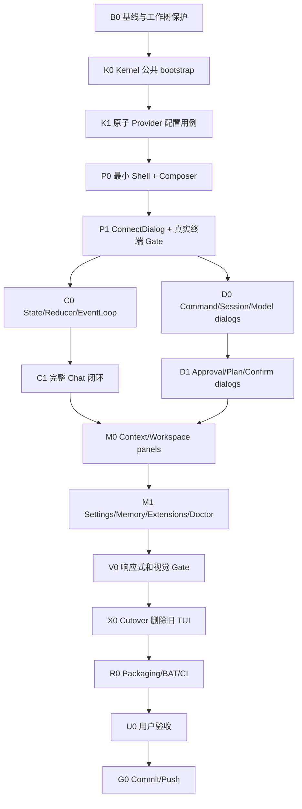

# Kairo TUI V2 从零重建执行计划

> 版本：1.0  
> 日期：2026-08-12  
> 适用仓库：`C:\Users\Admin\Desktop\project\pyTUI`  
> 当前基线分支：`main`  
> 编写目的：交给规模较小的模型机械执行；执行者不得自行重新设计架构、扩大范围或省略验收。

---

## 0. 任务结论

本计划不继续修补当前 TUI。保留 `kairo_kernel`，从空目录实现 TUI V2，并在 V2 完成真实 Windows Terminal 验收后一次性替换旧 `frontends/tui/kairo_tui`。

当前实现已经出现阻断首要路径的问题：

- 未完成 Setup 时，[`frontends/tui/kairo_tui/app.py`](../frontends/tui/kairo_tui/app.py) 主动将 Composer 设为 disabled，用户无法输入。
- [`frontends/tui/kairo_tui/screens/setup.py`](../frontends/tui/kairo_tui/screens/setup.py) 将多个输入控件动态挂载到 `Static`，缺少稳定标签、初始焦点和可验证的真实布局。
- 现有 Pilot 测试主要验证控件存在、handler 可调用、状态可改变，不能证明安装后的真实用户可以看清、聚焦和输入。
- 当前 headless smoke 不能发现焦点、键盘输入、颜色、按钮文本和终端尺寸问题。

因此，本轮完成标准不是“pytest 通过”，而是“安装后的真实终端可由用户只用键盘完成首条消息”。

---

## 1. 最终目标

交付一个 Python TUI，满足以下标准：

1. 启动后始终显示以聊天为中心的单一工作台。
2. Composer 永远可输入；是否配置 Provider 不影响输入和保存草稿。
3. 未配置 Provider 时，提交消息会打开“连接模型”对话框；关闭对话框后草稿保留。
4. 完成 Provider 配置后，原草稿可直接重试发送。
5. 支持流式文本、思考内容、工具卡、Plan、审批、停止、重试和并行 Session。
6. Session、Workspace、Model、Memory、Skills/MCP、Doctor 等功能通过命令面板、对话框或可选侧栏提供，不再使用七个全屏管理页面。
7. 所有业务数据和 mutation 通过 `KairoKernel` 公共门面；TUI 不直接访问数据库、service、engine、repository 或 registry。
8. Windows 安装后的 `kairo`、`kairo-tui`、`run.bat`、`run-tui.bat` 均启动同一 V2。
9. 最终仓库只保留一套 TUI，不保留 `legacy`、`next` 或双入口。

---

## 2. 非目标与禁止事项

### 2.1 本轮不做

- 不开发 WebUI 或 plain frontend。
- 不改变 Kernel turn engine、tool execution、authorization、session 存储的既有语义。
- 不修改 Kernel API/version 或 TUI package version，除非任务 K0 的公共 bootstrap 缺口确实要求 API 变更；变更必须由 Kernel Owner 单独提交。
- 不发布 PyPI，不创建 Release，不推送远端；最终推送由主集成者在用户验收后执行。
- 不复制 OpenCode 的源码、名称、Logo 或配色资产；只借鉴 chat-first、命令面板、Leader key、可选侧栏等交互范式。
- 不在 V2 原型阶段迁移 Settings、Workspace、Memory 等次要能力。

### 2.2 所有执行者共同禁止

- 禁止在旧 `frontends/tui/kairo_tui/**` 上继续修 UI，旧代码只用于行为取证。
- 禁止 `git reset --hard`、`git checkout -- .`、`git clean -fd`。
- 禁止删除或覆盖当前工作树中已有的未提交修改。
- 禁止修改 `dist/*.whl`，直到最终 Release 工单明确要求重建。
- 禁止前端导入：
  - `kairo_kernel.kernel`；
  - `kairo_kernel.engine`；
  - `kairo_kernel.services`；
  - `kairo_kernel.storage`；
  - `kairo_kernel.runtime`；
  - `kairo_kernel.tools`；
  - `kairo_kernel.providers`；
  - 任何以 `_` 开头的 Kernel 模块或属性。
- 禁止 Widget 直接调用 Kernel。
- 禁止 Controller 导入 Textual Widget 或修改 DOM。
- 禁止 UI 自己写 session JSON、SQLite、provider catalog、workspace revision、skills trust store。
- 禁止把 API key、token、secret value 放入 AppState、event、日志、snapshot、异常、测试 golden 或截图。
- 禁止为了测试通过而降低真实行为要求，例如重新禁用 Composer、直接调用 handler、跳过键盘事件、只断言 DOM id 存在。
- 禁止新增 `.pytest-*` 到仓库。测试临时目录必须使用系统临时目录；运行结束后不得在仓库留下 pytest 目录。

---

## 3. 当前事实与边界

### 3.1 保留的 Kernel 公共能力

V2 只能经由 `from kairo_kernel import ...`、`from kairo_kernel.contracts import ...` 和 `from kairo_kernel.ports import ...` 使用公开能力。`ports` 只用于实现或标注可注入适配器，不允许前端取得任何 concrete service：

- 生命周期：`start`、`status`、`capabilities`、`shutdown`。
- Turn：`submit`、`turn`、`wait`、`cancel`、`active_turns`。
- Session：`list`、`get`、`create`、`rename`、`delete`、`search`、`export`。
- Conversation：`history`、`clear`、`undo`、`compress`。
- Provider：`snapshot`、`resolve`、`probe`、`store_secret`、profile CRUD、role map/unmap、delete secret。
- Workspace：`snapshot`、`preview`、`tree`、`changed_files`、`diff`、`move`、bookmark mutation。
- Memory、Skills、MCP、Diagnostics、Tools。
- Event：`snapshot(after_sequence)`、`subscribe(after_sequence)`。
- Interaction：`pending`、`respond`。
- Preferences：`snapshot`、`patch`。
- Command：`catalog`、`parse`、`execute`。

### 3.2 已知 Kernel bootstrap 缺口

当前 TUI bootstrap 自己执行以下业务工作：

- 解析和加载全局 config document；
- 将 profiles 塞入 `KernelConfig`；
- 启动后逐个 seed role mappings；
- 维护另一套 `ConfigDocumentAdapter`；
- 以 `setup_complete` 推导 UI 是否可用。

Kernel 已有 `KernelConfigStore` 和 `DocumentProviderCatalog`，但它们位于 `kairo_kernel.services`，不是稳定根出口；`build_kernel` 仅在显式注入 `provider_catalog` 时从 repository 恢复 catalog。Gate K0 必须先提供统一公开 bootstrap，使所有前端不需要导入 service。

### 3.3 版本和打包约束

- Kernel distribution：`kairo-kernel==0.4.0a2`。
- TUI distribution：`kairo-tui==0.4.0a2`。
- Python：`>=3.11`。
- TUI runtime：`textual>=8.2,<9`、`rich>=14,<15`、`keyring>=25,<26`、`platformdirs>=4,<5`。
- console scripts：`kairo` 与 `kairo-tui` 都指向 TUI CLI。
- CI：Python 3.11–3.14，Windows/Linux/macOS。

---

## 4. 目标交互合同

### 4.1 默认界面

```text
┌ Kairo ─ Session ─ Workspace ─ Model ─ BUILD ────────────────────┐
│                                                                 │
│ You                                                             │
│ 检查当前项目                                                     │
│                                                                 │
│ Kairo                                                           │
│ 正在读取项目……                                                   │
│ ┌ Tool · list directory ──────────────────────────────────────┐ │
│ │ completed · 42 files                                       │ │
│ └─────────────────────────────────────────────────────────────┘ │
│                                                                 │
├─────────────────────────────────────────────────────────────────┤
│ Ask Kairo…                                                      │
│                                                                 │
├─────────────────────────────────────────────────────────────────┤
│ Not connected · Ctrl+P commands · Ctrl+X shortcuts · Esc stop   │
└─────────────────────────────────────────────────────────────────┘
```

### 4.2 输入合同

- 启动成功后焦点必须位于 Composer。
- Composer 在无 Provider、Kernel degraded、Setup 未完成等状态下仍可输入；只有应用 shutdown 后才可禁用。
- `Enter` 提交。
- `Shift+Enter`、`Ctrl+Enter`、`Alt+Enter` 插入换行。
- `Ctrl+Up`、`Ctrl+Down` 浏览本次进程输入历史。
- 中文、emoji、全角字符、粘贴、多行文本均不得丢失或错位。
- 提交失败时草稿保留；Turn 被 Kernel 接受后才清空 Composer。

### 4.3 未配置 Provider 的合同

1. 用户输入消息并按 Enter。
2. Controller 查询 provider catalog；若无可解析 chat profile，不调用 `kernel.submit`。
3. UI 保存 `pending_draft`，打开 `ConnectDialog`。
4. 用户可保存 Provider，或按 Escape/Cancel 返回。
5. Cancel 后 Composer 恢复原草稿并重新获得焦点。
6. Save 成功后关闭对话框；用户选择“发送”时用原草稿创建 Turn。

### 4.4 Escape 优先级

1. 关闭最上层 modal。
2. 如果存在 pending interaction，则用合法的 fail-closed action 响应。
3. 如果当前 Session 有 active turn，则调用 `kernel.cancel`。
4. 否则清除 Leader 状态。
5. Escape 绝不直接退出应用。

### 4.5 快捷键

| 按键 | 行为 |
|---|---|
| `Ctrl+P` | 命令面板 |
| `Ctrl+X` | 启动 2 秒 Leader chord |
| `Ctrl+X N` | 新 Session |
| `Ctrl+X L` | Session picker |
| `Ctrl+X B` | Context sidebar |
| `Ctrl+X M` | Model picker |
| `Ctrl+X C` | Compress 当前 Conversation |
| `Ctrl+L` | 聚焦 Composer |
| `Ctrl+T` | Thinking toggle |
| `Escape` | 按 4.4 处理 |

---

## 5. 目标目录和依赖方向

开发阶段使用独立包 `frontends/tui/kairo_tui_v2`，避免旧代码污染。最终 Cutover 时把它原子重命名为唯一的 `kairo_tui`。

```text
frontends/tui/kairo_tui_v2/
├── __init__.py
├── __main__.py
├── _version.py
├── cli.py
├── bootstrap.py
├── app.py
├── controller.py
├── state.py
├── reducer.py
├── event_loop.py
├── commands.py
├── redaction.py
├── theme.tcss
├── widgets/
│   ├── __init__.py
│   ├── shell.py
│   ├── transcript.py
│   ├── composer.py
│   ├── status.py
│   ├── message.py
│   ├── tool_card.py
│   └── plan_card.py
├── dialogs/
│   ├── __init__.py
│   ├── connect.py
│   ├── commands.py
│   ├── sessions.py
│   ├── models.py
│   ├── approval.py
│   ├── plan.py
│   └── confirm.py
└── panels/
    ├── __init__.py
    ├── context.py
    ├── workspace.py
    ├── settings.py
    ├── memory.py
    ├── extensions.py
    └── diagnostics.py
```

依赖方向固定为：

```text
Textual widgets/dialogs/panels
              ↓ UI intent / immutable view state
         app + controller
              ↓ public requests
        KairoKernel public API
              ↑ typed KernelEvent
        event_loop + reducer
              ↑
          immutable AppState
```

规则：

- `state.py`、`reducer.py` 不导入 Textual。
- `widgets/**`、`dialogs/**`、`panels/**` 不持有 Kernel。
- `controller.py` 可持有 Kernel，但不导入 Textual。
- `app.py` 负责 UI intent 转发和 view state 渲染，不实现业务 mutation。
- `bootstrap.py` 只调用新的 Kernel 公开 bootstrap。
- `redaction.py` 为纯函数，所有通知和错误展示先经过它。

---

## 6. 多 Agent 与 Git 执行规则

### 6.1 执行模式与并行槽位

默认使用**单分支串行模式**：所有工单依次在 `main` 上执行，每个工单一个提交。这最适合小模型，也符合仓库最终只保留一个 branch 的要求。不得为了“看起来并行”创建一批长期 feature branch。

只有 C0 与 D0、C1 与 D1 这两组被本计划明确标记的任务允许并行。确需并行时：

1. Integration Owner 先确保所有前置工单已经提交，工作树干净。
2. 使用 `git worktree add --detach <path> <freeze-sha>` 创建 detached worktree；不得创建新 branch。
3. 每个执行者只在自己的 detached worktree 修改白名单文件。
4. 执行者完成后生成单一 patch：`git diff --binary <freeze-sha> > <task-id>.patch`。
5. Integration Owner 在 `main` 上用 `git apply --3way --check` 预检，再用 `git apply --3way` 应用。
6. Integration Owner 运行该工单门禁并提交。
7. patch 已合入且验证后，删除 detached worktree 和临时 patch。

并行最多 3 个执行者加一个 Integration Owner。任何共享文件（`app.py`、`state.py`、`controller.py`、pyproject、BAT、CI）发生重叠时，立即退回单分支串行模式。

### 6.2 冻结点

- Freeze A：K0 合并后冻结公开 bootstrap 签名。
- Freeze B：P1 真实终端验收后冻结 `AppState`、UI intent 和基础 Widget id。
- Freeze C：C1 合并后冻结 KernelEvent → ViewState 映射。
- Freeze D：D1 合并后冻结快捷键和 modal result DTO。

冻结后，非 Owner 不得修改对应契约；发现缺口只提交 blocker 文档。

### 6.3 每个工单的提交要求

每个工单只允许一个提交，提交消息按本计划指定。提交前输出：

```text
Task ID:
Base SHA:
Changed files:
Tests run:
Manual checks:
Known limitations:
Contract changes: none / listed
```

禁止将 unrelated dirty files 加入提交。使用 `git diff --cached --name-only` 核对白名单。

### 6.4 小模型停止条件

出现以下任意情况必须停止并报告，不得猜测：

- 需要修改冻结 contract。
- 需要导入 Kernel 私有模块。
- 测试期望与本计划交互合同冲突。
- 同一错误修复两次仍失败。
- 需要删除用户原有未提交文件。
- 发现 secret 可能进入 state/event/log/snapshot。
- Textual 原型在真实 Windows Terminal 无法输入或焦点不可见。
- 任务需要修改白名单外文件。

---

## 7. 任务 DAG



硬规则：P1 未通过，不得启动 C0、D0 或后续任务。

---

## 8. 工单 B0：基线与工作树保护

### 目标

记录执行前仓库状态，保护当前未提交修改，建立 V2 专用 worktree 和真实失败证据。

### 负责人

Integration Owner，串行执行。

### 允许修改

- `docs/tui-v2-baseline.md`
- `.gitignore`，仅允许补充 `.pytest-*` 忽略规则。

### 禁止修改

- 所有 Python 源码。
- `dist/**`。
- BAT、CI、pyproject。

### 精确步骤

1. 执行并记录：

   ```powershell
   git branch --show-current
   git rev-parse HEAD
   git status --short
   git remote -v
   python --version
   python -m pip show textual rich kairo-kernel kairo-tui
   ```

2. 在 `docs/tui-v2-baseline.md` 写入：
   - 基线 SHA；
   - 当前 dirty files；
   - 截图文件名和观测结果；
   - 已确认代码根因；
   - 当前 `pytest frontends/tui/tests` 通过不代表可用；
   - Windows Terminal/CMD 的版本和窗口尺寸。

3. 确认 `.gitignore` 包含：

   ```gitignore
   .pytest-*/
   **/.pytest-*/
   ```

4. 后续所有 pytest 使用系统临时目录。不得使用仓库内 `--basetemp .pytest-xxx`。

5. 当前工作树已有未提交修改。开始实现前必须先由用户决定这些修改是纳入基线提交还是另存 patch；小模型不得自行丢弃或混入 V2 提交。
6. 用户选择纳入基线时：由 Integration Owner 审阅并提交一个明确的 checkpoint；用户选择另存时：执行 `git diff --binary > <系统临时目录>\pre-v2-working-tree.patch`，校验 patch 非空，并记录路径。禁止把 patch 放进仓库。
7. 默认后续工单直接在唯一 `main` 分支串行执行。只有 6.1 明确允许的并行组才使用 detached worktree。

### 验收

```powershell
git diff --check
git status --short
Get-ChildItem -Force -Directory | Where-Object Name -Like '.pytest*'
```

最后一条必须无输出。

### 提交

`docs(tui): record v2 rebuild baseline`

---

## 9. 工单 K0：Kernel 公共 bootstrap 与持久化统一

### 目标

让 TUI 只用 Kernel 根公共入口完成配置加载、provider catalog 恢复和启动；移除前端 seed roles 的必要性。

### 前置

- B0 完成。
- Base SHA 固定。

### 负责人

Kernel Owner。此工单必须串行；完成前其他执行者只能只读。

### 允许修改

- `kairo_kernel/__init__.py`
- 新建 `kairo_kernel/bootstrap.py`
- `kairo_kernel/factory.py`，仅 composition wiring
- `kairo_kernel/services/config_document.py`，仅补公共 bootstrap 所需的原子 document 更新能力
- `tests/kernel/test_public_bootstrap.py`
- `tests/kernel/contracts/test_contracts.py`，仅 public import smoke
- `docs/kernel/public-api.md`

### 禁止修改

- `kairo_kernel/engine/**`
- `kairo_kernel/runtime/**`
- `kairo_kernel/tools/**`
- `kairo_kernel/contracts/**`，除非 Owner 先报告 blocker 并获得集成者批准
- `frontends/**`
- package/API version

### 必须实现的公共类型

在 `kairo_kernel/bootstrap.py` 定义并从 `kairo_kernel.__init__` 导出：

```python
@dataclass(frozen=True)
class KernelOpenOptions:
    workspace_root: str
    config_path: str
    safe_mode: bool = False
    package_version: str | None = None

@dataclass(frozen=True)
class OpenedKernel:
    kernel: KairoKernel
    config_revision: int
    config_missing: bool
    config_warning: str | None

async def open_kernel(
    options: KernelOpenOptions,
    *,
    secrets: SecretPort | None = None,
    provider: ProviderPort | None = None,
    tools: ToolRegistryPort | None = None,
) -> KernelResult[OpenedKernel]: ...
```

如果实际类型循环依赖，允许将 `OpenedKernel.kernel` 用前向引用处理；不得返回裸 dict。

### 行为要求

1. 配置文件不存在：以空 `KernelConfigDocument` 启动，`config_missing=True`，不是错误。
2. 配置文件损坏：返回 typed failure；不得覆盖损坏文件。
3. 从 document 加载 profiles、roles、MCP servers、default profile。
4. 使用 `DocumentProviderCatalog` 作为 provider catalog repository，启动时恢复 catalog。
5. `KernelConfig` 接收 mcp servers 和 default profile。
6. safe mode：不自动连接 MCP，不写配置，不放宽 authorization。
7. Kernel start 失败时关闭已打开资源，不泄漏数据库连接。
8. Provider CRUD 和 role map/unmap 保存到同一 config document。
9. 不在 bootstrap 中读取或记录 secret value。
10. `open_kernel` 不能调用 `asyncio.run`；它是纯 async API。

### 测试清单

在 `tests/kernel/test_public_bootstrap.py` 至少实现：

1. `test_open_missing_document_starts_empty_kernel`
2. `test_open_restores_profiles_roles_and_default`
3. `test_open_invalid_document_fails_without_overwrite`
4. `test_provider_create_persists_to_document`
5. `test_role_mapping_persists_to_document`
6. `test_second_open_restores_first_open_mutations`
7. `test_safe_mode_does_not_connect_mcp`
8. `test_bootstrap_error_redacts_secret_markers`
9. `test_public_root_exports_open_kernel_types`
10. `test_open_failure_closes_database`

### 验收命令

```powershell
python -m pytest tests/kernel/test_public_bootstrap.py -q
python -m pytest tests/kernel -q
python -m ruff check kairo_kernel tests/kernel
python -m mypy kairo_kernel
python -c "from kairo_kernel import KernelOpenOptions, OpenedKernel, open_kernel; print('KERNEL_BOOTSTRAP_OK')"
```

### 完成定义

- 全部命令通过。
- `frontends/tui` 尚未修改。
- `kairo_kernel.__init__` 是唯一需要的 bootstrap import 路径。
- 提交后记录 Freeze A SHA。

### 提交

`feat(kernel): add public persisted bootstrap`

---

## 9A. 工单 K1：原子 Provider 配置用例与公共类型补齐

### 目标

ConnectDialog 只提交一个 typed request；Secret 保存、profile create/update、chat role mapping、default profile 持久化及失败补偿全部在 Kernel 内完成。TUI 不允许串联四个 facade mutation 来模拟事务。

### 前置

- K0 完成并记录 Freeze A SHA。

### 负责人

Kernel Owner，串行执行。

### 允许修改

- `kairo_kernel/contracts/providers.py`
- `kairo_kernel/contracts/__init__.py`
- `kairo_kernel/services/providers.py`
- `kairo_kernel/services/config_document.py`
- `kairo_kernel/kernel.py`
- `kairo_kernel/__init__.py`，仅新增 public export 时
- `tests/kernel/providers/test_connect_provider.py`
- `tests/kernel/contracts/test_contracts.py`
- `docs/kernel/public-api.md`

### 禁止修改

- engine、turn state machine、tools、runtime broker
- TUI
- 版本号
- 其他 contracts

### 必须新增的公共 DTO

在 `contracts/providers.py` 定义并通过 `contracts/__init__.py` 导出：

```python
@dataclass(frozen=True)
class ProviderConnectionRequest(Contract):
    profile: ProviderProfile
    secret: SecretInput | None = field(default=None, repr=False, compare=False)
    role: str = "chat"
    make_default: bool = True
    expected_revision: int = 0

@dataclass(frozen=True)
class ProviderConnectionReceipt(Contract):
    profile_id: ProfileId
    role: str
    catalog_revision: int
    default_profile_id: ProfileId | None
```

如 `SecretInput` 的现有 `repr=False` 已足够，外层仍必须 `repr=False`，并增加 repr/JSON redaction 测试。JSON serializer 不得序列化 secret value；如果 Contract 基类默认会序列化，则 `ProviderConnectionRequest` 不得继承可序列化 Contract，改为 frozen dataclass command object，并在文档写清其进程内、不可持久化语义。

### 必须新增的 facade

```python
await kernel.providers.configure(request) -> KernelResult[ProviderConnectionReceipt]
```

### 事务算法

1. 经过 Kernel mutation gate；busy/closing/degraded 时立即失败。
2. 校验 expected catalog revision。
3. 校验 profile 和 role；若提供 secret，其 `secret_id` 必须等于 profile 的 secret reference。
4. 读取 secret descriptor，记录本次 secret 是否为新建；不得读取旧 secret value用于日志或回滚缓存。
5. 暂存新 secret。
6. 在一个 config document update 中同时写入：profiles、role mapping、default_profile_id。
7. document 持久化成功后才交换 live provider catalog snapshot。
8. 任一步失败：
   - live snapshot 不变；
   - document revision 不增长；
   - 若本次创建了全新 secret，则删除它；
   - 若是替换已有 secret且后续失败，因无法恢复旧 secret value，禁止先覆盖：必须调整顺序或使用 SecretPort 的 staging 能力；若现有 port 不支持安全替换，返回 typed `CONFIG_PERSISTENCE_FAILED` 并保留 modal，不得做非原子覆盖。
9. 补偿失败则 `kernel.mark_degraded(...)`，后续 mutation 被拒绝。
10. 成功后发出一个 Provider changed event；不得发四个中间成功事件。

### 设计边界

如果现有 `SecretPort` 无法满足“替换旧 secret 的原子性”，小模型必须停止并提交 blocker，列出需要新增的最小 staging/compare-and-swap port；不得降低为“先写 key，失败就算了”。

### 测试清单

1. 新 profile + 新 secret + role + default 一次成功。
2. 无 secret 的环境引用 profile 成功。
3. expected revision conflict 零副作用。
4. secret store 失败零副作用。
5. document save 失败删除新 secret。
6. catalog live swap 仅发生在持久化后。
7. compensation 失败进入 degraded。
8. 重启后恢复 profile、role、default。
9. exactly one change event。
10. request repr、error、event、JSON 中无 secret marker。
11. busy/closing/degraded gate。
12. invalid role/profile/secret reference typed failure。

### 验收

```powershell
python -m pytest tests/kernel/providers/test_connect_provider.py tests/kernel/contracts/test_contracts.py -q
python -m pytest tests/kernel -q
python -m ruff check kairo_kernel tests/kernel
python -m mypy kairo_kernel
```

### Freeze A2

记录 `ProviderConnectionRequest`、`ProviderConnectionReceipt`、`kernel.providers.configure` 的签名。P1 只能使用这一用例，不得自行组合 secret/profile/role/default mutation。

### 提交

`feat(kernel): add atomic provider connection use case`

---

## 10. 工单 P0：最小可输入 Shell

### 目标

建立完全独立的 TUI V2 最小原型，只包含 TopBar、Transcript、Composer、StatusLine；无 SetupScreen、无 management pages。

### 前置

- K0、K1 合并。
- Freeze A SHA 已记录。

### 负责人

Prototype Owner，串行。

### 允许修改

- 新建 `frontends/tui/kairo_tui_v2/**`，仅：
  - `__init__.py`
  - `__main__.py`
  - `_version.py`
  - `cli.py`
  - `bootstrap.py`
  - `app.py`
  - `state.py`
  - `reducer.py`
  - `theme.tcss`
  - `widgets/__init__.py`
  - `widgets/shell.py`
  - `widgets/transcript.py`
  - `widgets/composer.py`
  - `widgets/status.py`
- 新建 `frontends/tui/tests_v2/**`，仅本工单测试
- `frontends/tui/pyproject.toml`，仅把 `kairo_tui_v2` 纳入开发 package discovery；暂不切 console script

### 禁止修改

- 旧 `frontends/tui/kairo_tui/**`
- 旧 `frontends/tui/tests/**`
- Kernel
- BAT、CI、docs、dist

### 必须实现的 AppState

`state.py` 使用 frozen dataclass，至少字段：

```python
@dataclass(frozen=True)
class AppState:
    kernel_status: KernelStatus | None = None
    active_session_id: SessionId | None = None
    workspace_label: str = ""
    model_label: str = "Not connected"
    draft: str = ""
    pending_draft: str | None = None
    active_turn_id: TurnId | None = None
    overlay: OverlayKind | None = None
    sidebar_visible: bool = False
    leader_active: bool = False
    shutting_down: bool = False
```

不得加入 secret、mutable list、Kernel concrete service 或 Textual Widget。

### Composer 合同

1. 使用 Textual `TextArea` 或自定义可聚焦文本控件。
2. `can_focus=True`。
3. App `on_mount` 最后一个动作是 `composer.focus()`。
4. 不存在 `setup_complete` 字段或 disabled 逻辑。
5. `Enter` 发送 intent；`Shift/Ctrl/Alt+Enter` 换行。
6. 提交 intent 后不立即清空；由 Controller 的 Accepted action 清空。
7. Failed action 恢复 draft 并 focus。
8. placeholder 只写提示；不能充当字段标签。

### Shell CSS 合同

- TopBar 高度 1–2 行。
- Transcript `height: 1fr`。
- Composer 3–8 行，始终位于底部。
- StatusLine 1 行。
- 不创建 nav rail。
- 不创建 SetupScreen。
- 不对 `Input`、`Select`、`Button` 使用全局 `width: 1fr`。
- 焦点边框和非焦点边框颜色必须有明显差异。
- 80×24 下 TopBar/Composer/StatusLine 均显示。

### 测试清单

在 `tests_v2/test_shell_input.py` 使用 Pilot 真实按键：

1. `test_composer_has_focus_after_mount`
2. `test_typing_ascii_updates_draft`
3. `test_typing_chinese_updates_draft`
4. `test_paste_multiline_preserves_text`
5. `test_enter_posts_submit_intent_without_clearing_draft`
6. `test_shift_enter_inserts_newline`
7. `test_ctrl_l_restores_composer_focus`
8. `test_composer_is_enabled_without_provider`
9. `test_80x24_keeps_composer_visible`
10. `test_60x20_keeps_composer_focusable`

禁止在这些测试里直接调用 `action_submit()`；必须 `pilot.press` 或 Textual paste event。

### 验收命令

```powershell
python -m pytest frontends/tui/tests_v2/test_shell_input.py -q
python -m ruff check frontends/tui/kairo_tui_v2 frontends/tui/tests_v2
python -m mypy frontends/tui/kairo_tui_v2
```

### 提交

`feat(tui): add v2 input-first shell prototype`

---

## 11. 工单 P1：ConnectDialog 与真实终端 Gate

### 目标

让无 Provider 的用户仍能输入；提交后通过可读、可键盘操作的 modal 配置 Provider。

### 前置

- P0 完成。

### 允许修改

- `frontends/tui/kairo_tui_v2/controller.py`
- `frontends/tui/kairo_tui_v2/dialogs/__init__.py`
- `frontends/tui/kairo_tui_v2/dialogs/connect.py`
- `frontends/tui/kairo_tui_v2/app.py`
- `frontends/tui/kairo_tui_v2/state.py`
- `frontends/tui/kairo_tui_v2/reducer.py`
- `frontends/tui/kairo_tui_v2/theme.tcss`
- `frontends/tui/tests_v2/test_connect_dialog.py`
- `frontends/tui/tests_v2/test_real_input_contract.py`
- `frontends/tui/tests_v2/manual_windows_checklist.md`

### 禁止修改

- Kernel frozen contract
- 旧 TUI
- 其他 dialogs/panels
- CLI console script

### ConnectDialog 字段

顺序固定：

1. Provider type：Select，选项 `OpenAI Responses`、`OpenAI Chat Completions`、`Anthropic`。
2. Model：Input，永久标签 `Model`。
3. Base URL：Input，永久标签 `Base URL`。
4. API key：password Input，永久标签 `API key`。
5. Context window：Input。
6. Max output tokens：Input。
7. Temperature：Input。
8. `Test connection`、`Save and send`、`Save`、`Cancel` 四个有文字按钮。

### 默认值

| Provider | provider id | Base URL |
|---|---|---|
| OpenAI Responses | `openai_responses` | `https://api.openai.com/v1` |
| OpenAI Chat | `openai_chat` | `https://api.openai.com/v1` |
| Anthropic | `anthropic` | `https://api.anthropic.com` |

Model 不提供猜测默认值，必须由用户输入。

### Controller 精确流程

1. 收到 `SubmitDraft(text)`。
2. `text.strip()` 为空则 no-op。
3. 查询 `kernel.providers.resolve(role="chat")`。
4. 若 resolve 成功，进入后续 Turn submit；P1 可以只显示 `Ready to submit`，C1 再接实际 Turn。
5. 若 `NOT_FOUND`：dispatch `OpenConnectDialog(pending_draft=text)`。
6. Cancel：dispatch `CloseOverlay(restore_draft=True)`，App 下一 refresh focus Composer。
7. Save：
   - 构造一个 `ProviderConnectionRequest`；
   - 只调用一次 `kernel.providers.configure(request)`；
   - 禁止 TUI 顺序调用 store secret/create profile/map role/default preference；
   - 失败显示 redacted inline error，modal 保持打开；
   - profile_id 固定为 `{provider}:{model}`，特殊字符按 Kernel contract 处理，不自行 hash；
   - 成功后立即清除 API key widget value；AppState 从未接收 API key。
8. Save and send：Save 成功后 dispatch `RetryPendingDraft`。

### 焦点合同

- 打开 modal 后焦点在 Provider Select 或 Model Input。
- `Tab` 顺序严格按字段和按钮顺序。
- `Shift+Tab` 反向。
- `Escape` 等同 Cancel。
- Cancel 后 Composer 恢复 pending draft 并获得焦点。
- Save 失败后焦点移到第一个无效字段或错误摘要。

### 自动测试

1. `test_submit_without_provider_opens_connect_dialog`
2. `test_cancel_restores_original_draft_and_focus`
3. `test_tab_order_visits_all_fields_and_actions`
4. `test_labels_are_visible_without_placeholders`
5. `test_buttons_have_nonempty_text`
6. `test_missing_model_stays_open_with_inline_error`
7. `test_save_calls_atomic_kernel_provider_configure_once`
8. `test_save_and_send_retries_exact_original_draft`
9. `test_api_key_never_enters_app_state_repr`
10. `test_api_key_never_enters_notification_or_error_text`
11. `test_escape_does_not_exit_application`
12. `test_dark_and_light_theme_button_foreground_contrast`

### 真实 Windows Terminal Gate

此 Gate 不能由 pytest 代替。执行者构建临时开发入口：

```powershell
$env:PYTHONPATH = "frontends\tui"
python -m kairo_tui_v2 --config "$env:TEMP\kairo-tui-v2-empty.json"
```

人工逐项记录 PASS/FAIL：

1. 启动后直接输入 `hello 中文 🚀`，字符出现在 Composer。
2. 按 Enter，ConnectDialog 出现。
3. 所有字段标签可见。
4. 所有按钮文字可见。
5. Tab 顺序无跳跃，无不可见焦点。
6. Escape 关闭 modal，原文本完整恢复。
7. 窗口分别调整到 80×24、120×30、200×50；Composer 始终可见。
8. Windows Terminal、传统 `cmd.exe` 各执行一次。

保存四张截图到本工单交付说明，但截图不得包含真实 API key。截图不提交仓库，除非用户明确要求。

### Textual 失败回退条件

任一条件成立即停止后续 Textual 开发：

- Windows Terminal 或 cmd.exe 无法稳定输入；
- 中文输入丢字；
- 焦点不可见或 Tab 顺序无法稳定控制；
- 80×24 无法保留 Composer；
- 按钮文字仍为空白或主题不可读。

回退方案：新建决策工单，将 P0/P1 用 `prompt_toolkit>=3.0,<4` 重做；不要同时保留 Textual 和 prompt_toolkit 两套实现。

### Freeze B

P1 只有在用户看到截图或现场运行并明确确认后才完成。记录：

- Shell widget ids；
- AppState 字段；
- UI intents；
- modal result DTO；
- 快捷键。

### 提交

`feat(tui): add v2 provider connection flow`

---

## 12. 工单 C0：State、Reducer 和 Kernel EventLoop

### 目标

建立唯一、可重放、无 Widget 引用的 UI 状态模型，并可靠消费 Kernel events。

### 可与 D0 并行

只有 Freeze B 后允许并行。

### 允许修改

- `kairo_tui_v2/state.py`
- `kairo_tui_v2/reducer.py`
- `kairo_tui_v2/event_loop.py`
- `kairo_tui_v2/controller.py`，仅新增 turn/session intent
- `tests_v2/test_reducer.py`
- `tests_v2/test_event_loop.py`
- `tests_v2/support/fakes.py`

### 禁止修改

- widgets/dialogs/theme/app
- Kernel
- Freeze B DTO

### 状态要求

加入：

- Session summaries 和 active session id；
- 每 Session 独立 transcript；
- active turns；
- pending interactions；
- global last sequence；
- workspace root/revision；
- provider/profile label；
- per-turn terminal state；
- transient redacted notice。

所有 collection 使用 tuple、frozen dataclass 或只读 mapping；不得使用共享 mutable list/dict。

### EventLoop 算法

1. 读取 state.last_sequence。
2. 调 `kernel.events.subscribe(after_sequence=last_sequence)`；必须采用 Kernel 原子 replay→live 语义。
3. 对每个 event：
   - sequence <= last_sequence：去重丢弃；
   - sequence > last_sequence + 1：触发 recovery snapshot；
   - 正常 event：纯 reducer fold；
   - subscriber overflow：从 last_sequence 重订阅；
   - UI 卸载或 shutdown：关闭 subscription。
4. subscriber/handler 异常不能结束应用；写 redacted notice，并重试一次。
5. 每 turn 只接受一个 terminal event。

### 测试

- replay/live 边界无重复；
- gap recovery；
- overflow recovery；
- duplicate event no-op；
- unknown event no crash；
- terminal exactly once；
- session correlation；
- workspace revision stale drop；
- interaction requested/resolved；
- secret marker scan；
- close 不留下 task；
- 50 轮 emit/recover 无死锁。

### 验收

```powershell
python -m pytest frontends/tui/tests_v2/test_reducer.py frontends/tui/tests_v2/test_event_loop.py -q
python -m ruff check frontends/tui/kairo_tui_v2/state.py frontends/tui/kairo_tui_v2/reducer.py frontends/tui/kairo_tui_v2/event_loop.py frontends/tui/tests_v2
python -m mypy frontends/tui/kairo_tui_v2/state.py frontends/tui/kairo_tui_v2/reducer.py frontends/tui/kairo_tui_v2/event_loop.py
```

### 提交

`feat(tui): add v2 state and event pipeline`

---

## 13. 工单 C1：完整 Chat 闭环

### 目标

实现消息提交、stream、thought、usage、tool/plan card、stop/retry、历史恢复和多 Session 后台 turn。

### 前置

- C0 完成。
- D1 可以尚未完成；approval 可用 fake view 占位，但不得自动批准。

### 允许修改

- `widgets/transcript.py`
- `widgets/message.py`
- `widgets/tool_card.py`
- `widgets/plan_card.py`
- `widgets/status.py`
- `controller.py`
- `app.py`
- `tests_v2/test_chat_flow.py`
- `tests_v2/test_chat_rendering.py`

### 核心流程

1. 用户提交：确保 session；构造 `TurnRequest`；调用 `kernel.submit`。
2. 只有 `TurnAccepted.ok` 后清空 draft，插入 user message。
3. 失败：保留 draft，展示 typed redacted error。
4. event reducer 按 turn/session 组装 assistant message。
5. thought 和 content 分离；thought 默认折叠。
6. tool requested/started/output/completed 更新同一 ToolCard。
7. Plan 作为结构化 card，不能混入普通 content。
8. Stop 调 `kernel.cancel`；按钮变为 `Stopping…`，禁止重复请求。
9. partial response 和 `[stopped]` 只按 Kernel event/history 展示，TUI 不自行拼接。
10. Retry 使用最后一条 user message 的精确文本创建新 turn；不能删除旧失败记录。
11. Session 切换不取消后台 turn。
12. 每个 Session transcript 独立。

### 测试矩阵

- submit accepted 才清空；
- submit failure 保留；
- content delta 合并；
- thought delta 单独折叠；
- usage 只显示一次；
- multi-round tool；
- tool error；
- Plan card；
- stop streaming；
- stop running tool；
- retry failed turn；
- partial save；
- two sessions parallel；
- switch session during stream；
- recovery loads history；
- long markdown；
- code block；
- Unicode/emoji width；
- exactly one terminal visual state。

### Freeze C

记录 EventType → UI ViewModel 映射表；后续工单不得重新解释 event payload。

### 提交

`feat(tui): complete v2 chat workflow`

---

## 14. 工单 D0：Command、Session 和 Model 对话框

### 目标

实现命令面板和两个核心 picker；不创建管理页面。

### 可与 C0/C1 并行

必须基于 Freeze B DTO。

### 允许修改

- `commands.py`
- `dialogs/commands.py`
- `dialogs/sessions.py`
- `dialogs/models.py`
- `tests_v2/test_command_palette.py`
- `tests_v2/test_session_dialog.py`
- `tests_v2/test_model_dialog.py`

### Command Palette 要求

- `Ctrl+P` 打开并聚焦搜索框。
- 合并 TUI local commands 与 `kernel.commands.catalog()`。
- TUI local commands 仅限展示动作：open sessions/models/sidebar/settings 等。
- Kernel command 由 `kernel.commands.parse/execute` 执行。
- fuzzy/filter 大小写不敏感。
- Up/Down 选择，Enter 执行，Escape 关闭。
- 无结果显示 `No matching commands`。

### Session Picker

- 列表显示 name、更新时间、running badge。
- 支持搜索、新建、切换、rename、delete confirm。
- 切换不取消后台 turn。
- 删除最后一个 Session 时遵从 Kernel typed error。

### Model Picker

- 来自 `kernel.providers.snapshot()`。
- 显示 label、provider、model，不显示 secret id/value。
- 选择后使用 preferences/command 公共接口更新 chat profile。
- `Connect another model…` 打开 ConnectDialog。

### 测试

每个对话框覆盖：打开焦点、键盘遍历、搜索、选择、取消、错误、空状态、长文本、80×24。

### 提交

`feat(tui): add v2 command session and model dialogs`

---

## 15. 工单 D1：Approval、Plan 和 Confirm 对话框

### 目标

完整处理 Kernel pending interactions，全部 fail closed。

### 允许修改

- `dialogs/approval.py`
- `dialogs/plan.py`
- `dialogs/confirm.py`
- `controller.py`，仅 interaction response
- `app.py`，仅 modal routing
- `tests_v2/test_interactions.py`

### 行为要求

- Interaction 由 `interaction_id + turn_id` 关联。
- 只展示 request 提供的合法 action。
- 不使用数组 index 代表 action。
- Tool approval 支持 Run once、Reject、Stop，以及 request 给出的 broader authorization。
- Plan 支持 Approve、Edit、Cancel；Edit 必须提供真正的文本输入并提交。
- timeout/disconnect/shutdown/invalid response 一律 fail closed。
- Escape 优先选择 `STOP`；若 request 不允许 STOP，则选择 safe cancel/reject；绝不默认 approve。
- response 成功前 modal 不消失；失败显示 redacted error。
- 同时多个 interaction 按请求顺序排队，不叠多层 modal。

### 测试

- approve once；
- reject；
- stop；
- enable auto/yolo only if offered；
- invalid action rejected；
- stale interaction；
- duplicate response；
- timeout；
- shutdown；
- Escape fail closed；
- Plan approve/edit/cancel；
- exact correlation；
- secret scan。

### Freeze D

冻结快捷键、modal result DTO 和 Escape 优先级。

### 提交

`feat(tui): add v2 fail-closed interactions`

---

## 16. 工单 M0：Context 与 Workspace 侧栏

### 目标

在不离开聊天的情况下展示上下文和 workspace；所有结果受 revision 保护。

### 允许修改

- `panels/context.py`
- `panels/workspace.py`
- `app.py`，仅 sidebar slot
- `state.py/reducer.py`，仅 Frozen view state
- `tests_v2/test_context_panel.py`
- `tests_v2/test_workspace_panel.py`

### Context 内容

- active session/model；
- token/context usage；
- active turn phase；
- pending interactions；
- workspace revision；
- loaded skills/tools 数量。

### Workspace 内容

- lazy tree；
- changed files；
- preview/diff；
- bookmark；
- move workspace confirm。

### 约束

- 侧栏默认关闭。
- 宽屏宽度 36–44；窄屏覆盖层；80×24 全屏 overlay。
- 所有 workspace response 校验 root+revision；stale response 丢弃。
- move 成功后刷新；失败不改变 UI revision。
- 不自行执行 git。

### 提交

`feat(tui): add v2 context and workspace panels`

---

## 17. 工单 M1：Settings、Memory、Extensions、Doctor

### 目标

完成剩余 Kernel capability，但仍使用 modal/sidebar，不恢复全屏页面导航。

### 允许修改

- `panels/settings.py`
- `panels/memory.py`
- `panels/extensions.py`
- `panels/diagnostics.py`
- 对应 `tests_v2/test_*_panel.py`
- `commands.py`，仅注册打开动作

### Settings

- profiles CRUD、role mapping、secret store/delete、preferences、theme、reduced motion。
- profile 被 role 使用时，删除错误原样映射。
- secret 输入只存在于 password widget 生命周期。
- 修改使用 expected revision；CONFLICT 时刷新并要求用户重试。

### Memory

- namespace + query + tags 搜索；
- create/edit/delete；
- mutation 后刷新；
- 不允许空 namespace 时伪造默认 namespace。

### Extensions

- Skills inspect/reload/trust/revoke；
- MCP catalog/connect/refresh；
- digest drift 明确提示；
- trust 必须显式确认。

### Doctor

- local/full；
- 每 check 状态/耗时/消息；
- cancel UI worker；
- copy redacted report；
- 不把 provider key 输出到 clipboard。

### 提交

`feat(tui): complete v2 management capabilities`

---

## 18. 工单 V0：响应式、主题、可访问性和视觉 Gate

### 目标

以实际可见结果验收，不再以 DOM 存在代替 UI 可用。

### 允许修改

- `theme.tcss`
- `widgets/**` 的 presentation-only 属性
- `dialogs/**`、`panels/**` 的 CSS classes，不改业务流程
- `tests_v2/test_size_matrix.py`
- `tests_v2/test_focus_contract.py`
- `tests_v2/test_visual_snapshots.py`
- `docs/tui-v2-visual-acceptance.md`

### 尺寸矩阵

| 尺寸 | 要求 |
|---|---|
| 60×20 | Composer 可输入；显示尺寸紧凑提示；无控件重叠 |
| 80×24 | 完整最小体验；modal 可滚动；按钮可见 |
| 120×30 | 标准聊天体验 |
| 160×40 | 可显示 sidebar |
| 200×50 | 不把表单拉成全宽；内容有最大宽度 |

### 视觉断言

- 每个 Button 的 rendered label 非空。
- focus widget 具有可检测的高亮 class/style。
- modal 不超出 screen。
- 无水平滚动条，代码块例外。
- form label 与 input 同时可见。
- 主要动作、危险动作、取消动作有一致但可区分的样式。
- light/dark theme 前景/背景不相同。
- reduced motion 无 transition/animation。

### 人工截图清单

每种尺寸至少截图：

1. 空聊天；
2. 输入中文；
3. ConnectDialog；
4. streaming；
5. tool approval；
6. command palette；
7. workspace sidebar；
8. settings。

每张截图人工检查后在 `docs/tui-v2-visual-acceptance.md` 写 PASS/FAIL 和问题。禁止只写“看起来正常”。

### 提交

`test(tui): add v2 visual and focus acceptance gates`

---

## 19. 工单 X0：Cutover 与旧 TUI 删除

### 目标

V2 通过用户视觉确认后，原子替换旧 TUI，最终只保留一个 package/entrypoint/test suite。

### 前置硬门

- K0、K1、P0–V0 全部通过。
- 用户明确确认 V2 最小原型和最终视觉。
- Integration Owner 已记录当前 dirty files。

### 负责人

只能由 Integration Owner 执行，禁止并行。

### 精确步骤

1. 保存旧行为中仍需保留的 config migration/keyring/path 工具清单。
2. 将 V2 必需且已验证的纯工具迁入新包；禁止复制旧 screens/store。
3. 删除旧 `frontends/tui/kairo_tui`。
4. 将 `kairo_tui_v2` 重命名为 `kairo_tui`。
5. 删除旧 `frontends/tui/tests`。
6. 将 `tests_v2` 重命名为 `tests`。
7. 更新 imports、package discovery、wheel content test。
8. `rg` 确认零残留：

   ```powershell
   rg -n "SetupScreen|setup_complete|composer\.disabled|kairo_tui_v2|legacy" frontends/tui
   ```

   预期无命中；文档迁移说明中的历史描述例外必须显式列出。

9. AST boundary 检查前端只导入 root/contracts。
10. 不重建 wheel，先完成源码全套测试。

### 必须新增边界测试

- `test_no_setup_screen`
- `test_no_composer_setup_gate`
- `test_single_tui_package`
- `test_frontend_imports_only_kernel_public_surface`
- `test_widgets_do_not_reference_kernel`
- `test_controller_does_not_import_textual_widgets`
- `test_no_secret_fields_in_app_state`

### 提交

`refactor(tui): replace legacy frontend with v2`

---

## 20. 工单 R0：Packaging、BAT、CI 和干净安装

### 目标

重建两个 wheel，验证 clean venv 安装，确保所有 Windows 入口启动同一个 V2。

### 负责人

Integration Owner，串行。

### 允许修改

- `frontends/tui/pyproject.toml`
- `.github/workflows/ci.yml`
- `install.bat`
- `run.bat`
- `run-tui.bat`
- `README.md`
- `frontends/tui/README.md`
- `docs/en/**`
- `docs/zh/**`
- packaging tests
- `dist/kairo_kernel-0.4.0a2-py3-none-any.whl`
- `dist/kairo_tui-0.4.0a2-py3-none-any.whl`

### BAT 合同

- 所有 BAT 先 `cd /d "%~dp0"`。
- Python <3.11 给出可读错误。
- `run-tui.bat` 可创建 `.venv`、安装 editable kernel/TUI、先 headless smoke、再启动。
- `install.bat` 只安装本地两个 wheel；不从源码目录隐式 import。
- `kairo.bat` 和 `kairo-tui.bat` 都指向 managed venv 中的 V2 console script。
- 不覆盖未知安装目录；保留 owner manifest 保护。
- 安装结束提示打开新终端。

### Headless smoke 必须升级

不能只 import。至少验证：

1. Kernel open/start/status/shutdown；
2. App compose；
3. Composer enabled；
4. Composer can_focus；
5. 无 provider 启动；
6. 不留下 worker/subscription；
7. 输出唯一标记 `KAIRO_TUI_SMOKE_OK`。

### 构建和验证

```powershell
python -m pytest tests/kernel -q
python -m pytest frontends/tui/tests -q
python -m ruff check kairo_kernel tests/kernel
Push-Location frontends/tui
python -m ruff check kairo_tui tests
python -m mypy kairo_tui
Pop-Location
python -m mypy kairo_kernel
python -m build
python -m build frontends\tui --outdir dist
python -m twine check dist\*.whl
python -m pytest tests/kernel/packaging -q
python -m pytest frontends/tui/tests/test_wheel_content.py -q
```

### 干净 venv 安装

在系统临时目录创建 venv；不得复用开发 `.venv`。当前发行物没有捆绑第三方依赖 wheel，因此此门禁明确允许 pip 从配置的软件源解析 Textual/Rich/keyring/platformdirs/aiosqlite/httpx；不要把它伪装成离线验收：

```powershell
$checkRoot = Join-Path $env:TEMP "kairo-tui-v2-wheel-check"
python -m venv "$checkRoot\venv"
& "$checkRoot\venv\Scripts\python.exe" -m pip install --upgrade pip
& "$checkRoot\venv\Scripts\python.exe" -m pip install `
  "dist\kairo_kernel-0.4.0a2-py3-none-any.whl" `
  "dist\kairo_tui-0.4.0a2-py3-none-any.whl"
& "$checkRoot\venv\Scripts\kairo-tui.exe" --headless-smoke
& "$checkRoot\venv\Scripts\kairo.exe" --headless-smoke
```

如果未来要交付离线安装包，必须另立工单生成并审计完整 wheelhouse，再把 installer 改为 `--no-index --find-links`；本工单不得声称已经完成离线交付。

### BAT 验收

在临时安装根执行：

```powershell
$env:KAIRO_INSTALL_ROOT = Join-Path $env:TEMP "Kairo-v2-install"
$env:KAIRO_SKIP_PATH = "1"
$env:KAIRO_NONINTERACTIVE = "1"
cmd.exe /c install.bat
cmd.exe /c run.bat --headless-smoke
cmd.exe /c run-tui.bat --headless-smoke
```

### CI

- Python 3.11–3.14；Windows/Linux/macOS。
- TUI Pilot tests 不依赖真实网络和真实 keyring。
- Windows job 增加 `cmd.exe /c ... --headless-smoke`。
- Alpha wheel job验证两个 entrypoint。

### 提交

`build(tui): package and launch v2 frontend`

---

## 21. 工单 U0：用户验收

### 目标

由用户验证安装后的真实交互；未通过不得 push。

### 验收脚本

用户在全新终端执行：

```bat
install.bat
kairo
```

逐项验收：

1. 启动后立即输入中文。
2. 无 Provider 时 ConnectDialog 出现。
3. Cancel 后文字保留。
4. 使用测试 Provider 或用户配置完成连接。
5. 首条消息发送并获得流式回复。
6. `Ctrl+P` 打开命令面板。
7. `Ctrl+X L` 打开 Session picker。
8. `Ctrl+X B` 打开/关闭 sidebar。
9. Tool approval 可以 Reject。
10. Escape 可以停止 turn，但不会退出应用。
11. 关闭并重开，Session 和 Provider profile 恢复。
12. 最大化、80×24、120×30 下均可输入。

发现任一 P0 问题立即回退到对应工单，不在用户面前临时改 CSS。

### 交付记录

在 `docs/tui-v2-user-acceptance.md` 记录日期、安装方式、终端、每项 PASS/FAIL、剩余问题；禁止记录 secret。

---

## 22. 工单 G0：最终提交与推送

### 前置

- U0 全部 PASS。
- 用户明确授权推送。
- 当前只有 `main` 分支策略已确认。

### 步骤

1. `git status --short`，确认无 pytest/cache/临时截图。
2. `git diff --check`。
3. 核对 wheel SHA256 并写入交付报告。
4. 运行 R0 全部门禁一次。
5. 合并为用户要求的提交结构；不得把 unrelated 用户文件混入。
6. 检查本地/远端只保留目标 branch；删除 branch 是破坏性操作，必须单独获得用户确认。
7. push 后比较：

   ```powershell
   git rev-parse HEAD
   git ls-remote origin refs/heads/main
   ```

   两个 SHA 必须相同。

---

## 23. 每个工单通用验收模板

小模型完成工单时必须逐字填充以下模板：

```markdown
## Task completion

- Task ID:
- Base SHA:
- Result SHA:
- Goal achieved: yes/no

### Files changed

- path: reason

### Files intentionally not changed

- path/scope: reason

### Tests

- command: exact result

### Manual verification

- step: PASS/FAIL + observation

### Boundary audit

- forbidden imports: zero / list
- secret scan: pass/fail
- pytest temp dirs in repo: zero / list
- unrelated dirty files preserved: yes/no

### Known limitations

- none / exact limitation

### Blockers

- none / exact blocker and required owner
```

如果 `Goal achieved` 为 no，禁止提交“完成”结论。

---

## 24. 全局验收矩阵

| 能力 | 自动测试 | 真实终端 | 完成波次 |
|---|---:|---:|---|
| 启动后 Composer 焦点 | 必须 | 必须 | P0 |
| 无 Provider 可输入 | 必须 | 必须 | P0 |
| Connect Cancel 保留草稿 | 必须 | 必须 | P1 |
| Provider 持久恢复 | 必须 | 必须 | K0/P1 |
| 消息流式输出 | 必须 | 必须 | C1 |
| Stop/Retry | 必须 | 必须 | C1 |
| Session 并行 | 必须 | 建议 | C1/D0 |
| Tool approval fail closed | 必须 | 必须 | D1 |
| Plan edit | 必须 | 必须 | D1 |
| Workspace revision | 必须 | 建议 | M0 |
| Settings/Memory/Doctor | 必须 | 抽查 | M1 |
| 60×20/80×24/120×30/200×50 | 必须 | 必须 | V0 |
| Wheel clean install | 必须 | 必须 | R0 |
| BAT 启动 | 必须 | 必须 | R0/U0 |
| 用户认可视觉和交互 | 不可替代 | 必须 | U0 |

---

## 25. 最终 Definition of Done

只有以下条件全部成立，才可声称 TUI V2 完成：

- [ ] `kairo` 和 `kairo-tui` 启动同一 V2。
- [ ] 无 Provider 时 Composer 可输入。
- [ ] 启动后 Composer 自动聚焦。
- [ ] 无 `SetupScreen`。
- [ ] 无 `setup_complete` 驱动 Composer disabled。
- [ ] 无动态向 `Static` 挂载表单字段。
- [ ] ConnectDialog 字段标签、按钮和焦点在真实终端清晰可用。
- [ ] Provider 配置经 Kernel 公共 bootstrap 和 catalog persistence。
- [ ] TUI 不直接导入 Kernel 私有模块。
- [ ] 完整 chat、tool、plan、approval、stop、retry 可用。
- [ ] Session、Workspace、Settings、Memory、Extensions、Doctor 能力存在且不离开 chat-first shell。
- [ ] 60×20、80×24、120×30、160×40、200×50 均通过。
- [ ] Windows Terminal 与 cmd.exe 均通过。
- [ ] Kernel/TUI pytest、Ruff、Mypy 全通过。
- [ ] 两个 wheel 构建和 Twine check 通过。
- [ ] clean venv 安装通过。
- [ ] `install.bat`、`run.bat`、`run-tui.bat` 通过。
- [ ] 仓库内无 `.pytest-*`、cache、临时截图和第二套 TUI。
- [ ] 用户实际验收并明确确认。
- [ ] 推送后本地 HEAD 与 `origin/main` SHA 相同。

---

## 26. 给执行小模型的固定开场指令

每次只把一个工单连同以下文字交给执行模型：

```text
你只执行《docs/tui-v2-execution-plan.md》中的【工单 ID】。

规则：
1. 先读取该工单、共同禁止事项、当前 Freeze 记录和通用交付模板。
2. 只修改工单白名单文件。
3. 不重新设计，不自行扩展 contract，不修改版本号，不推送远端。
4. 先写失败测试，再实现，再运行该工单全部验收命令。
5. 测试必须模拟真实键盘路径；不得直接调用 handler 冒充 UI 可用。
6. 遇到停止条件立即停止，只报告 blocker，不猜测修复。
7. 不清理或覆盖任何已有未提交修改。
8. 测试临时目录只能放系统 TEMP，仓库内不得产生 .pytest-*。
9. 完成后按“Task completion”模板逐项报告，并提供唯一 commit SHA。
```
