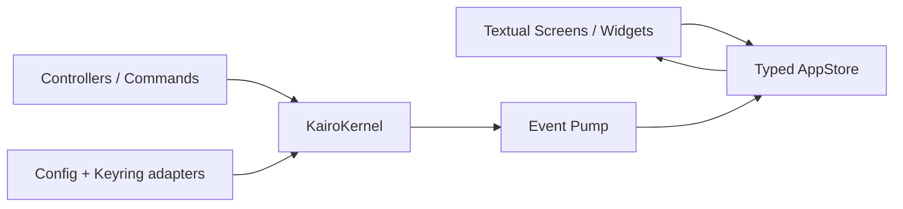

# Kairo TUI 0.4.0a2 重构方案

## 总体设计

采用 Textual 8.2+ 全量重写，交付独立发行包 `kairo-tui`，只依赖公开 `kairo-kernel`，不再引用旧 `Agent`、`ConfigDraft`、`WorkspaceMonitor`、`CommandDispatcher` 或 `tools.*`。

- 版本：`kairo-kernel 0.4.0a2`、`kairo-tui 0.4.0a2`，Python 3.11+。
- 包结构：Kernel 继续由根目录单独构建；TUI 放在 `frontends/tui/`，提供 `kairo-tui` 命令。
- 依赖：`textual>=8.2,<9`、`rich>=14,<15`、`keyring>=25,<26`、`platformdirs>=4,<5`。
- 本轮不迁移旧 `config.json` 或旧会话；原文件保持不变。
- 只在 `main` 顺序提交，不创建 worktree、开发分支或并行修改。

## Kernel 必须先补齐的接口

将 Kernel API 升为 `1.1`，事件 envelope 仍保持 schema 1。

- 暴露准确的 `kernel.capabilities()`；能力矩阵必须根据实际 composition 生成，不能继续声明尚未接线的能力。
- 新增 `kernel.active_turns()`，返回所有运行中会话、turn、phase、开始时间和 pending interaction，支持多会话并发任务中心。
- 新增 typed Command API：catalog、parse、execute；`/new`、`/clear`、`/undo`、`/compress`、`/model`、`/mode`、`/workspace` 等业务命令必须委托 Kernel service。页面跳转、帮助、退出属于 TUI 命令。
- 新增 runtime preferences snapshot/patch，统一修改 authorization、Plan、Thinking、上下文阈值；修改只影响以后接受的 turn。
- Provider catalog 改为持久化并接入动态 ProviderRouter；profile/role 更新对未来 turn 生效，已接受 turn 保持原快照；接入真实 probe。
- Workspace 增加 typed tree、changed-files、diff、preview 接口，并在 workspace move、文件修改工具完成后发布 revisioned change event。
- Sessions、configuration、workspace、provider、skills、memory 服务成功提交后发布对应 change event；TUI 不轮询或自行推导业务状态。
- MCP 门面补齐 typed tool call、resource read、prompt render，并把 MCP tools 接入 Kernel ToolRegistry；所有失败映射为 `KernelResult`，不向 TUI抛原始 transport exception。
- 增加 versioned KernelConfig 文档加载/原子保存接口；全局配置保存 profile、role、MCP、主题、快捷键和最近 workspace，项目数据库保存会话、memory、skills/trust 和 workspace 状态。
- TurnEngine 在接受 turn 时获取当前 workspace/config/provider 快照；修复 workspace revision、动态 profile 和 status context 仍使用构建期值的问题。

## TUI 产品与交互

### 工作台布局

- 顶栏：Kernel 状态、workspace、chat profile、权限级别、Plan/Thinking、多任务数量。
- 左侧导航：Chat、Sessions、Workspace、Memory、Extensions、Settings、Doctor。
- 中央区域：当前页面。
- 右侧 Inspector：Context、Activity、Changes 三个标签，可折叠。
- 底部：多行 Composer、slash 补全、当前 session/turn 状态。
- Kai mascot 仅作为可关闭的品牌状态指示器；Reduced Motion 下完全静止。

响应式规则：

- `>=140` 列：完整三栏。
- `100–139` 列：窄导航，Inspector 作为可切换抽屉。
- `80–99` 列：单页布局，导航和 Inspector 使用 overlay。
- `<80x24`：显示兼容提示并使用极简聊天布局，不崩溃、不丢输入草稿。

### 页面能力

- Chat：Markdown、代码、reasoning 折叠块、tool card、Plan card、流式输出、停止、重试、并发任务状态。
- Sessions：创建、搜索、切换、重命名、删除、导出、clear、undo、compress；运行中会话显示 badge。
- Workspace：懒加载目录树、文本预览、Git changed files、diff、bookmark、workspace 切换；所有结果带 revision，丢弃 stale response。
- Memory：namespace/tag 搜索、查看、创建、编辑、删除。
- Extensions：Built-in Tools、Skills、MCP Tools/Resources/Prompts；支持 trust、revoke、reload、connect、refresh 和 typed invocation。
- Settings：Profiles、role routing、Keyring secret、authorization、Plan、Thinking、context、主题、动画、快捷键。
- Doctor：local/full 检查、逐项状态、重试、取消和复制脱敏报告。
- Setup：空配置时作为默认页面，依次配置 workspace、provider/model、Keyring、probe 和权限；完成前禁用发送。

多媒体 ContentBlock 在通用终端中显示 metadata card；图片、音频和文件不自动打开外部程序，用户显式操作后才能保存或打开。

### 状态与事件

- `KairoTuiApp` 只持有 Kernel protocol、AppStore 和 UI controller。
- EventPump 从最后 sequence 订阅；所有事件先经过 typed reducer，再在 Textual 主线程更新 Store。
- Store 按 session/turn/message/tool/interaction ID 归一化，禁止按显示文字或 tool name 匹配。
- streaming delta 每 30 FPS 批量刷新；terminal event 前强制 flush。
- replay gap 或 subscriber overflow 时暂停增量渲染，重新读取 Kernel status、sessions、active turns、workspace 和 pending interactions，再恢复订阅。
- 每个 session 最多一个 turn，不同 session 可并行；切换页面或 session 不取消后台 turn。
- pending interaction 同时出现在消息时间线和 Activity Inspector；超时倒计时只展示，TUI不得自动批准。
- Esc 优先级：关闭 palette/modal → 取消当前 foreground turn → 无操作；退出必须通过命令或确认流程。
- 存在后台 turn 时退出显示“等待完成 / 停止全部并退出 / 返回”三选项。

### 命令与快捷键

导航、命令面板和 slash 使用同一 registry。

- `Ctrl+K`：命令面板。
- `Ctrl+1…7`：页面导航。
- `Ctrl+L`：聚焦 Composer。
- `Ctrl+N`：新会话。
- `Ctrl+B`：Workspace。
- `Ctrl+A`：切换 authorization。
- `Ctrl+P`：Plan。
- `Ctrl+T`：Thinking。
- `Ctrl+Up/Down`：输入历史。
- Enter 提交；Shift/Ctrl+Enter 插入换行。

保留 `/help`、`/new`、`/sessions`、`/clear`、`/undo`、`/compress`、`/model`、`/mode`、`/workspace`、`/status`、`/find`、`/export`、`/doctor`、`/skills`、`/mcp`、`/memory`、`/settings`、`/exit`。

## 配置、安全与发行

- 全局配置路径使用 `platformdirs`：Windows `%APPDATA%\Kairo\config-v1.json`，其他平台使用对应用户配置目录。
- 每个 workspace 使用 `.kairo/kernel.db`、`.kairo/skills`、`.kairo/trust`。
- Keyring service 固定为 `kairo`，account 使用 `secret_id`；磁盘只保存 opaque reference。
- Keyring 不可用时禁止明文保存，允许用户选择环境变量引用；诊断页面明确显示 backend 不可用。
- 默认 authorization 为 Manual、Plan 关闭、Thinking 开启、MCP 不自动连接。
- CLI：`kairo-tui [WORKSPACE]`，支持 `--config`、`--theme`、`--reduced-motion`、`--safe-mode`、`--headless-smoke`。
- `--safe-mode` 强制 Manual、禁止 MCP 自动连接、禁止持久化设置变更。
- Kernel wheel 必须继续只包含 `kairo_kernel`；TUI wheel 只包含 `kairo_tui`，不得打入旧 `agent/`。
- 新 TUI 验收后删除旧 `agent/ui/`；`agent/tui_widgets.py` 继续留给 plain 前端，plain/WebUI 本轮不改。

## 实施顺序与验收

1. Kernel Gate：完成 capability、command、active-turn、preferences、workspace inspector、change events、provider routing、MCP 门面和配置加载；Kernel tests 全绿后冻结 API 1.1。
2. TUI Foundation：独立包、CLI、Keyring/config adapter、AppStore、reducer、EventPump、主布局和 Setup。
3. Chat Gate：session、streaming、tool/Plan/text interaction、stop、多会话并发、replay recovery。
4. Workbench Gate：Workspace、Memory、Extensions、Settings、Doctor 和统一 command registry。
5. Cutover：将旧 `--tui` 入口改为兼容跳转，完成 wheel 验收后删除旧 Textual 实现。
6. Release Gate：构建两个 `0.4.0a2` Alpha wheel，只保留本地制品，不发布 PyPI。

必须通过：

- Kernel 与 TUI 单元、集成、Textual Pilot 和 headless smoke。
- 尺寸矩阵：80×24、100×30、140×40、200×50。
- Windows、Ubuntu、macOS；Python 3.11–3.14。
- 并发 session、stop、Plan edit/cancel、tool approval timeout、subscriber overflow、workspace stale revision、Keyring failure、配置损坏和 shutdown race。
- Ruff、strict Mypy、Twine、isolated wheel install。
- AST 边界测试证明 `kairo_tui` 不导入 `agent.*`、旧 `tools.*` 或 Kernel private module。
- secret scan 证明事件、日志、错误、repr、snapshot 和导出中不存在完整密钥。
- 最终本地和远端仍只有 `main`，且指向同一最新提交。
